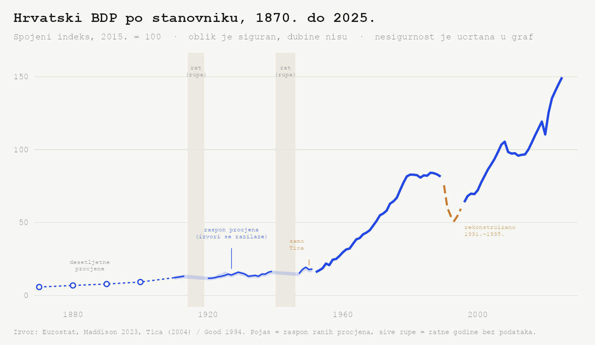
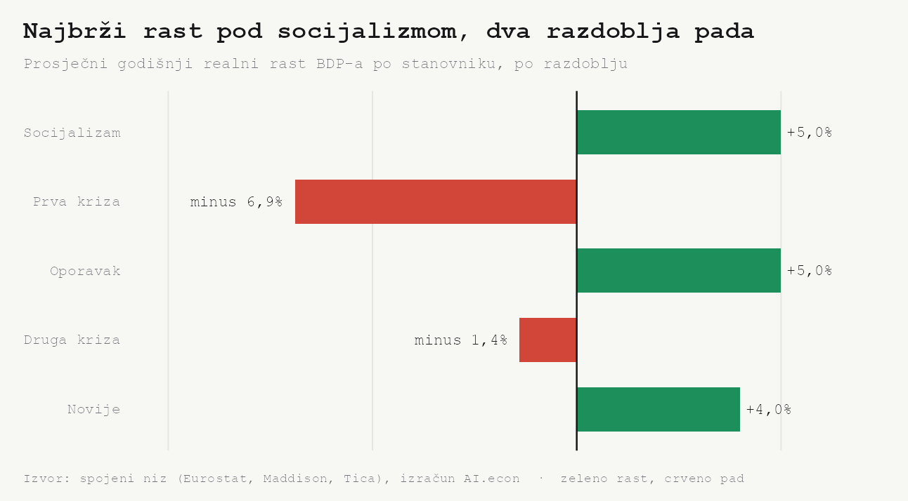
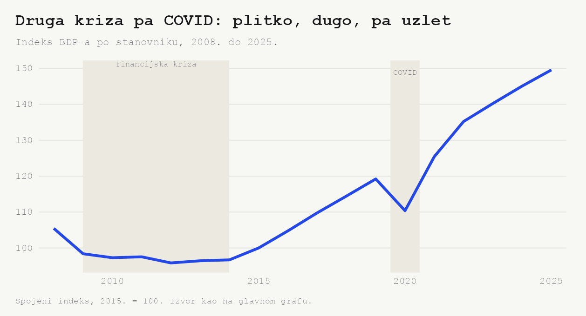
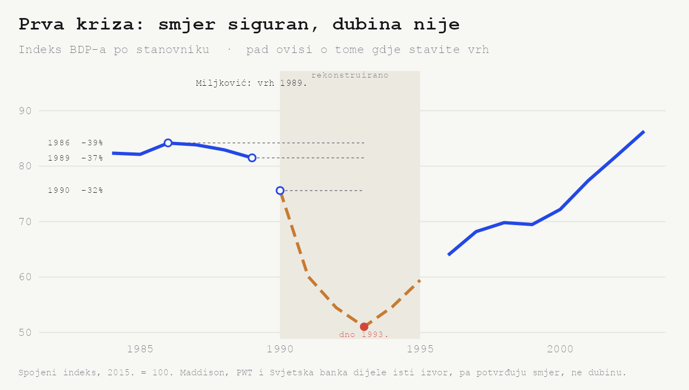
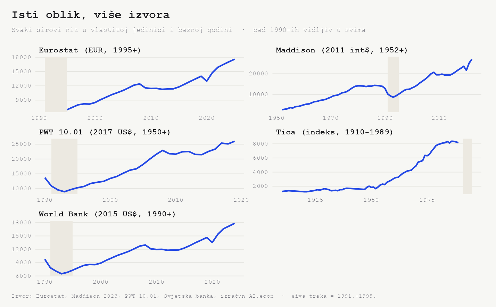

Hrvatski BDP po stanovniku stane u jednu liniju, od 1870. do danas. Kroz dva
svjetska rata, dvije države koje su nestale i četiri krize. Šest puta padne,
šest puta se vrati.

Odmah razdvojimo dvije stvari. *Oblik* te linije je čvrst, brojke ispod nisu. Da
je do svakog pada došlo, i kad otprilike, znamo pouzdano. Koliko je dubok bio,
puno manje. Zato nesigurnost ne guramo u napomene na dnu. Crtamo je u sam graf,
da je vidi i čitatelj koji do napomena nikad ne stigne.

Pogledajte gdje je tlo meko. Pojas oko rane linije je raspon procjena, mjesto
gdje se izvori razilaze. Kružići prije 1910. su desetljetne procjene, ne godišnji
podatci. Sive rupe su ratne godine bez ijednog broja. Žuta isprekidana dionica
devedesetih je rekonstrukcija, ne mjerenje. A dionicu oko 1950. drži jedan jedini
izvor.

Linija se popne otprilike 25 puta. **Indeks 6 (1870.) → indeks 150 (2025.)**. Tu
brojku držimo najlabavije od svih, jer su razine sintetske, spojene iz tri niza
(više u *Napomenama*). Sigurno je nešto drugo. Raspored padova i povrataka, i
koliko je linija svaki put trebala da se vrati.

## Rast u dva naleta, dvaput prekinut

Stope rasta su čvršće tlo od razina, pa krenimo od njih. Rast nije bio
ravnomjeran. Socijalizam je gurao liniju **plus 5,0% godišnje** (1952. do 1986.),
poslijeratni oporavak jednako jako, **plus 5,0%** (1993. do 2008.). Novije
razdoblje drži **plus 4,0%** (2014. do 2025.).

Pa dva razdoblja kad je linija padala. Prva kriza **minus 6,9% godišnje** (1986.
do 1993.), druga **minus 1,4%** (2008. do 2014.). Prije rata sporije i od niske
baze. Habsburško **plus 1,6%** (1870. do 1900.), međuratno **plus 1,8%** (1920.
do 1939.).

I tu vrijedi ista ograda. Smjer svake od ovih brojki je siguran, zadnja decimala
nije.

## Šest padova, ni jedan isti

Sad svaki pad izbliza. Za svaki vrijedi isto pravilo. *Smjer je siguran, dubina
je procjena.*

**Rat 1914. i rat 1940.** Dvije rupe, ne dvije brojke. Prvi svjetski rat prekida
liniju između 1914. i 1919., drugi između 1940. i 1946. Tu nema podataka, pa
linija stoji prekinuta. Sigurno je da je bilo loše. Koliko, ne piše nigdje.

**Blokada 1949. do 1952.** **Indeks 19 (1949.) → indeks 16 (1952.)**, oko **minus
16%**. Raskol s Informbiroom i blokada Istočnog bloka. Ali ovu dionicu nosi samo
jedan izvor (Tica), prije nego Maddison preuzme niz 1952. Smjer je dosljedan
unutar tog niza, drugi ga izvori ne potvrđuju, pa samu dubinu uzmite kao grubu.
Zato na glavnom grafu i nosi oznaku *samo Tica*.

Nakon blokade slijedi najstrmiji uspon u nizu. **Indeks 16 (1952.) → indeks 84
(1986.)**. Otprilike peterostruko u jednoj generaciji, ali na sintetskoj razini,
jugoslavenske stope prenesene na Hrvatsku (više u *Karti pouzdanosti*). Pa Tito
umre i linija stane. Indeks 84 (1986.) je vrh koji linija dugo neće prijeći.

**Letargija 2008. do 2014.** **Indeks 105 (2008.) → indeks 97 (2014.)**, **minus
8%**, plitko. Ali šest godina dugo. Financijska kriza pa duga domaća recesija drže
liniju u mjestu pola desetljeća. Ovo je najpouzdanije izmjeren pad u nizu, jer
se računa na modernim Eurostatovim podatcima. I baš trajanje, ne dubina, ostavlja
[sektorski trag](https://mislavsag.github.io/CroAIcon/posts/2026-06-firme-i-zaposlenost-po-sektorima/).

**Pandemija 2020.** **Indeks 119 (2019.) → indeks 110 (2020.) → indeks 125
(2021.)**. Pad pa skok u dvije godine, najbrži povratak u nizu. I ovo je čvrsto
izmjereno, opet na Eurostatovim podatcima. Linija nastavi do **indeksa 150
(2025.)**.

I tu je *dubina naspram trajanja*. Prva kriza duboka i kratka, druga plitka i duga,
pandemija duboka i munjevita. Ni jedan pad nije kao prošli. Najveći od svih, onaj
devedesetih, ostavljamo za kraj. On je i najveći i najnesigurniji, pa traži
vlastiti odjeljak.

## Što je starije, to je tanje, osim devedesetih

Prije nego zumiramo devedesete, evo karte pouzdanosti, dionicu po dionicu.

**Socijalizam (1947. do 1990.).** Najlakše ga je obnoviti, postoje gotovi
predlošci. Ali kako linija sad stoji, počiva na jugoslavenskim stopama
prenesenima na Hrvatsku, ne na izravnom hrvatskom mjerenju.

**Međuratno (1920. do 1939.).** Tanje. Više procjena koje se razilaze, što je onaj
pojas oko rane linije na glavnom grafu.

**Prije Prvog rata (do 1910.).** Najtanje. Desetljetne točke iz širih habsburških
rekonstrukcija (Good), nisu specifične za Hrvatsku nego pripadaju cijeloj regiji
pa su pripisane.

**Ratne rupe (1914. do 1919., 1940. do 1946.).** Naprosto ih nema.

**Tranzicija (devedesete).** Najspornija od svih. Njoj sad.

## Devedesete, naša najveća i najnesigurnija točka

Devedesete su u središtu priče, a ujedno i mjesto gdje brojci najmanje vjerujemo.
Pad je golem, to nitko ne spori. Ali kolik je točno, ovisi o tome gdje stavite
vrh.

Od 1986. (indeks 84) pad je **minus 39%**, od 1990. (indeks 76) **minus 32%**.
Razlika je samo u izboru početne godine. Procjena koju jedan kasniji pregled drži
najpouzdanijom za to razdoblje (Miljković, 1992.) vrh stavlja na 1989., ne na
1990., što daje pad od oko **minus 37%**.

Zabilježeni pad k tome vjerojatno precjenjuje stvarni. Dio gospodarstva preselio
se u sivu zonu koju statistika ne hvata. To je opće mjesto literature o
tranziciji, zabilježeni pad redovito precjenjuje stvarni, a za koliko, razlikuje
se od zemlje do zemlje. Rat je k tome dio zemlje nakratko izmaknuo iz brojki, no
ta su područja bila siromašnija od prosjeka, pa je njihov udio u izgubljenom
outputu vjerojatno manji nego u stanovništvu.

A slaganje izvora?

Maddison, Penn World Table i Svjetska banka svi pokazuju isti pad, oko **minus
33%** od 1990., u skladu s našom procjenom. Zvuči kao potvrda. Nije. Sva tri u
konačnici crpe iz istog izvora, pa dijele istu pristranost. Njihovo slaganje
pribija **smjer** i grubo **vrijeme**, ne **dubinu**. Smjer je siguran. Dubina je
jedina brojka kojoj u cijelom nizu vjerujemo najmanje.

Pa ipak, linija se vrati. Vrh iz 1980-ih dosegnut je tek 2003., četrnaest do
sedamnaest godina ovisno o izboru vrha. Toliko da bi se linija vratila tamo gdje
je već bila.

## Raznolikost padova je nalaz, ne njihova dubina

Ogradimo zaključak pošteno.

Povratak sam po sebi nije velika vijest. Svako gospodarstvo koje preživi na kraju
nešto pokaže prema gore. K tome, niz je ulančan na novije podatke koji jesu
rasli, pa je *povratak dijelom ugrađen* u samu konstrukciju linije. Dubine padova
su nesigurne, posebno ona devedesetih. O razini prema EU ili o konvergenciji iz
ovog niza ne govorimo, za to bi trebao usporedni niz.

Ono što ovaj niz pouzdano govori je nešto drugo. Ne kolika je svaka kriza bila,
nego koliko su bile različite, i koliko je svaki put trebalo da se linija vrati,
od jedne godine do sedamnaest. *To* je nalaz, ne brojka na dnu svakog pada. Za
novije krize ta su vremena povratka čvrsta, na Eurostatovim podatcima, a za
devedesete su i sama očitana s ulančanog niza, pa ih uzmite kao red veličine.

Smjer pričamo glasno. Dubinu pričamo tiho.

## Napomene

- **Bazna godina i stope.** Indeks 2015. = 100. Stope rasta po razdoblju iz
  `outputs/tables/gdp_growth_eras.csv`.
- **Spajanje.** Jedna linija, spojena iz tri niza po *stopama rasta*, ne po
  razinama. Eurostat (`nama_10_pc`) od 1995., Maddison 2023. za 1952. do 1994.,
  Tica (2004.) unatrag do 1910., pa desetljetne točke do 1870. koje Tica preuzima
  od Gooda (1994.). Spajanje razina stvorilo bi lažne skokove jer su jedinice
  različite.
- **Što se da popraviti.** Socijalizam je najlakši, republički društveni proizvod
  postoji pa se niz može presložiti na hrvatske podatke umjesto na prenesene
  jugoslavenske stope. Međuratno počiva na starijim procjenama nacionalnog dohotka
  (Vinski, Stajić) i ostaje tanje. Prije 1910. nema hrvatskih nacionalnih računa,
  samo regionalne habsburške procjene (Good). Ratne rupe i rekonstruirane
  devedesete ostaju otvoreni zadatci.
- **Devedesete.** Dubina ovisi o izboru vrha (1986., 1989. ili 1990.). Miljković
  (1992.) i kasniji pregled (Bićanić i Tuđa, 2014.) vrh stavljaju na 1989. Maddison,
  PWT i Svjetska banka dijele isti izvor, pa potvrđuju smjer, ne dubinu. Zabilježeni
  pad vjerojatno precjenjuje stvarni, koliko se ne zna.
- **Razine.** Sintetske (ulančane stope), pa ih iznosimo oprezno i bez usporednog
  niza.

*Izvori. Eurostat (`nama_10_pc`), Maddison Project 2023, Tica (2004.) i Good
(1994.), uz Miljković (1992.) i Bićanić i Tuđa (2014.) za devedesete. PWT i
Svjetska banka kao provjera. Registar izvora. `data/reference/gdp_sources.json`.
Skripta. `scripts/update_gdp.R`.*
