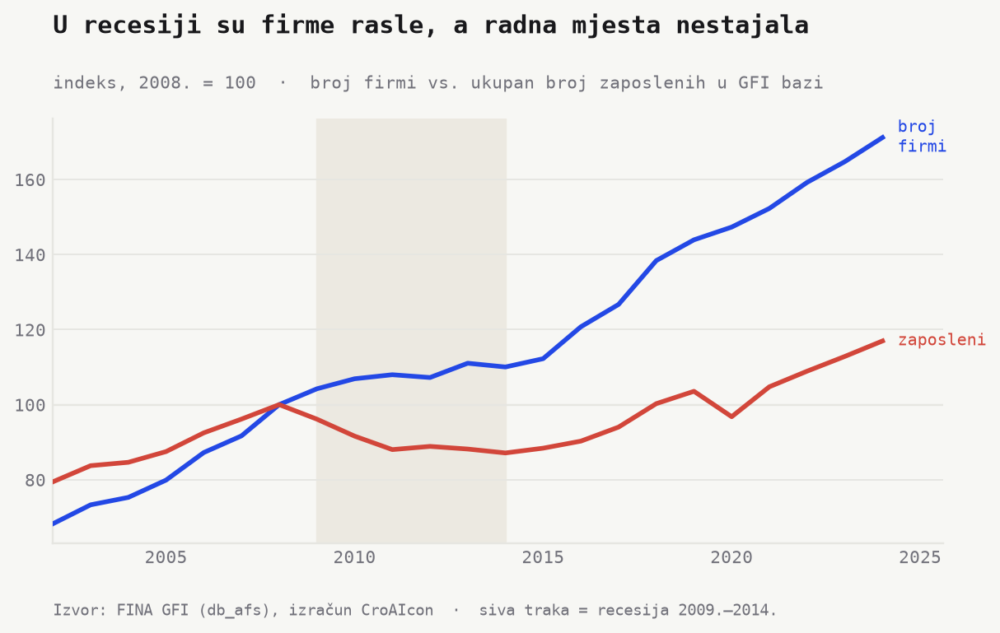
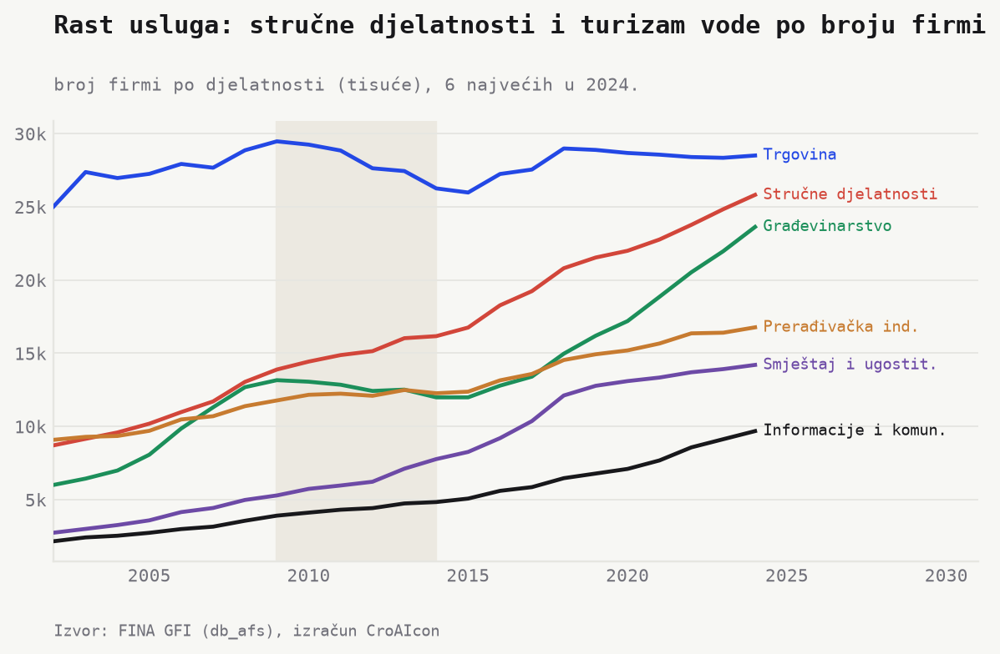
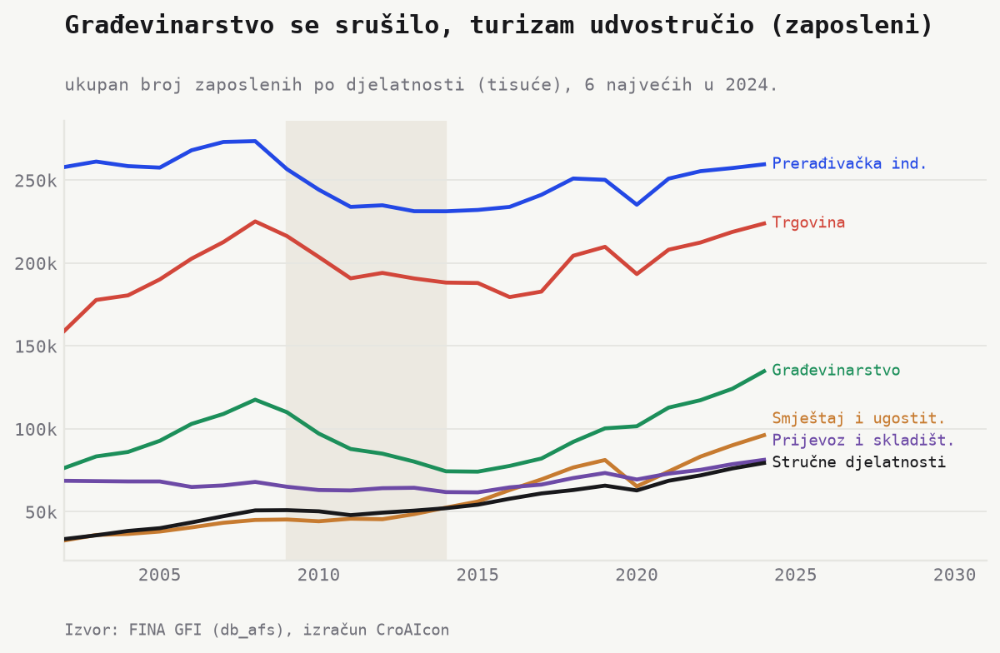
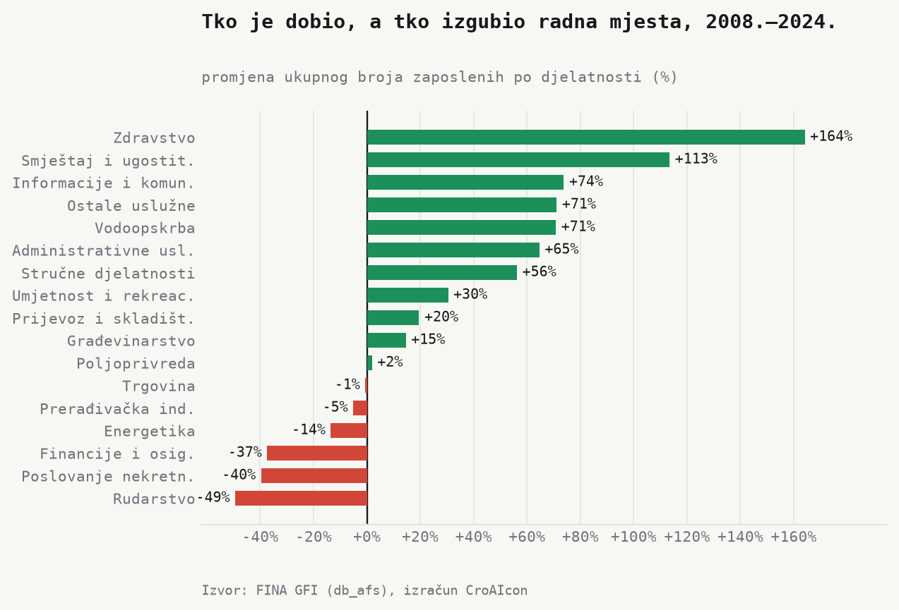

Koliko firmi posluje u RH, gdje i koliko ljudi zapošljavaju? Odgovorimo na ovo pitanje kroz dvije brojke, dvije različite priče. Broj firmi raste. **65.000 (2002.) → 162.000 (2024.)**.

## Recesija se vidi u radnim mjestima, ne u broju firmi

**Minus 127.000** radnih mjesta. Tijekom recesije (2009. do 2014.) broj firmi je rastao (više o obuhvatu u *Napomenama*), a zaposlenost padala. **982.000 (2008.) → 855.000 (2014.)**, **minus 13%**. Oporavak dolazi tek nakon 2015. Do 2024. broj zaposlenih je porastao do ~ **1,15 milijuna**, iznad pretkrizne razine. Firme su preživljavale. Rezale su ljude. *Firmi sve više, radnih mjesta manje.* 

## Sve više firmi, sve više u uslugama

Trgovina ostaje najbrojnija (oko **28.000** firmi), ali stagnira. Rast vode stručne djelatnosti (**13.000 → 26.000**), građevinarstvo (**13.000 → 24.000**), smještaj i ugostiteljstvo te informacije i komunikacije. Struktura se pomiče prema uslugama i znanju.

## Industrija drži vrh, građevina pada i ustaje, turizam eksplodira

Prerađivačka industrija je najveći poslodavac (oko **260.000**), uz blagi pad (**minus 5%**). Građevina je drama. **118.000 → 74.000** (**minus 37%**). Pa natrag na **135.000**. Turizam udvostručuje. **45.000 → 96.000** (**plus 113%**).

## Tko je dobio, a tko izgubio radna mjesta

Realokacija u jednoj slici. Dobitnici. Zdravstvo **plus 164%**, turizam **plus 113%**, informacije **plus 74%**. Gubitnici. Rudarstvo **minus 49%**, nekretnine **minus 40%**, financije **minus 37%**. Klasici stoje. Industrija **minus 5%**, trgovina **minus 1%**.

Realokacija ocrtava RH model rasta. Strukturno preslagivanje. Težište se seli s industrije i građevine na turizam i usluge. To je i snaga (novi poslovi, oporavak iznad pretkrizne razine) i rizik (rast sve više počiva na turizmu, osjetljivom na vanjske šokove).

## Napomene

- Izvor. GFI baza, razdoblje 2002. do 2024.
- Broj firmi. Poduzeća koja su predala GFI te godine (uključuje firme bez zaposlenih).
- Zaposleni. `employeecounteop` (kraj razdoblja), zbroj po djelatnosti.
- Djelatnost. NKD 2007. područje (`nacerev21`, A do U).
- Oprez. Rast broja firmi dijelom odražava širi obuhvat baze. Zaposlenost je robustnija mjera.

*Izvor. FINA, Godišnji financijski izvještaji (`db_afs`). Izračun. AI.econ. Skripte. `python/sectors_build.py`, `python/sectors_charts.py`.*
