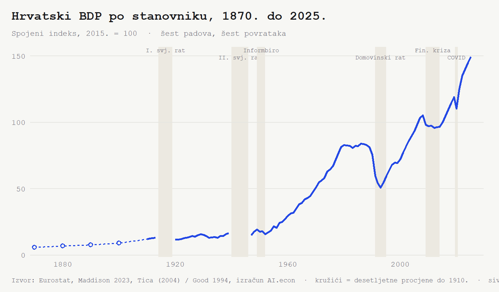
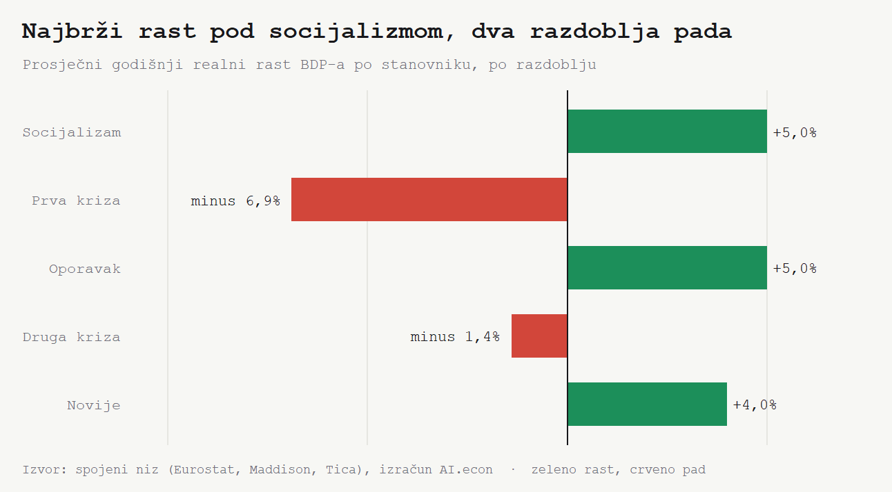
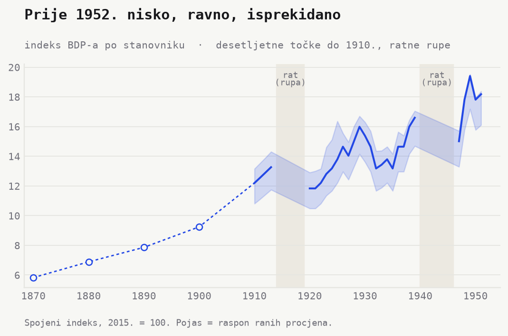
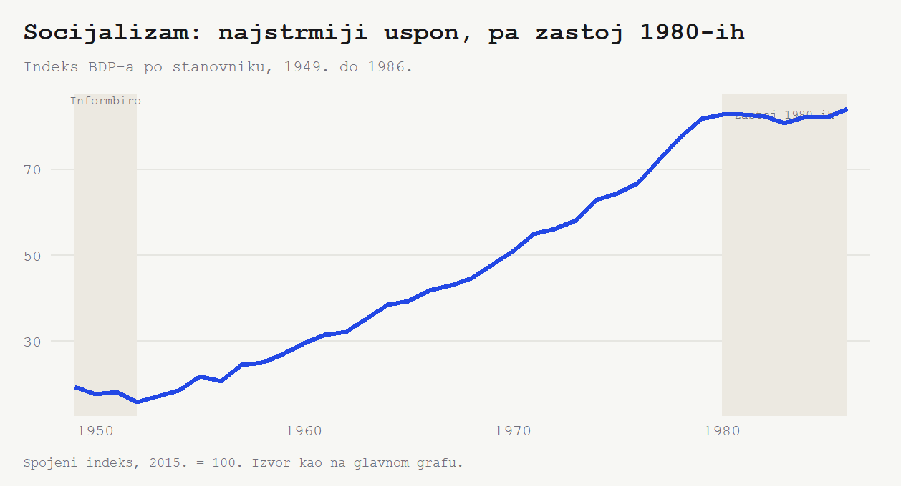
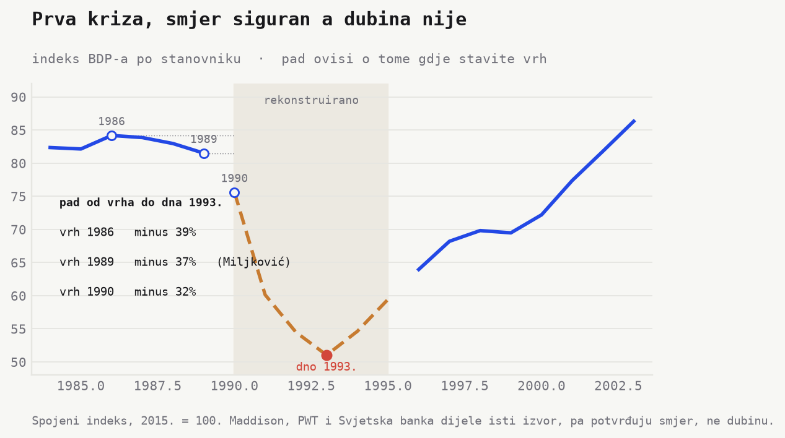
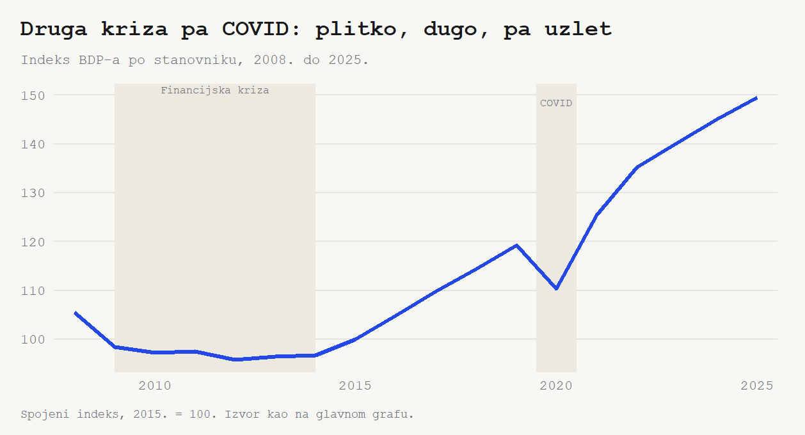
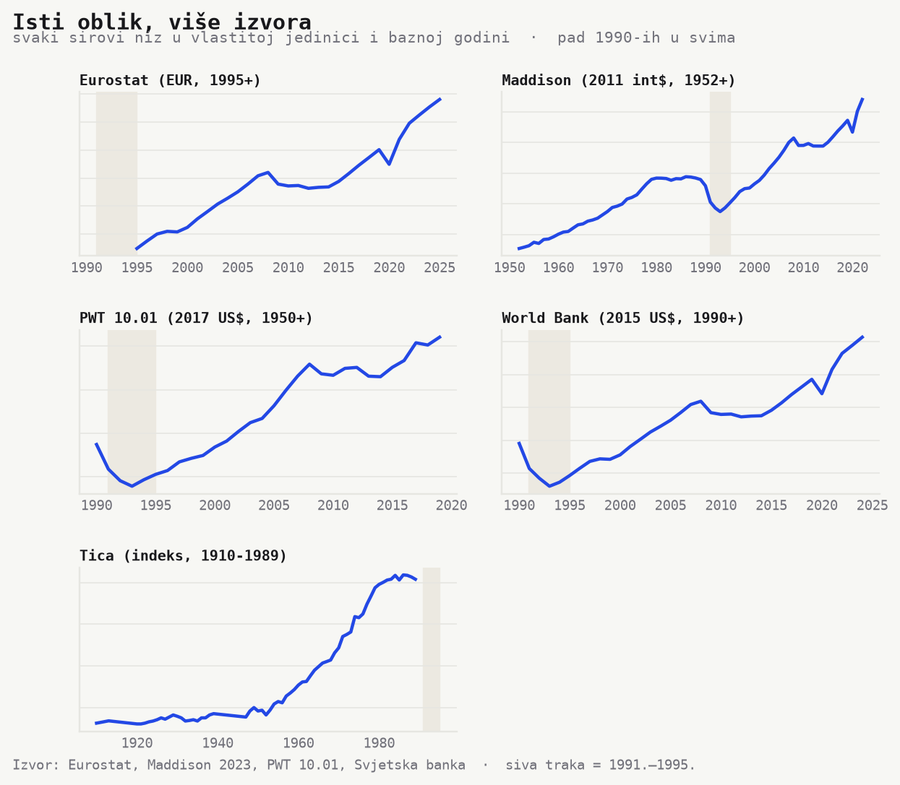

Koliko se popela linija BDP-a od 1870. do 2025., kroz dva svjetska rata, dvije
države koje su nestale, dvije teške i dvije manje teške krize? **Oko 25 puta**. **Indeks 6 (1870.) → indeks 150 (2025.)**. Sve se vidi na grafu ispod (indeks 2015. = 100, više u *Napomenama*).

Ali najupečatljiviji nije sam rast, nego povratak. Linija se nakon svakog pada
vrati na staru putanju. Šest padova, šest povrataka. Dvije krize se izdvajaju, skroz
različite. Jedna duboka i brza, druga plitka i duga.

Pogledajmo prvo koliko je brzo linija rasla, pa onda svako razdoblje izbliza.

## Brz rast u dva naleta, dvaput prekinut krizom

Rast nije bio ravnomjeran. Socijalizam ga je gurao **plus 5,0% godišnje**
(1952. do 1986.), a poslijeratni oporavak jednako jako, **plus 5,0%** (1993. do
2008.). Novije razdoblje drži **plus 4,0%** (2014. do 2025.).

Pa dva razdoblja kad je linija padala. Prva kriza **minus 6,9% godišnje**
(1986. do 1993.). Druga **minus 1,4%** (2008. do 2014.). U cijelom periodu od 1952. ipak
raste **plus 3,1% godišnje**. Prije rata sporije. Habsburško razdoblje **plus
1,6%** (1870. do 1900.), međuratno **plus 1,8%** (1920. do 1939.).

## Prije 1900. jedva pomak, Habsburška Hrvatska raste sporo i od niske baze

**Indeks 6 (1870.) → indeks 9 (1900.)**. Trideset godina, jedva pomak. Ovo su
desetljetne procjene, ne pravi godišnji podatci, pa stoje kao kružići na isprekidanoj liniji
(više u *Napomenama*).

Onda dva prekida. Prvi svjetski rat prekida liniju između 1914. i 1919. Drugi između
1940. i 1946. To su godine bez podataka. Međuratno razdoblje jedva pomakne liniju, pa slijedi još jedan pad oko 1950. Tek nakon 1952. počinje pravi uspon.

## Socijalizam diže liniju pet puta, najstrmiji uspon u nizu

U 1952. linija je na dnu, ali tu je tek stigla. Prethodne tri godine pada. **Indeks
19 (1949.) → indeks 16 (1952.)**, oko **minus 18%**. To je raskol s Informbiroom
1948. i blokada Istočnog bloka (podatci za te godine postoje samo u jednom izvoru, pa ih čitamo
oprezno (više u *Napomenama*)).

Nakon toga kreće uspon. **Indeks 16 (1952.) → indeks 84 (1986.)**. Peterostruko u jednoj generaciji, **plus 5%
godišnje**. Industrijalizacija i sustizanje s niske baze guraju liniju gotovo bez
prekida.

Umro Tito! Linija prestaje rasti. **Indeks 84** je vrh tog razdoblja, koji linija dugo poslije neće prijeći.

## Prva kriza ruši liniju duboko i brzo

**Indeks 84 (1986.) → indeks 51 (1993.)**. **Minus 39%**, najdublji izmjereni pad. Rat, raspad Jugoslavije i tranzicija na tržište, sve odjednom. Tvornice staju, država se mijenja. Linija brzo pada.

Ovo su osjetljive godine (1991. do 1995. su rekonstruirane, više u *Napomenama*),
pa se ne oslanjamo na točan postotak nego na slaganje izvora. Pad od 1990. do dna
potvrđuju svi izvori. Maddison **minus 33%**, Penn World Table **minus 35%**, Svjetska
banka **minus 33%**.

Pa ipak, linija se vrati. Vrh iz 1980-ih ponovno je dosegnut tek 2003. Sedamnaest
godina da bi linija došla tamo gdje je već bila.

## Druga kriza liniju dugo drži u zarobljeništvu, pa stiže COVID

**Indeks 105 (2008.) → indeks 97 (2014.)**. **Minus 8%**, plitko. Ali šest godina dugo.
Globalna financijska kriza pa duga domaća recesija drže liniju "u zarobljeništvu" pola
desetljeća.

Dvije krize, dva lica. Prva duboka i brza, druga plitka i spora. *Dubina vs
trajanje.* I baš trajanje, ne dubina, ostavlja [sektorski trag](https://mislavsag.github.io/CroAIcon/posts/2026-06-firme-i-zaposlenost-po-sektorima/). 

Onda COVID. **Indeks 119 (2019.) → indeks 110 (2020.) → indeks 125 (2021.)**. Pad pa
skok u dvije godine, najbrži oporavak u dugodišnjem nizu. Linija nastavi dalje, do **indeksa 150 (2025.)**.

## Šest puta dolje, šest puta natrag

Rat 1914. Rat 1940. Blokada 1949. do 1952. Slom 1990-ih. Letargija 2008. do 2014.
Pandemija 2020. Šest puta dolje, šest puta natrag. To je *zakon ekonomskog rasta*. 

## Kako je ovo izračunato, i gdje je nesigurno

Jedna linija, spojena iz **tri niza rastom, ne razinama**. Eurostat ide od 1995.
nadalje, Maddison 1952. do 1994., a Tica ide unatrag do 1910., pa i do 1870.
desetljetnim procjenama koje Ticin niz preuzima od Gooda (1994.). Svaki stariji
niz prilagodimo tako da zadržimo njegove **stope rasta**, ne apsolutne razine. Spajanjem razina bismo stvorili lažne skokove jer su jedinice različite. Penn
World Table i Svjetska banka ne ulaze u liniju. Služe samo kao neovisna provjera
oblika, najviše za slom 1990-ih.

Tri su mjesta gdje je niz nesiguran, i sva tri su na grafu vidljiva. Prije 1910.
imamo samo desetljetne točke, pa ih crtamo kružićima i isprekidano, ne kao glatku
krivulju. Ratne godine (1914. do 1919. i 1940. do 1946.) nedostaju, pa je linija
prekinuta. Godine 1991. do 1995. su rekonstruirane, ne službeno izmjerene.

Zato za najdramatičniji potez, slom 1990-ih, tražimo potvrdu izvana. Isti pad
vide svi neovisni izvori.

## Napomene

- **Bazna godina.** Indeks 2015. = 100. Stope rasta po razdoblju iz
  `outputs/tables/gdp_growth_eras.csv`.
- **Spajanje i nesigurnost.** Kako je niz sastavljen (ulančavanje stopa rasta) i
  gdje je nesiguran (desetljetne procjene do 1910., ratne rupe 1914. do 1919. i 1940.
  do 1946., rekonstrukcija 1991. do 1995.) opisano je gore, u odjeljku *Kako je
  ovo izračunato*.
- **Pad oko 1950.** Godine 1947. do 1951. nosi samo Tica, prije nego Maddison
  preuzme niz 1952., pa pad iz 1949. (indeks 19) u 1952. (indeks 16) stoji na jednom
  izvoru. Smjer je dosljedan unutar tog niza, ali ga drugi izvori ne potvrđuju.
- **Razine i usporedbe.** Razine su sintetske (ulančane stope), pa ih iznosimo
  oprezno. Na grafu nema usporednog niza, pa o razini prema EU ili o konvergenciji
  ne govorimo.

*Izvori. Eurostat (`nama_10_pc`), Maddison Project 2023, Tica (2004) i Good
(1994). PWT i Svjetska banka kao provjera. Registar izvora.
`data/reference/gdp_sources.json`. Skripta. `scripts/update_gdp.R`.*
