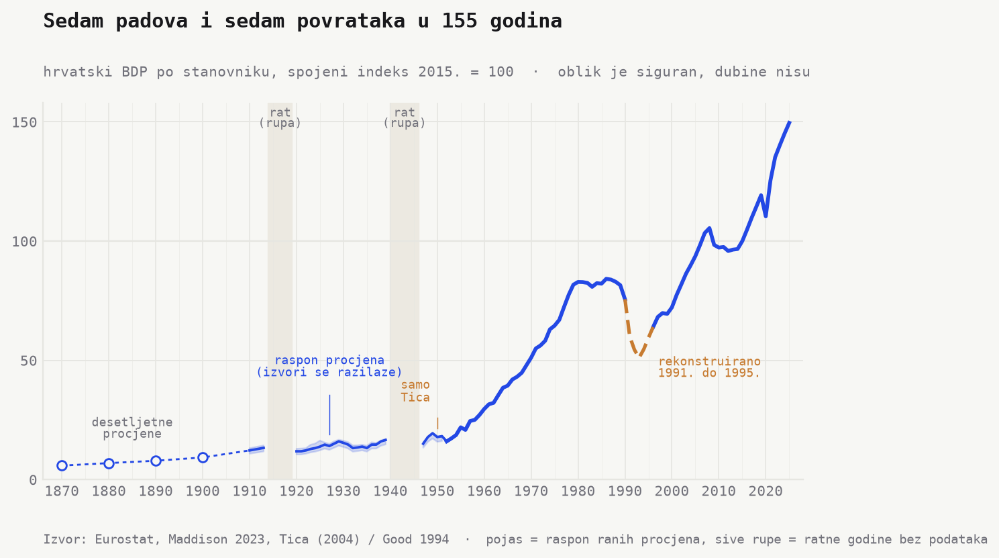
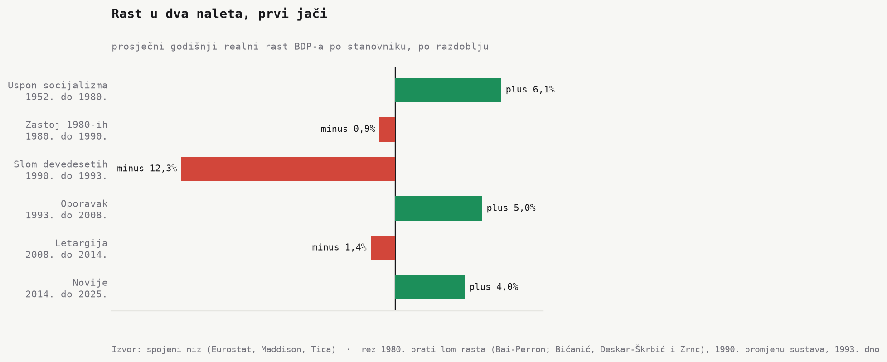
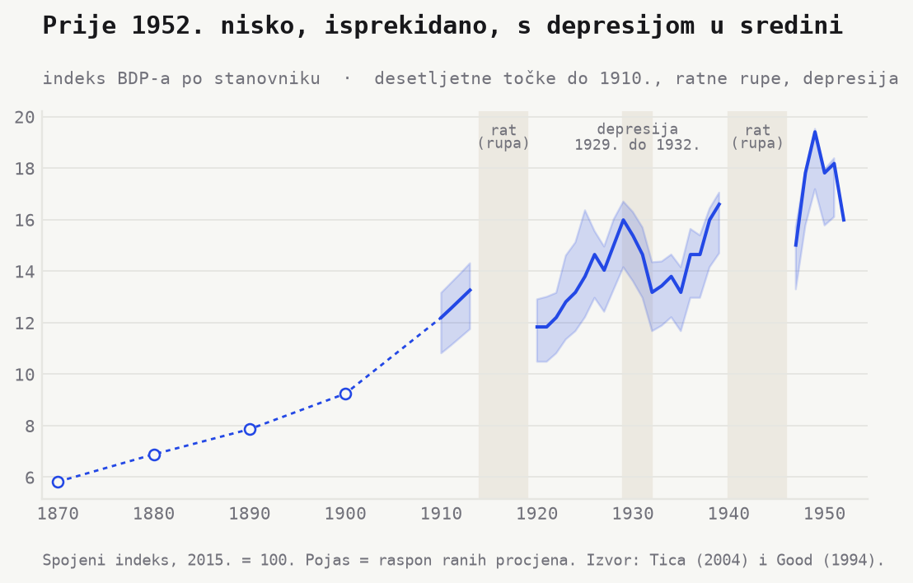
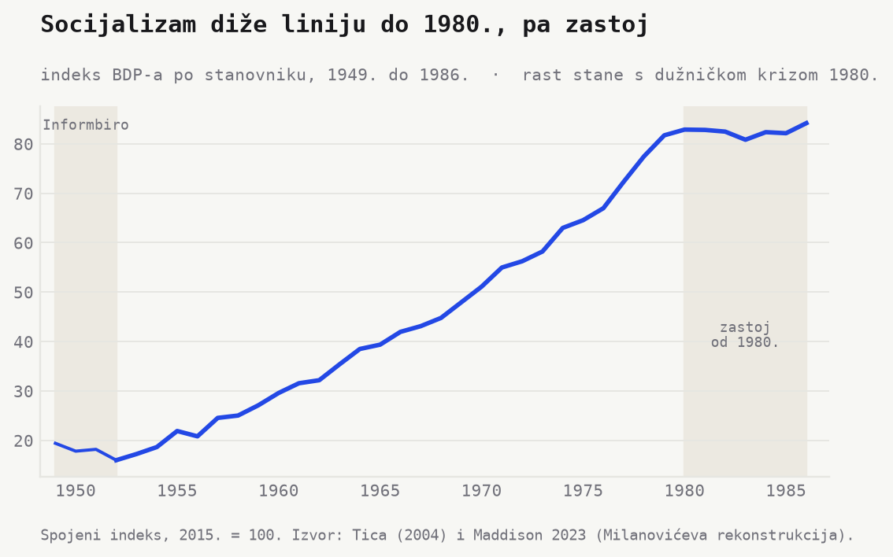
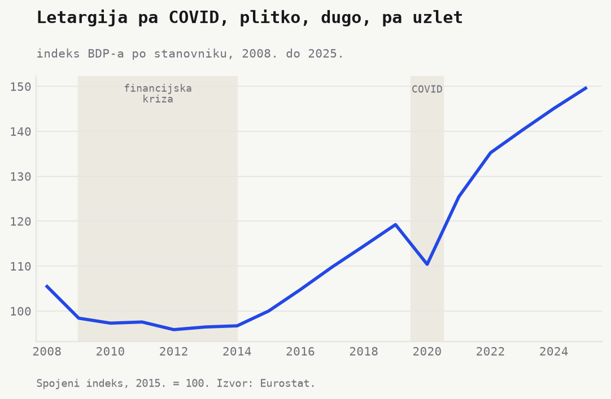
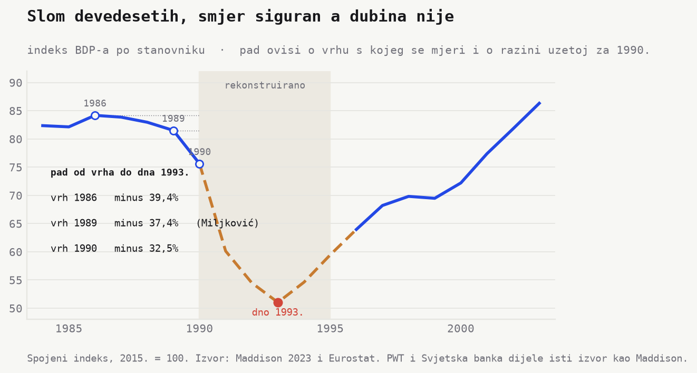
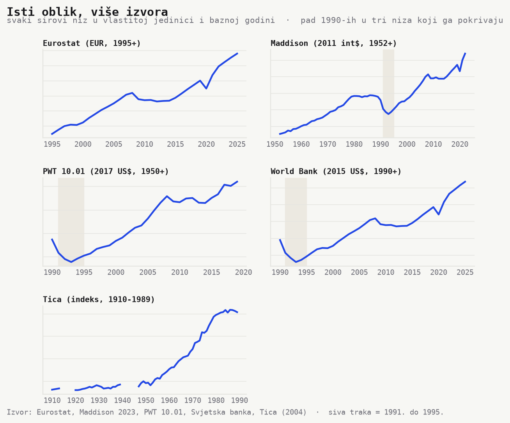

Hrvatski BDP po stanovniku stane u jednu liniju, od 1870. do danas. Kroz dva
svjetska rata, dvije države koje su nestale i pet kriza. Sedam puta padne,
sedam puta se vrati.

Odmah razjasnimo dvije stvari. *Smjer* linije je siguran, a točne brojke puno manje. Da
je do svakog pada došlo, i kad otprilike, znamo pouzdano. Koliko je dubok bio,
puno manje. Zato nesigurnost ne guramo u napomene na dnu. Ucrtali smo je u prvi
graf, da je vidi i onaj čitatelj koji do napomena uopće ne stigne.

Pogledajte što je nesigurno. Pojas oko linije pri početku je raspon procjena. Tu se izvori razilaze. Kružići prije 1910. desetljetne su procjene, ne godišnji
podatci. Sive rupe su ratne godine bez ijednog broja. Narančasta isprekidana dionica
devedesetih je rekonstrukcija. A za dio oko 1950. postoji samo jedan
provjerljiv izvor.

Linija se popne oko 26 puta. **Indeks 6 (1870.) → indeks 150 (2025.)**. U ovu
brojku ne vjerujemo doslovno, jer su razine sintetske, spojene iz tri niza
(više u *Napomenama*). Sigurno je nešto drugo. Raspored padova i povrataka, i
koliko je linija svaki put trebala da se vrati.

## Rast u dva naleta, prvi jači

Stope rasta su sigurnije od razina, pa krenimo od njih. Rast dolazi u dva
naleta, ali ne jednaka. Uspon socijalizma nosi **plus 6,1% godišnje** (1952. do
1980.), poslijeratni oporavak **plus 5,0%** (1993. do 2008.), novije razdoblje
**plus 4,0%** (2014. do 2025.). Svaki je nalet sporiji od prethodnog, a tempo
prvog se poslije 1980. više ne vrati.

Granice ne stavljamo od oka. Formalni testovi na nizu od 1952. do 2015. nalaze
lomove rasta 1980., 1994. i 2009. (Bićanić, Deskar-Škrbić i Zrnc, 2016.), pa
uspon režemo na 1980. Da smo rezali na vrhu razine, 1986., zastoj osamdesetih
ušao bi u prosjek uspona i oba bi naleta izgledala jednako, po 5,0% godišnje.
Ta jednakost ne bi bila nalaz, nego posljedica izbora granice.

Između naleta linija stoji ili pada. Zastoj **minus 0,9% godišnje** (1980. do
1990.), slom **minus 12,3%** (1990. do 1993.), letargija **minus 1,4%** (2008.
do 2014.). Do 1939. sporije i od niske baze. Habsburško **plus 1,6%** (1870. do
1900.), međuratno **plus 1,8%** (1920. do 1939.). Taj prosjek izglađuje cijelu
depresiju. O njoj niže.

I tu opet oprez. Smjer je siguran, brojke nisu.

## Sedam padova, nijedan isti

Sad svaki pad izbliza. Za svaki vrijedi isto pravilo. *Smjer je siguran, dubina
je procjena.*

**Rat 1914. i rat 1940.** Dvije rupe, ne dvije brojke. Prvi svjetski rat prekida
liniju između 1914. i 1919., drugi između 1940. i 1946. Tu nema podataka, pa
linija stoji prekinuta. Sigurno je da je bilo loše. Koliko?

**Depresija 1929. do 1932.** Siva traka između dvaju ratova. **Indeks 16
(1929.) → indeks 13 (1932.)** (oko **minus 18%**), s dvostrukim dnom, 1932. pa
loša žetva 1935. U agrarnu zemlju svjetska kriza ne uđe kroz tvornice nego kroz
cijene. Cijene poljoprivrednih proizvoda gotovo se prepolove, nominalni dohodak
padne oko 40%, a realni proizvod, ovaj na grafu, oko 18% (Gnjatović, 2017.).
Isti dug seljak zato vraća s dvostruko više robe (Gnjatović i Aleksić, 2011.).
Razinu iz 1929. linija vrati tek 1938. Devet godina. Jedini pad u nizu koji
nije došao ni iz rata ni iz domaće politike, nego uvezen izvana. Hrvatskih
procjena za tridesete nema, međuraće nosi jugoslavenske stope (više u
*Napomenama*).

**Blokada 1949. do 1952.** **Indeks 19 (1949.) → indeks 16 (1952.)** (oko
**minus 18%**). Ista dubina kao depresija, posve drugi uzrok. Raskol s
Informbiroom i blokada Istočnog bloka. Povratak 1955., šest godina. Ali za ovu
dionicu postoji samo jedan provjerljiv izvor (Tica), prije nego što niz 1952.
preuzme Maddison (u podlozi je Milanovićeva rekonstrukcija hrvatske serije).
Drugih procjena ima, Stipetić i Vinski, ali bez objavljenog računa, pa su za
provjeru neupotrebljive (Bićanić, 2012.). A autori jedine novije rekonstrukcije
vlastiti niz počinju tek 1952., prvom godinom koju drže dovoljno pouzdanom
(Bićanić, Deskar-Škrbić i Zrnc, 2016.). Smjer je unutar dionice dosljedan,
dubinu uzmite kao grubu. Zato na glavnom grafu i nosi oznaku *samo Tica*.

Nakon blokade slijedi najstrmiji uspon u nizu. **Indeks 16 (1952.) → indeks 83
(1980.)**. Otprilike peterostruko u jednoj generaciji, ali na sintetskoj razini
(kartu pouzdanosti donosimo niže). Onda, 1980., rast stane. Iste godine umre
Tito, ali objašnjenje nije u tome. Jeftini strani krediti koji su uspon
financirali nestaju u svjetskoj dužničkoj krizi 1979. i 1980. Zemlja potpisuje
prvi uvjetovani aranžman s MMF-om. Kreće stabilizacija s devalvacijom
(Bićanić, Deskar-Škrbić i Zrnc, 2016.). Sljedećih šest godina linija se jedva
miče. Najvišu točku, **indeks 84**, dosegne 1986. To je vrh koji dugo neće
prijeći. Pad koji slijedi najveći je u nizu i najnesigurniji, pa ga ostavljamo
za poseban odjeljak. Prije njega dva novija pada, izmjerena najpouzdanije.

**Letargija 2008. do 2014.** **Indeks 105 (2008.) → indeks 96 (2012.)** (oko
**minus 9%**), plitko. Ali dugo. Financijska kriza pa duga domaća recesija drže
liniju u mjestu šest godina. Dno je 2012., stajanje traje do 2014., a vrh iz
2008. linija prijeđe tek 2017. Ovo je
najpouzdanije izmjeren pad u nizu, jer se računa na modernim Eurostatovim
podatcima. I baš trajanje, ne dubina, ostavlja
[sektorski trag](https://mislavsag.github.io/CroAIcon/posts/2026-06-firme-i-zaposlenost-po-sektorima/).

**Pandemija 2020.** **Indeks 119 (2019.) → indeks 110 (2020.) → indeks 125
(2021.)**. Pad pa skok u dvije godine, najbrži povratak u nizu. U ovo čvrsto
vjerujemo, jer je na Eurostatovim podatcima. Linija nastavi do **indeksa 150
(2025.)**.

Ispod ovih sedam ostaju trzaji, 1927., 1956., zastoj 1980-ih, 1999. Nijedan ne
prijeđe minus 5%, dobro ispod praga od oko 7% iz *Napomena*, pa ih ne brojimo.

I tu se dubina razdvoji od trajanja. Depresija i blokada podjednako duboke,
jedna se vraća devet godina, druga šest. Letargija plitka, a na vrh se čeka
devet godina. Pandemija duboka i gotova u dvije. Nijedan pad nije kao prošli.
Najveći od svih, onaj devedesetih, tek slijedi.

## Što je starije, to je tanje, osim devedesetih

Prije nego što zumiramo devedesete, još malo opreza. Sve prije 1952. je
rekonstrukcija. Evo karte pouzdanosti, dionicu po dionicu.

**Socijalistička dionica niza (1947. do 1990.).** Čvršća nego što izgleda.
Stope od 1952. su hrvatske, republičke, iz Milanovićeve rekonstrukcije za
Maddisonov projekt. Provjerili smo, razlikuju se od stopa svake druge republike
u svakoj godini, dakle nisu jugoslavenski prosjek pripisan Hrvatskoj. Slabosti
su druge dvije. Socijalizam je mjerio *društveni proizvod*, uži pojam bez
dijela usluga, pa se ovdje stope tog agregata lančaju na BDP (više u
*Napomenama*). I cijela dionica ovisi o razini izabranoj za 1990., o *sidru*
na koje je vezana.

**Međuratno (1920. do 1939.).** Tanje. Više procjena koje se razilaze, što je
onaj pojas oko rane linije na glavnom grafu. Depresiju ipak pokazuju svi. Oba
ruba pojasa padaju od 1929. do 1932., razilaze se samo oko dubine.

**Prije Prvog rata (do 1910.).** Najtanje. Desetljetne točke iz širih habsburških
rekonstrukcija (Good), nisu specifične za Hrvatsku nego pripadaju cijeloj regiji,
pa su Hrvatskoj pripisane.

**Ratne rupe (1914. do 1919., 1940. do 1946.).** Nema podataka.

**Tranzicija (devedesete).** Najspornija od svih. Njoj sad.

## Devedesete, najveći i najnesigurniji pad u nizu

U devedesetima brojkama ne vjerujte.
Pad je golem, to nitko ne spori. Ali koliko točno, ovisi o tome gdje stavite
vrh. Odnosno, gdje ubodete prstom.

Od 1986. (indeks 84) pad je **minus 39%**, od 1990. (indeks 76) **minus 33%**.
Razlika je samo u izboru početne godine. Procjena koju Bićanić i Tuđa (2014.)
drže najpouzdanijom za to razdoblje (Miljković, 1992.) vrh stavlja na 1989., ne
na 1990., što daje pad od oko **minus 37%**.

Vrh nije jedini izbor koji mijenja brojku. Kroz devedesete naša linija nosi
Milanovićevu rekonstrukciju. Bićanić, Deskar-Škrbić i Zrnc (2016.) izveli su
vlastitu, iz hrvatskih statističkih godišnjaka, i njihova početkom devedesetih
pada pliće. Dvije ozbiljne rekonstrukcije razilaze se točno ondje gdje je
nesigurnost najveća. Razloga su dva, drukčije *sidro* i drukčije stope kroz
ratne godine (više u *Napomenama*).

Zabilježeni pad k tome vjerojatno precjenjuje stvarni (zašto, u *Napomenama*).

A slaganje izvora?

Maddison, Penn World Table i Svjetska banka svi pokazuju sličan pad, **između
minus 33 i minus 35%** od 1990., u skladu s našom procjenom. Zvuči kao potvrda? Nije. Sva tri u
konačnici crpe iz istog izvora, Milanovićeve rekonstrukcije, i zato dijele istu
pristranost. Njihovo slaganje utvrđuje *smjer* i grubo *vrijeme*, ne *dubinu*.
Smjer je siguran. Dubini vjerujemo najmanje.

Pa ipak, linija se vrati, i to prije mira. Formalni lom na bolje pada u 1994.,
godinu poslije stabilizacije koja obara hiperinflaciju, a ne u 1995. s krajem
rata (Bićanić, Deskar-Škrbić i Zrnc, 2016.). A promjena sustava 1990. u stopama
rasta uopće nije lom. Vrh iz 1986. linija prijeđe tek 2003. Ovisno o izboru
vrha, povratak traje od jedanaest do sedamnaest godina. Toliko da bi se linija
vratila tamo gdje je već bila.

## Sigurna je raznolikost padova, ne njihova dubina

Ogradimo zaključak pošteno.

Povratak sam po sebi nije velika vijest. Svako gospodarstvo koje preživi na kraju
ide prema gore. K tome, niz je ulančan na novije podatke koji jesu
rasli, pa je *povratak dijelom ugrađen* u samu konstrukciju linije. Uz to, o razini
prema EU ili o konvergenciji iz ovog niza ne govorimo. Za to bi trebao usporedni
niz, a njega ovdje nemamo. Tko ga traži, naći će ga kod Bićanića, Deskar-Škrbića
i Zrnca (2016.).

Ono što ovaj niz pouzdano govori je nešto drugo. Ne kolika je svaka kriza bila,
nego koliko su bile različite, i koliko se svaki put čekao povratak, od dvije
godine do sedamnaest, ondje gdje se uopće da izmjeriti. Ista vrsta sigurnosti
vrijedi i za uspone. Ne koliko smo točno rasli, nego da je svaki nalet bio
sporiji od prethodnog. Sljedeći pad neće biti kao prošli, i o dubini ćemo se
opet sporiti. Broj koji vrijedi gledati je koliko traje povratak.

## Napomene

- **Bazna godina i stope.** Indeks 2015. = 100. Stope rasta po razdoblju iz
  `outputs/tables/gdp_growth_eras.csv`. Granice razdoblja. Rez 1980. prati lom
  rasta iz teksta (Bai-Perronov test), 1990. je promjena sustava, 1993. dno
  niza. Stope su prosjeci između rubnih godina, a i to je izbor. Trend preko cijelog
  niza od 1952. daje 2,3% godišnje prema 3,1% iz rubnih godina, jer 1952. leži
  ispod trenda. Isti raskorak na svojem nizu mjere i Bićanić, Deskar-Škrbić i
  Zrnc.
- **Spajanje.** Jedna linija, spojena iz tri niza po *stopama rasta*, ne po
  razinama. Eurostat (`nama_10_pc`) od 1995., Maddison 2023. za 1952. do 1994.
  (za Hrvatsku je to Milanovićeva rekonstrukcija iz republičkih podataka),
  Tica (2004.) unatrag do 1910., pa desetljetne točke do 1870. koje Tica preuzima
  od Gooda (1994.). Spajanje razina stvorilo bi lažne skokove jer su jedinice
  različite.
- **Padovi i prag.** Svi vrhovi, dna i povratci su u
  `outputs/tables/gdp_drawdowns.csv`, skripta `scripts/gdp_drawdowns.R`. Padom
  brojimo epizodu dublju od oko 7%, uz dvije ratne rupe. Trzaji iz 1927., 1956.
  i 1980-ih ostaju ispod praga. Zastoj 1999. (oko minus 0,5%, vidljiv u
  `outputs/tables/gdp_long.csv`) pada unutar epizode devedesetih, pa u tablici
  nema svoj red.
- **Depresija.** Dubina od oko minus 18% slijedi jugoslavenske procjene realnog
  proizvoda (Vinski, preko Maddisona i Tice). Po stanovniku Maddison 2023. daje
  oko minus 17% za Jugoslaviju. Kriza je velikim dijelom cjenovna, poljoprivredne
  cijene pale su brže od općih (*škare cijena*), pa je nominalni dohodak pao
  dvostruko dublje od realnog proizvoda. Brojke o dohotku, cijenama i seljačkom
  dugu nose Gnjatović (2017.) te Gnjatović i Aleksić (2011.). Zasebnih hrvatskih
  procjena za tridesete nema, pa hrvatska linija zrcali jugoslavensku.
- **Devedesete.** Dubina ovisi o izboru vrha. Miljković (1992.) i Bićanić i Tuđa
  (2014.) vrh stavljaju na 1989. Uz vrh, brojku pomiču i *sidro*, razina uzeta
  za 1990., i izvor stopa kroz ratne godine, po čemu se Milanovićeva
  rekonstrukcija (u našoj liniji) i ona Bićanića, Deskar-Škrbića i Zrnca
  razilaze. Zabilježeni pad uz to precjenjuje stvarni iz najmanje tri razloga.
  Službena statistika od 1991. do 1995. ne pokriva područja izvan nadzora
  Zagreba, oko desetine stanovništva i četvrtine teritorija. Do 1993. mjerenje
  kvari hiperinflacija. I dio gospodarstva preselio se u sivu zonu, a ratna
  pomoć ostaje neregistrirana (Åslund, 2001. te Bićanić, Deskar-Škrbić i Zrnc,
  2016.). Koliko sve to iznosi, ne zna se.
- **Društveni proizvod i BDP.** Socijalistička statistika mjerila je *društveni
  proizvod*, pojam koji ispušta dio nematerijalnih usluga. BDP je od njega veći
  otprilike 12 do 14% (procjene Dubeya i Miljkovića, prenose Bićanić,
  Deskar-Škrbić i Zrnc, 2016.). Naša linija stope tog užeg agregata lanča na
  BDP, pa socijalistička dionica nosi i tu pojmovnu razliku.
- **Što se da popraviti.** Stope socijalističke dionice već jesu hrvatske, pa je
  posao drugdje. Most između društvenog proizvoda i BDP-a, osjetljivost na
  sidro za 1990. i usporedba s nizom koji su Bićanić, Deskar-Škrbić i Zrnc
  izveli izravno iz hrvatskih godišnjaka. Međuratne procjene (Vinski, Stajić)
  ostaju tanke. Ratne rupe i rekonstruirane devedesete ostaju otvoreni zadatci.
- **Razine.** Sintetske (ulančane stope), pa ih iznosimo oprezno i bez usporednog
  niza.

*Izvori. [Eurostat, `nama_10_pc`](https://doi.org/10.2908/NAMA_10_PC),
[Maddison Project 2023](https://www.rug.nl/ggdc/historicaldevelopment/maddison/releases/maddison-project-database-2023),
[Tica (2004.)](https://hrcak.srce.hr/35610) i
[Good (1994.)](https://doi.org/10.1017/S0022050700015527), uz Miljković (1992.,
*Yugoslav Survey* 33/4, bez mrežnog izdanja) i
[Bićanić i Tuđa (2014.)](https://hrcak.srce.hr/125493) za devedesete te
[Gnjatović (2017.)](https://doi.org/10.51663/pnz.57.2.03) i
[Gnjatović i Aleksić (2011.)](https://scindeks-clanci.ceon.rs/data/pdf/0350-0373/2011/0350-03731102284G.pdf)
za depresiju. [Bićanić (2012.)](https://hrcak.srce.hr/file/143698) za ocjenu
starijih serija,
[Bićanić, Deskar-Škrbić i Zrnc (2016.)](https://www.hub.hr/sites/default/files/inline-files/rh_dugi_rok_cinjenice_koje_treba_objasniti_final.pdf)
za lomove rasta, konvergenciju i vlastitu rekonstrukciju od 1952. do 2015.,
[Åslund (2001.)](https://carnegieendowment.org/research/2001/03/the-myth-of-output-collapse-after-communism)
za precijenjeni pad tranzicije.
[PWT](https://www.rug.nl/ggdc/productivity/pwt/pwt-releases/pwt1001)
i [Svjetska banka](https://data.worldbank.org/indicator/NY.GDP.PCAP.KD) kao
provjera. Registar izvora. `data/reference/gdp_sources.json`. Skripte.
`scripts/update_gdp.R`, `scripts/gdp_drawdowns.R`.*
