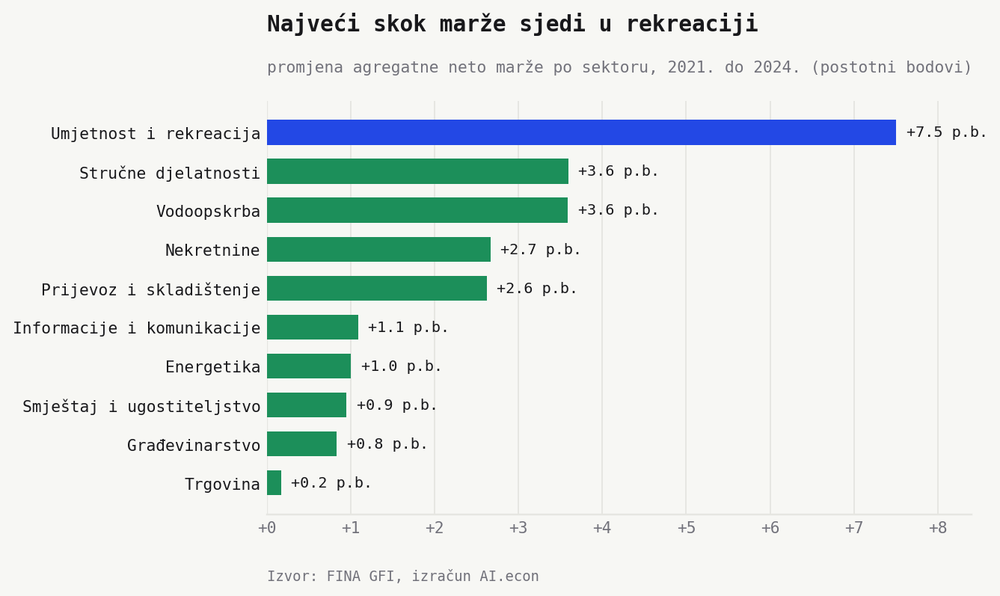
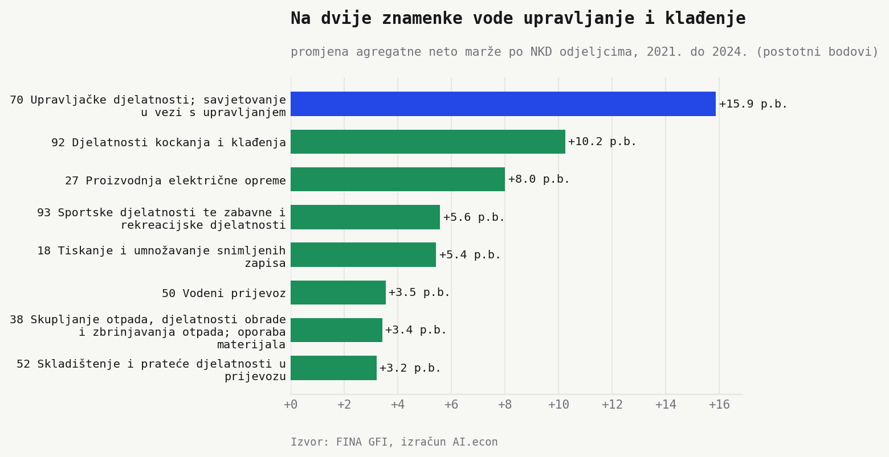
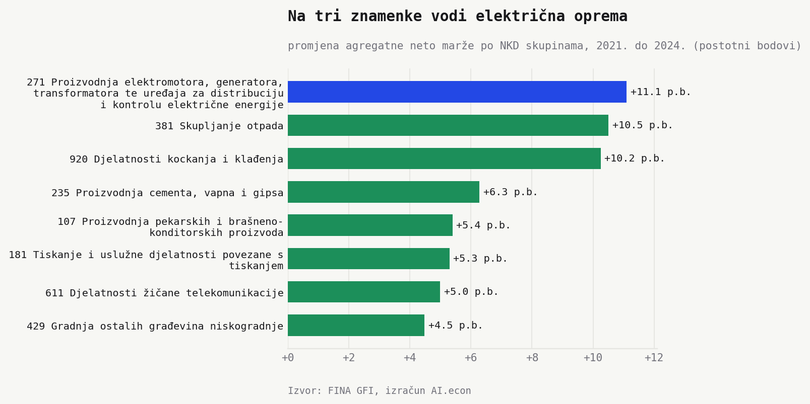
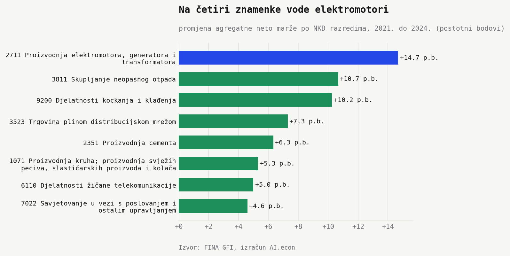
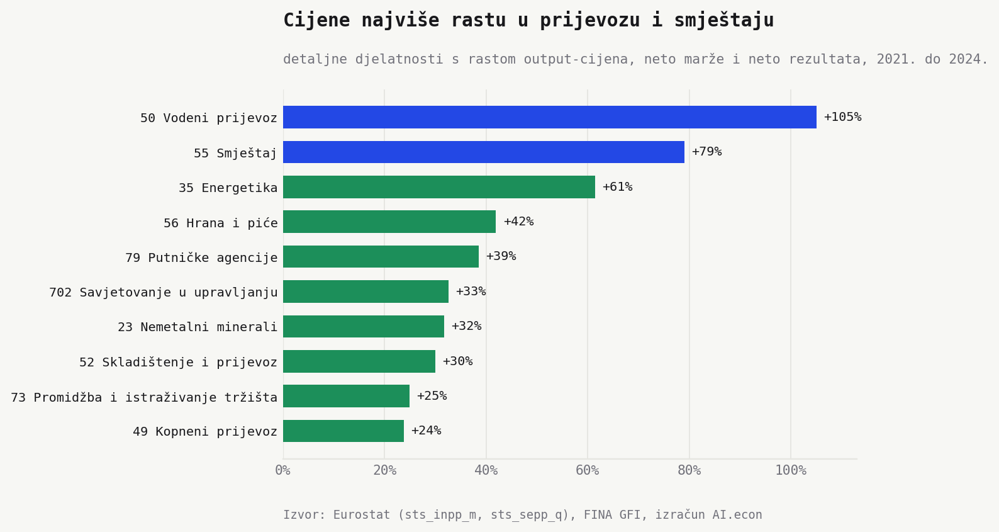

Inflacijska priča obično traži krivca u trgovini, energiji ili turizmu. GFI daje drukčiji prvi trag. Odgovorimo kroz neto maržu po sektorima, spustimo se na detaljnije NKD razine, pa na kraju ubacimo Eurostatove output-cijene.

Na najširoj razini najveći skok sjedi u umjetnosti i rekreaciji. **8,4% (2021.) → 16,0% (2024.)** (**plus 7,5 postotnih bodova**). Ispod toga slika postaje zanimljivija. Pobjednici više nisu samo sektori, nego konkretne niše.

To zadnje je važna ograda. GFI ne vidi količine, pa sam ne može reći tko je dizao cijene. Eurostat ne zatvara slučaj, ali daje bolji trag. Tražimo djelatnosti u kojima rastu output-cijene, neto marža i neto rezultat.

## Sektor kaže rekreacija

Umjetnost i rekreacija odskače od ostatka liste. Drugo mjesto dijele stručne djelatnosti i vodoopskrba, obje s oko **plus 3,6 postotnih bodova**. Nekretnine rastu **plus 2,7**, prijevoz i skladištenje **plus 2,6**.

To nije mala razlika u poretku. Prvi sektor raste dvostruko jače od drugog. Ako tražimo gdje se neto rezultat najviše odvojio od prihoda, prvi trag nije tamo gdje ga javna rasprava najčešće traži.

## Razina 2 spušta priču na upravljanje i klađenje

Na dvije znamenke pobjednik više nije rekreacija kao široki sektor. Prvo mjesto drže upravljačke djelatnosti i savjetovanje u vezi s upravljanjem. **16,9% → 32,7%** (**plus 15,9 postotnih bodova**).

Odmah iza su djelatnosti kockanja i klađenja. **13,5% → 23,8%** (**plus 10,2**). Treća je proizvodnja električne opreme. **6,0% → 14,0%** (**plus 8,0**). Agregatna rekreacija zato nije jedna priča. U njoj sjede i klađenje i sportsko-zabavne djelatnosti.

## Razine 3 i 4 vraćaju industrijske niše na vrh

Na tri znamenke vrh preuzima proizvodnja elektromotora, generatora i transformatora. **5,9% → 17,0%** (**plus 11,1 postotnih bodova**). Iza nje stoje skupljanje otpada. **minus 6,4% → 4,1%** (**plus 10,5**). Treće je kockanje i klađenje. **13,5% → 23,8%** (**plus 10,2**).

Na četiri znamenke rezultat je još konkretniji. Proizvodnja elektromotora, generatora i transformatora vodi s **6,9% → 21,6%** (**plus 14,7 postotnih bodova**). Skupljanje neopasnog otpada ide **minus 6,9% → 3,7%** (**plus 10,7**). Kockanje i klađenje ostaje treće.

## Veliki osumnjičenici nisu na vrhu

Trgovina je najveći prihodovni sektor u ovoj usporedbi, ali joj se neto marža jedva pomiče. **3,9% → 4,1%** (**plus 0,2 postotna boda**). Energetika raste **3,4% → 4,4%** (**plus 1,0**). Smještaj i ugostiteljstvo raste **6,4% → 7,3%** (**plus 0,9**).

To ne znači da ti sektori nisu važni. Znači da na ovoj mjeri nisu pobjednici. Neto marža hvata ono što ostane nakon svih prihoda i rashoda razdoblja. Ako je pitanje *tko je najviše proširio neto prostor*, odgovor nije trgovina.

## Cijene vraćaju prijevoz i smještaj u kadar

Kad se GFI spoji s Eurostatovim output-cijenama, pitanje se mijenja. Ne tražimo najveći skok marže, nego djelatnosti u kojima se pale tri signala. Cijene rastu, neto marža raste, neto rezultat raste.

Na detaljnom NKD-u najveći rast cijena među takvim kandidatima ima vodeni prijevoz. **plus 105%**. Slijede smještaj **plus 79%**, energetika **plus 61%**, hrana i piće **plus 42%** i putničke agencije **plus 39%**.

To ne dokazuje da je rast cijena završio u maržama. Ali sužava listu. Ako tražimo gdje se cjenovni val najvjerojatnije pretvorio u bolji rezultat, prvo gledamo prijevoz, smještaj, energetiku, dio turizma, savjetovanje u upravljanju i nemetalne minerale. Trgovina ni ovdje ne iskače.

Na široj sektorskoj razini rudarstvo je ekstrem. Cijene rastu **plus 39%**, a marža **plus 15,9 postotnih bodova**. Ali s manje od 1 mlrd. prihoda ostaje signal male baze. Korisno za provjeru, ne za naslov.

## Financije i rudarstvo mijenjaju tablicu, ali ne i priču

Ako se lista čita doslovno, financije i osiguranje imaju najveći skok. **30,6% → 54,1%** (**plus 23,5 postotnih bodova**). Rudarstvo također skače. **1,5% → 17,4%** (**plus 15,9**).

Zato ih ne guramo u glavni naslov. Financijski sektor nije usporediv s ostatkom gospodarstva, a rudarstvo je premali sektor za opći zaključak (manje od 1 mlrd. prihoda u 2024.). Za makro priču treba rang koji ne dobije pobjednika iz računovodstvene neusporedivosti ili male baze.

Agregatni sektor je dobar signal, ali loš kraj analize. Što je NKD sitniji, to priča manje izgleda kao opća inflacijska marža, a više kao skup specifičnih niša. Kad ubacimo cijene, dobivamo drugi sloj. Marže same guraju rekreaciju, elektromotore, otpad i klađenje. Cijene plus marže vraćaju prijevoz, smještaj i energetiku u kadar. To nije presuda, ali jest bolja lista za sljedeće pitanje.

## Napomene

- Izvor. FINA GFI, 2021. i 2024. Eurostat, tablice `sts_inpp_m` i `sts_sepp_q`, Hrvatska, 2021. i 2024.
- Mjera. Agregatna neto marža. Neto rezultat razdoblja podijeljen poslovnim prihodima, zbrojeno na razini djelatnosti.
- NKD razine. Sektor je najšira razina. Razina 2 su odjeljci, razina 3 skupine, razina 4 razredi.
- Uzorak. Sektorski rang isključuje financije i osiguranje te sektore s manje od 1 mlrd. poslovnih prihoda u 2024. Detaljni NKD grafovi isključuju financije i osiguranje te djelatnosti s manje od 500 mil. poslovnih prihoda u 2024.
- Cijene. Eurostatove output-cijene su godišnji prosjek mjesečnih industrijskih proizvođačkih cijena i kvartalnih cijena usluga proizvođača za Hrvatsku.
- Cjenovni graf. Uključuje detaljne NKD/NACE djelatnosti s najmanje 500 mil. poslovnih prihoda u 2024. i s rastom cijena, neto marže i neto rezultata.
- Oprez. Ovo je neto marža, ne EBITDA marža i ne cjenovna marža. Mjera može hvatati jednokratne stavke, poreze, gubitke i postpandemijski bazni efekt.
- Oprez. Eurostatova pokrivenost nije jednaka za sve djelatnosti. Ovo nije CPI/HICP i nije procjena količina.
- Oprez. Stupci za prihod i neto rezultat provjereni su za ovu dijagnostiku, ali treba širi audit prije jačeg kauzalnog zaključka.
- Skripte. `python/sector_margin_growth_2021_2024.py`, `python/sector_margin_growth_charts.py`, `python/price_margin_winners.py`, `python/price_margin_charts.py`.
