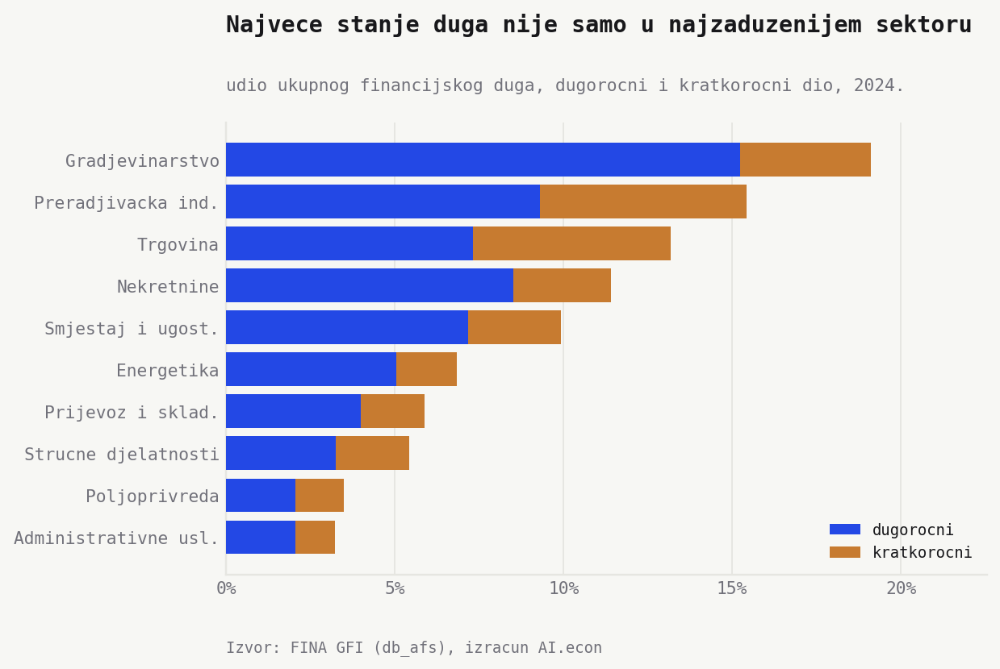
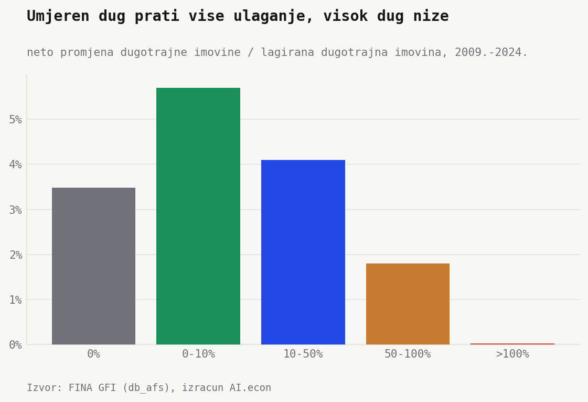
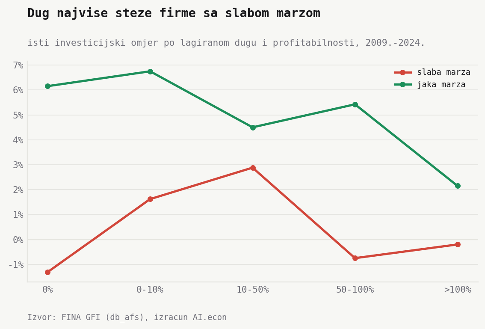

Koliko su hrvatske firme zadužene? Krenimo od dvije brojke. Tipična firma duguje malo. **6,6% prihoda (2024.)**. Sve firme zajedno, puno. **32%**. Naslov obećava 50 nijansi. Potrebno je manje da bi se razumjela zaduženost. Ovo su prve dvije.

Ta razlika otvara priču. Dug nije velik, nego koncentriran. To se očituje u nekoliko dimenzija. Veličina firme, profitabilnost, sektor, ročnost i investicije. Zadnja dimenzija je najvažnija. Dug je problem tek kad počne uzimati prostor za nove investicije.

## Tipična firma duguje malo, sve firme zajedno puno

Prva dimenzija je veličina. Sve firme zajedno duguju **37% prihoda (2008.) → 32% (2024.)**. Pad nije bio ravnomjeran. Omjer se najprije popeo do **50% (2016.)**, pa se spustio nakon 2020.

Tipična firma izgleda sasvim drukčije. **8,0% (2008.) → 6,6% (2024.)**. Ali nije svaka firma tipična. Najzaduženija četvrtina ima oko **42% (2024.)**, a kod najzaduženijih deset posto dug premašuje cijeli godišnji prihod. Zato ukupna brojka nije slika prosječne firme. Ona je slika koncentracije. Najviše duga nose najveće firme.

## Neprofitabilne firme nose najteži teret

Druga dimenzija je profitabilnost. Logika je jednostavna. Profitabilnije firme ulaganja plaćaju iz vlastite dobiti, pa im treba manje duga. Podatci to potvrđuju, ali ne posve.

Podijelimo firme u pet skupina po profitabilnosti. Kod najslabije petine tipičan dug je **60% prihoda**. U sredini pada na **~7%**, a kod najprofitabilnije petine na **0%**. Mnoge vrlo profitabilne firme uopće nemaju dug.

Pa ipak, te najprofitabilnije firme zajedno duguju **48%**. Mali broj velikih, profitabilnih firmi ima puno duga. Opet ista priča. Tipična firma nisko, sve zajedno visoko.

## Nekretnine su najzaduženije u odnosu na prihod, ali dug je raspoređen po mnogim sektorima

Treća dimenzija je sektor, i tu je stvar jasna. Sektor nekretnina nosi dug od **325% godišnjih prihoda (2024.)**. Slijede smještaj i ugostiteljstvo (**75%**) i građevinarstvo (**68%**). Administrativne usluge, stručne djelatnosti, poljoprivreda i prijevoz kreću se **39% do 45%**.

To je omjer tereta, koliko duga sektor nosi na svaki euro prihoda, a ne mjera toga gdje leži najveći dio ukupnog duga. Nekretnine po prirodi posla nose više imovine i duga u odnosu na prihod. Ali kad umjesto omjera mjerimo koliki udio ukupnog financijskog duga otpada na svaki sektor, slika se širi.

Građevinarstvo nosi **19%** ukupnog financijskog duga, prerađivačka industrija **15%**, trgovina **13%**, nekretnine **11%**, a smještaj i ugostiteljstvo **10%**. Nekretnine imaju najveći omjer tereta, ali sam dug raspoređen je široko, po običnim sektorima poput građevinarstva, industrije i trgovine, a ne nagomilan u nekretninama.

## Dug je koncentriran, ali uglavnom dugoročan

Sad znamo gdje je dug. Ali je li opasan? Dijelom ovisi o tome koliko brzo dospijeva. Ročnost ne izgleda opasno. Kratkoročni dug je oko **32% (2024.)**, gotovo isto kao 2008. Najviše je dosegao **37% (2016.)**.

To ne znači da je rizik refinanciranja malen. Znači da ga ne treba preuveličati. Većina duga knjižena je kao dugoročna obveza.

Ročnost po djelatnostima ipak dodaje nijansu. U građevinarstvu je kratkoročno oko **20%** financijskog duga, u nekretninama **26%**, u smještaju i ugostiteljstvu **28%**, a u trgovini **44%**. Trgovina zato nema ekstreman omjer duga i prihoda, ali ima veći kratki dio u velikom stanju duga.

## Ulaganja nestaju kad dug prijeđe godišnji prihod

Četvrta dimenzija su investicije. Ovdje gledamo promjenu dugotrajne imovine kroz firmu, podijeljenu dugotrajnom imovinom iz prethodne godine. Nije savršen CAPEX, ali je dobar prvi trag.

Kad firma u godinu ulazi s dugom od **0% do 10%** prihoda, agregatna neto promjena dugotrajne imovine iznosi **5,7%**. Kod duga od **10% do 50%** pada na **4,1%**. Kod **50% do 100%** pada na **1,8%**. Iznad **100%** prihoda gotovo nestaje. **0,03%**.

To nije kauzalni test. Visok dug može značiti da je investicijski ciklus već odrađen. Može značiti i da firma nema prostora za novi projekt. Ali kao dijagnostika financijske frikcije nalaz je jasan. Umjeren dug podržava investiranje. Velik dug ne.

## Dug najviše koči ulaganje kad je marža slaba

Za investicije nije važno samo *koliko duga*. Nego *koji dug, kod koje firme, uz koju zaradu*. To je *debt-overhang* logika. Dug postaje smetnja za nova ulaganja kad kreditori imaju prvo pravo na budući novac firme, a firma nema dovoljno marže da istodobno otplaćuje dug i financira novu investiciju.

 Kod firmi s jakom maržom ulaganje ostaje pozitivno u svim razredima duga. Čak i kod duga iznad godišnjeg prihoda iznosi **plus 2,2%**. Kod firmi sa slabom maržom ulaganje pada u minus. U razredu **50% do 100%** duga/prihoda ulaganje je **minus 0,7%**, a **iznad 100%** je **minus 0,2%**.

Zaključno. Dug nije loš sam po sebi. Financira imovinu, hotele, strojeve, skladišta i projekte. Problem počinje kad se dug spoji sa slabom maržom i kratkim rokom otplate. Tu se odražava prava financijska frikcija. Ne u prosječnoj firmi, nego u dijelu bilanci gdje dug već uzima prostor za nove investicije.

## Napomene

- Izvor. FINA, Godišnji financijski izvještaji (GFI), 2008. do 2024.
- Mjere. *Tipična firma* je medijan, firma u sredini. *Sve firme zajedno* je agregatni omjer, zbroj duga svih firmi podijeljen zbrojem njihovih prihoda. *Petina* znači da su firme poredane po profitabilnosti i podijeljene u pet jednakih skupina.
- Uzorak. Aktivne nefinancijske firme s pozitivnim poslovnim prihodima, iz svih djelatnosti osim financijskih. Od ~80.000 do ~142.000 firmi godišnje.
- Financijski dug. Obveze prema bankama i drugim financijskim institucijama, zajmovi, depoziti i slično. Zbrajamo dugoročni i kratkoročni dio.
- Profitabilnost. Neto marža, dobit poslovne godine podijeljena poslovnim prihodima.
- Ulaganje. Neto promjena dugotrajne imovine između dvije uzastopne firmine godine, podijeljena dugotrajnom imovinom iz prethodne godine. To nije bruto capex. Može uključiti prodaje, amortizaciju, revalorizacije i promjene u obuhvatu bilance.
- Što nije uključeno. Pokriće kamata (koliko zarada pokriva kamate) nije prikazano jer kamatni trošak još nije pouzdano izmjeren.
- Literatura.
    - Myers (1977.), [*Determinants of corporate borrowing*](https://doi.org/10.1016/0304-405X(77)90015-0), o debt-overhang problemu.
    - Myers (2001.), [*Capital Structure*](https://doi.org/10.1257/jep.15.2.81), o pecking-order motivu.
    - Martinis i Ljubaj (2017.), [*Corporate Debt Overhang in Croatia*](https://www.hnb.hr/documents/20182/1993349/w-051.pdf), HNB, o prezaduženosti hrvatskih firmi.
    - Pepur, Ćurak i Poposki (2016.), [*Corporate capital structure: the case of large Croatian companies*](https://doi.org/10.1080/1331677X.2016.1175726), o velikim firmama.
    - Šarlija i Harc (2016.), [*Capital Structure Determinants of Small and Medium Enterprises in Croatia*](https://www.fm-kp.si/en/zalozba/ISSN/1581-6311/14_251-266.pdf), o malim i srednjim poduzećima.
    - Kocabaş i Saiz (2026.), [*Navigating credit dynamics*](https://www.ecb.europa.eu/pub/pdf/scpwps/ecb.wp3173~3c6d25609d.en.pdf), ECB, o kreditnim šokovima i investicijama kroz AnaCredit.
    - Drechsel (2026.), [*Monetary policy under multiple financing constraints*](https://www.ecb.europa.eu/pub/pdf/scpwps/ecb.wp3217~e43de9be7f.en.pdf), ECB, o višestrukim financijskim ograničenjima.
- Skripte. `python/import_gfi_db_afs_codebook.py`, `python/debt_structure_build.py`, `python/debt_structure_charts.py`.
