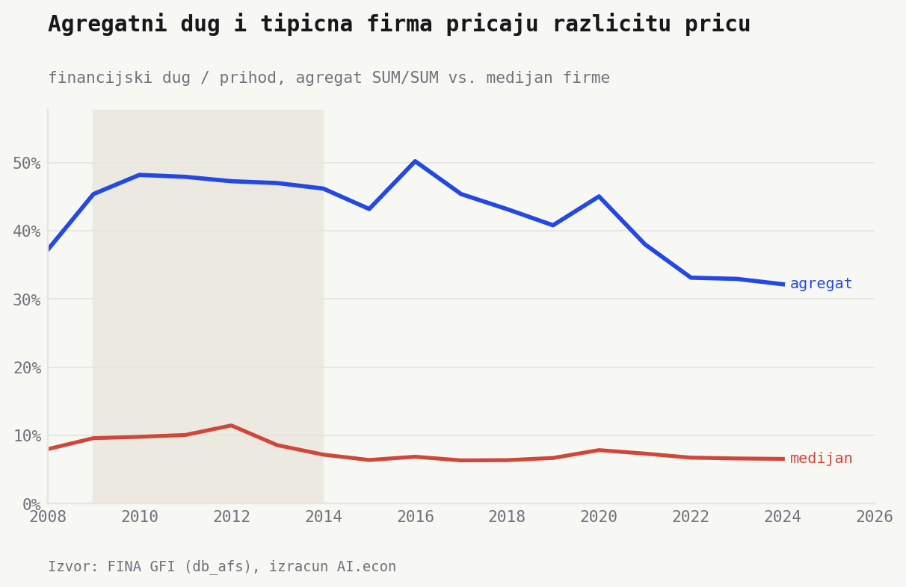
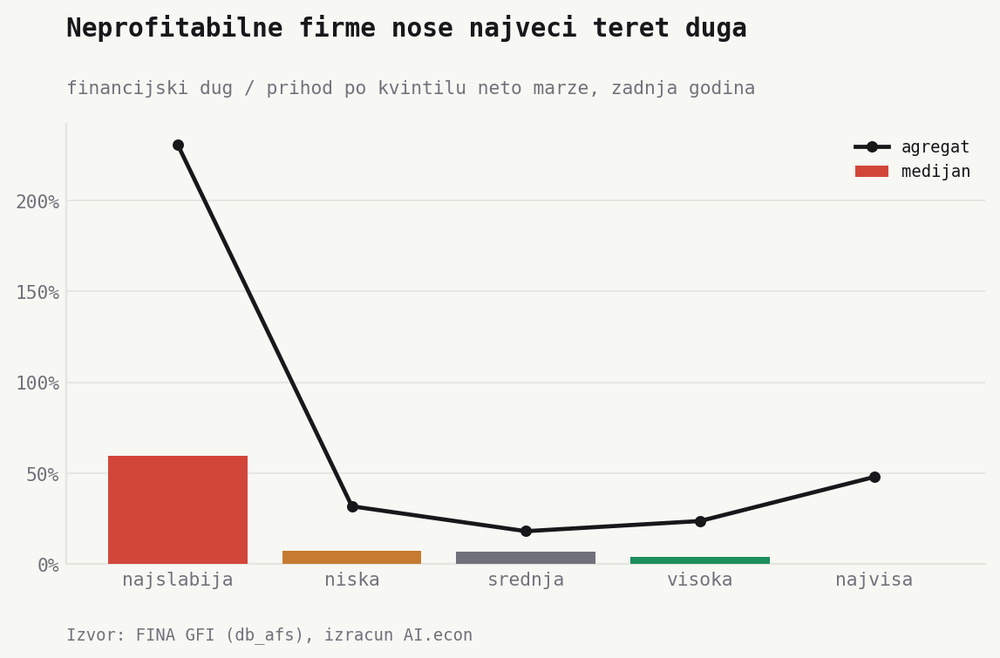
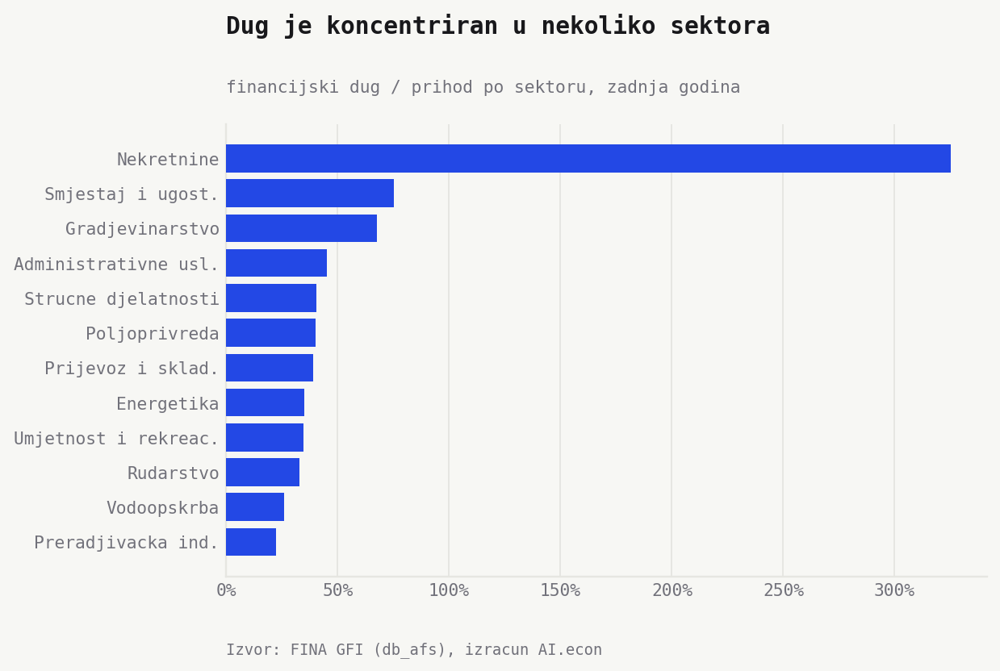
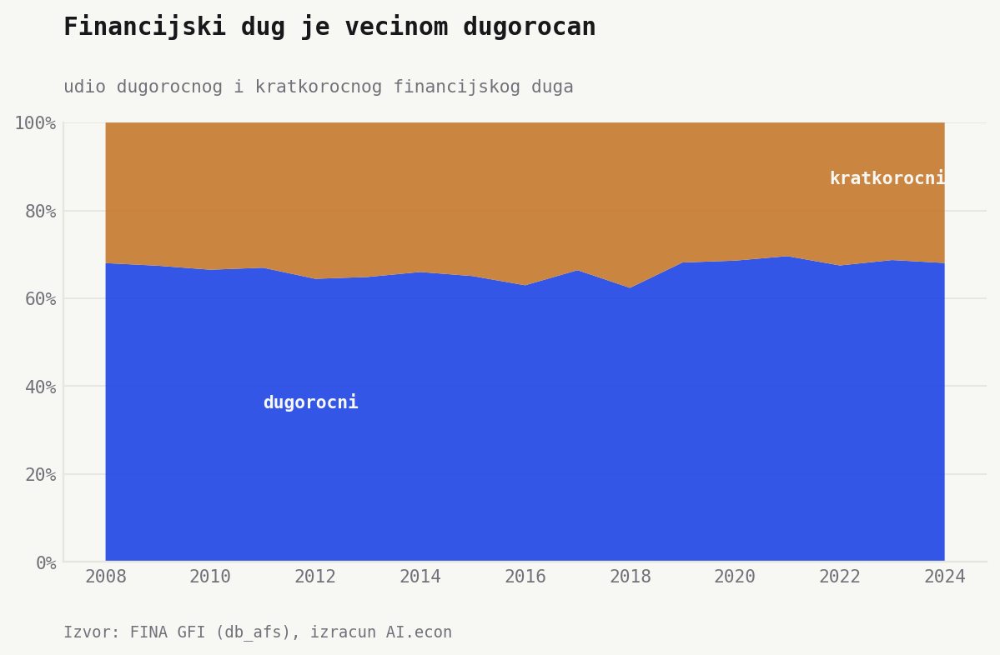

Koliko su hrvatske firme zadužene? Probajmo odgovoriti pomoću dvije brojke. (Naslov obećava pedeset, ali dovoljne su zapravo dvije.) Tipična firma duguje malo. **6,6% prihoda (2024.)**. Sve firme zajedno, puno. **32%**. Upravo je razlika između te dvije brojke odgovor na naše pitanje. Dug nije ogroman, koncentriran je. I to u tri dimenzije. Veličina firme, profitabilnost i sektor.

## Tipična firma duguje malo, sve firme zajedno puno

Prva dimenzija je veličina. Sve firme zajedno duguju **37% prihoda (2008.) → 32% (2024.)**. Pad nije bio ravnomjeran. Omjer se najprije popeo do **50% (2016.)**, pa se spustio nakon 2020.

Tipična firma izgleda sasvim drukčije. **8,0% (2008.) → 6,6% (2024.)**. Ali nije svaka firma tipična. Najzaduženija četvrtina ima oko **42% (2024.)**, a kod najzaduženijih deset posto dug premašuje cijeli godišnji prihod. Zato ukupna brojka nije slika prosječne firme. Ona je slika koncentracije. Najviše duga nose najveće firme.

## Neprofitabilne firme nose najteži teret

Druga dimenzija je profitabilnost. Logika je jednostavna. Profitabilnije firme ulaganja plaćaju iz vlastite dobiti, pa im treba manje duga. Podatci to potvrđuju, ali ne posve.

Podijelimo firme u pet skupina po profitabilnosti. Kod najslabije petine tipičan dug je **60% prihoda**. U sredini pada na **~7%**, a kod najprofitabilnije petine na **0%**. Mnoge vrlo profitabilne firme uopće nemaju dug.

Pa ipak, te najprofitabilnije firme zajedno duguju **48%**. Mali broj velikih, profitabilnih firmi ima puno duga, vjerojatno jer ima imovinu, projekte i sposobnost otplate. Opet ista priča. Tipična firma nisko, sve zajedno visoko.

## Nekretnine iskaču iz sektorske slike

Treća dimenzija je sektor, i tu je stvar jasna. Sektor nekretnina nosi dug od **325% godišnjih prihoda (2024.)**. Slijede smještaj i ugostiteljstvo (**75%**) i građevinarstvo (**68%**). Administrativne usluge, stručne djelatnosti, poljoprivreda i prijevoz kreću se **39% do 45%**.

To odražava strukturu ranjivosti. Nekretnine prirodno nose više imovine i duga prema prihodu. Turizam i građevina imaju vlastite cikluse, kolateral i sezonalnost. Ali ako zaoštre financijski uvjeti, pritisak refinanciranja prvo udara tu.

## Koncentriran, ali uglavnom dugoročan

Sad znamo gdje je dug. Ali je li opasan? Dijelom ovisi o tome koliko brzo dospijeva. Ročnost ne izgleda opasno. Kratkoročni dug je oko **32% (2024.)**, gotovo isto kao 2008. Najviše je dosegao **37% (2016.)**.

To ne znači da je rizik refinanciranja malen. Znači da ga ne treba preuveličati. Većina duga knjižena je kao dugoročna obveza.

Zaključak je čvrst. Nije svaka hrvatska firma prezadužena. Dug je koncentriran. Tipična firma je umjereno zadužena, a veličina, profitabilnost i sektor otkrivaju gdje se skriva financijska ranjivost.

## Napomene

- Izvor. FINA / GFI, MySQL tablica `db_afs`, 2008. do 2024.
- Mjere. *Tipična firma* je medijan, firma u sredini. *Sve firme zajedno* je agregatni omjer, zbroj duga podijeljen zbrojem prihoda. *Petina* znači da su firme poredane po profitabilnosti i podijeljene u pet jednakih skupina.
- Šifrarnik. Pozicije su čitane fizičkim GFI šifrarnikom `codes_gfi_db_afs_physical` (uvezen iz `financije_sifrarnik.xlsx`, sheet `cb_afs`), koji mapira fizičke `db_afs.bNNN` stupce. Stari `codes_gfi` se ne koristi za ove pozicije jer se ne poklapa s fizičkim rasporedom stupaca.
- Uzorak. Aktivne nefinancijske firme s `b110 > 0`, valjanom NKD sekcijom `A` do `S`, bez `K`. Broj firmi po godini ide od ~80.000 do ~142.000.
- Financijski dug. Dugoročno `b086 + b087`, kratkoročno `b096 + b097`. Obveze za zajmove, depozite i slično te obveze prema bankama i drugim financijskim institucijama.
- Prihod i profitabilnost. Poslovni prihodi `b110`. Neto rezultat razdoblja `b152 - b153`. Neto marža je taj rezultat podijeljen poslovnim prihodima.
- Što nije korišteno. Pokriće kamata nije prikazano jer kamatni trošak još nije posebno validiran u ovom pipelineu. Ranije korišteni `b166 + b168` nisu kamate u fizičkom šifrarniku.
- Literatura. Myers (2001) za pecking-order motiv, Martinis i Ljubaj (HNB) za hrvatski debt overhang, Pepur, Ćurak i Poposki za velike hrvatske firme, Šarlija i Harc za hrvatska mala i srednja poduzeća, IMF i ECB za dug, rizik refinanciranja i investicije.
- Skripte. `python/import_gfi_db_afs_codebook.py`, `python/debt_structure_build.py`, `python/debt_structure_charts.py`.
