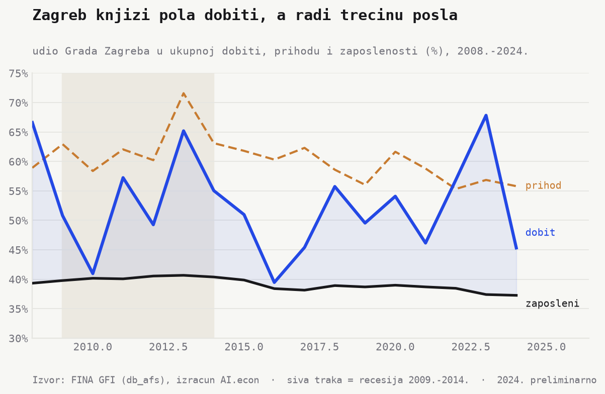
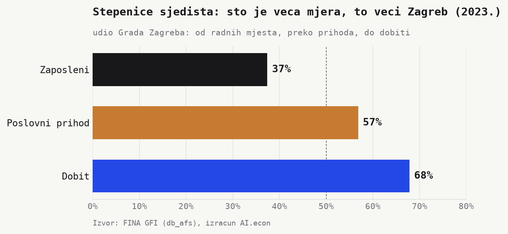

> **Nacrt za uredničku obradu.** Brojke i grafovi dolaze iz GFI baze (FINA, `db_afs`) i provjereni su.
> Mjesta označena s **[KUT]** su za tvoju interpretaciju i okvir priče.

Svi znaju da je Zagreb najveći. Iznenađenje je *koliko* je veći u dobiti nego u radu. Grad drži **37%**
radnih mjesta, ali knjiži **68%** dobiti (2023.). Profit je centraliziraniji od ljudi.

## Trećina posla, pola dobiti

Tri linije, jedna priča. Zaposlenost je ravna. Zagreb drži **oko 38%** svih radnih mjesta cijelo
razdoblje, blago padajući na **37% (2023.)**. Dobit je posve druga priča. Udio se penje i pada, ali
gotovo uvijek leži visoko iznad zaposlenosti. **Prosječno oko 55%**, s vrhovima na **66% (2008.)** i
**68% (2023.)**. U **22 od 23 godine** Zagreb knjiži veći udio dobiti nego rada.

Poslovni prihod sjeda točno između. **Oko 57% (2023.)**. Logičan redoslijed. Što je mjera bliža dnu
(profitu), to je Zagreb veći.

> **[KUT]** Je li ovo zdrava aglomeracija (sjedišta, talent, produktivnost se gomilaju u centru) ili
> efekt knjiženja koji prikriva da se vrijednost stvara drugdje. Ovdje treba tvoj sud.

## Stepenice sjedišta

Ista godina, tri broja. Zaposleni **37%**. Prihod **57%**. Dobit **68%**. Svaka stepenica naviše vodi
prema sjedištu. Na svako radno mjesto Zagreb knjiži **1,8 puta** više dobiti od prosjeka zemlje.

*Efekt sjedišta.* Banke, telekomi i trgovački lanci posluju po cijeloj zemlji. Dobit knjiže u Zagrebu.

## Nisu samo banke

Prva sumnja pada na financije. Pogrešna. Izbacimo li banke i osiguranja (NKD K), brojka se gotovo ne
mijenja. Udio dobiti **67,8% → 67,8%**, udio zaposlenih **37,4% → 37,1%** (2023.). Koncentracija nije
bankarski artefakt. Drže je telekomi, energetika, trgovački i turistički divovi sa sjedištem u Zagrebu.

> **[KUT — glavna interpretacija]** Što ovo znači za poreznu bazu, regionalni razvoj i ovisnost ostatka
> zemlje o jednom gradu. Curi li fiskalni i razvojni kapacitet prema centru brže nego sama radna mjesta.

## Napomene

- Izvor. GFI baza, tablica `db_afs`, jedan redak po firmi i godini, 2002. do 2024.
- Geografija. `countyid` (popunjen u 100% redaka), Grad Zagreb je šifra 21, preko `ref_county`.
- Udio. Zbroj za Zagreb podijeljen sa zbrojem za RH, posebno za svaku mjeru i godinu. Udjeli su omjeri
  unutar iste godine, pa su neovisni o prijelazu HRK→EUR 2023. i o deflatoru.
- Dobit. Neto rezultat po firmi = `COALESCE(b184, b197) − COALESCE(b185, b198)`, kako ga računa i
  službeni pogled `vw_db_afs_financial_subject_year`. Polje `b183` se **ne koristi** (mrtvo, popunjeno
  u tek ~1% redaka). Mjera je *pozitivni profitni bazen*. Zbroj dobiti firmi koje su je ostvarile.
- Zaposleni. `employeecounteop` (kraj razdoblja). Prihod. Poslovni prihod `b125`.
- Koncentracija. Udio u dobiti podijeljen udjelom u zaposlenosti. Veće od 1 znači više dobiti po radniku.
- Oprez. Brojka mjeri mjesto **knjiženja** dobiti (sjedište), ne mjesto **stvaranja** vrijednosti.
  Profitni bazen je hlapljiv iz godine u godinu (jednokratne revalorizacije kod divova), pa nosi priču
  trajni *jaz*, ne jedna vršna godina. 2024. je preliminarna (veliki zagrebački obveznici prijavljuju
  kasno, što obara njihov udio dobiti na ~45%). Rani podaci (prije 2008.) su rjeđi i bučniji.

*Izvor. FINA, Godišnji financijski izvještaji (`db_afs`). Izračun. AI.econ.
Skripte. `python/zagreb_profit_build.py`, `python/zagreb_profit_charts.py`.*
