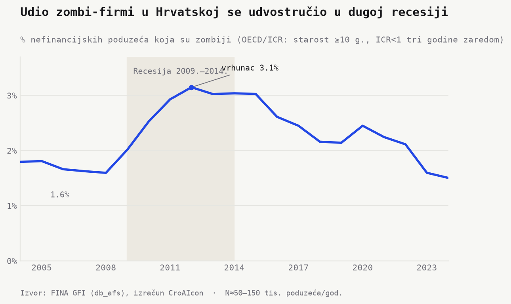
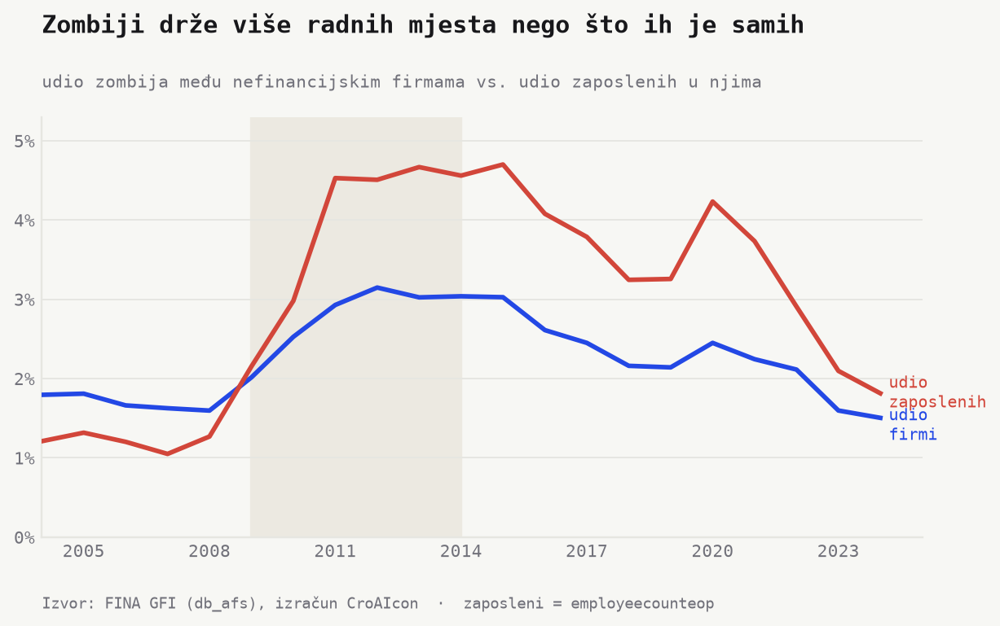
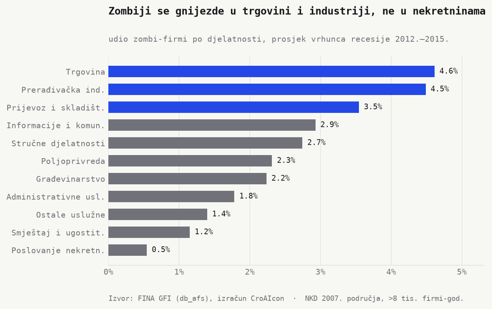

> **Nacrt za uredničku obradu.** Brojke i grafovi dolaze iz GFI baze (FINA, `db_afs`) i provjereni su. Mjesta označena s **[KUT]** su za tvoju interpretaciju i okvir priče.

**Zombi-firme** — zrela poduzeća koja godinama ne zarađuju dovoljno ni za pokriće
kamata, a ipak opstaju — u središtu su makrofinancijskih istraživanja od japanskog
"izgubljenog desetljeća". Drže kapital, rad i kredit koji bi inače otišao zdravim
firmama, pa koče rast produktivnosti. Pitanje za Hrvatsku: je li njezina neobično
duga recesija (šest godina kontrakcije, 2009.–2014.) ostavila iza sebe val zombija?

Izračunali smo udio zombija po **OECD/ICR** definiciji: firma starija od 10 godina
koja tri godine zaredom ne pokriva kamate iz poslovne dobiti (ICR < 1), na cijeloj
populaciji nefinancijskih poduzeća 2004.–2024.

## Udvostručenje u recesiji

Udio zombija skočio je s **1,6 % uoči krize (2008.)** na **vrhunac od 3,1 % (2012.)** —
praktički udvostručenje — i ostao iznad 3 % sve do 2015. Tek nakon dugog oporavka,
te uz rast kamata nakon 2022., vraća se na **1,5 % (2024.)**, ispod pretkrizne razine.

> **[KUT]** Klasičan nalaz: u dugim recesijama izostaje "čišćenje" (cleansing effect)
> jer banke radije obnavljaju nego priznaju gubitke. Je li to hrvatska priča —
> ili je glavni pokretač nešto drugo (NPL-ovi, stečajno zakonodavstvo)?

## Zombiji drže više radnih mjesta nego firmi

Zombiji nisu samo sitne firme. Na vrhuncu su činili ~3 % poduzeća, ali su u njima
radila gotovo **5 % svih zaposlenih** (2013.–2015.) — dakle vežu nesrazmjerno mnogo
radnih mjesta. To je kanal kroz koji "živi mrtvaci" zadržavaju radnu snagu dalje od
produktivnijih poslodavaca.

> **[KUT]** Vrijedi li naglasiti da je riječ o ~svakom dvadesetom radnom mjestu na vrhuncu?

## Gdje se kriju — i gdje ne

Iznenađenje: recesijski zombiji gnijezde se u **trgovini (4,6 %)** i
**prerađivačkoj industriji (4,5 %)**, a ne u građevini (2,2 %) ni — najmanje od svih —
u poslovanju nekretninama (0,5 %). Vjerojatno objašnjenje: hrvatski građevinski i
nekretninski balon *pukao je ranije* (stečajevi 2009.–2011.), pa su preživjeli do
2012.–2015. izgledali zdravije, dok je teret "živih mrtvaca" ostao u realnom sektoru.

> **[KUT]** Ovo je dobar most prema sljedećem tekstu (sektorska karta) — istaknuti ili ostaviti za kasnije?

## Što ovo znači

> **[KUT — glavna interpretacija]** Npr.: zašto je važno (produktivnost, alokacija
> kredita), što govori o (ne)učinkovitosti čišćenja, i je li povratak na 1,5 %
> stvarno čišćenje ili posljedica još nepotpunih podataka za 2023.–2024.

## Metoda i ograničenja

- **Definicija (OECD/ICR):** starost ≥ 10 g. **i** ICR = poslovna dobit / kamatni
  rashod < 1 tri godine zaredom. ICR = (`b125` − `b131`) / (`b166` + `b168`).
- **Uzorak:** sva nefinancijska poduzeća iz `db_afs`, isključene financije (NKD K) i
  komunalije (D, E); starost preko spoja na registar (`subjekti`, podudaranje **91,7 %**).
- **Robusnost:** ICR je omjer pa je neovisan o prijelazu HRK→EUR 2023.
- **Ograničenja:** dob nedostaje za ~8 % firmi; 2023.–2024. mogu se još revidirati
  kako pristižu izvještaji; OECD/ICR je samo jedna od pet definicija (usporedba slijedi
  u zasebnom tekstu).

*Izvor: FINA, Godišnji financijski izvještaji (`db_afs`). Izračun: CroAIcon.
Skripte: `python/zombie_topic1_build.py`, `python/zombie_topic1_charts.py`.*
