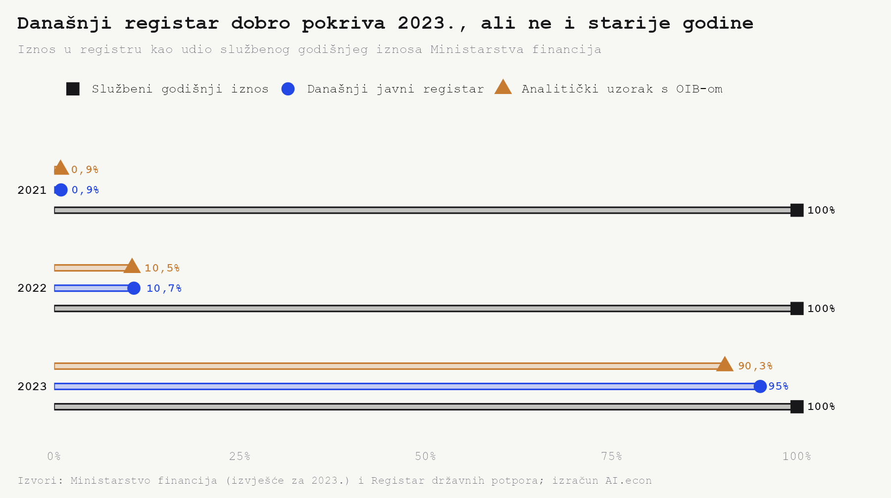
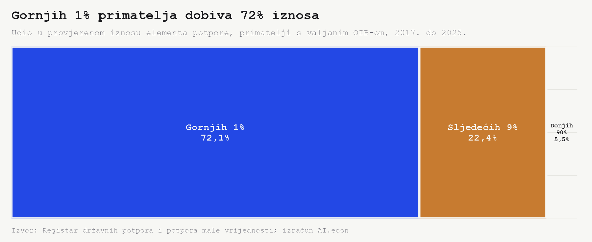
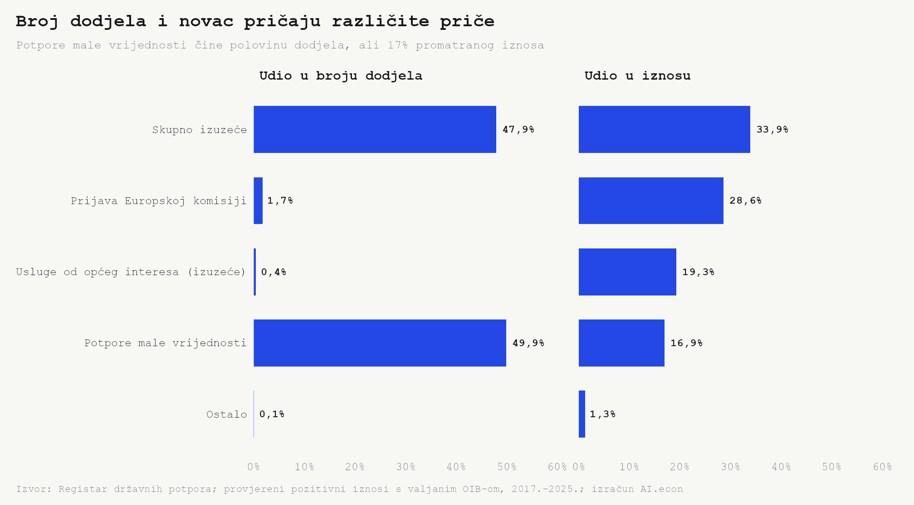
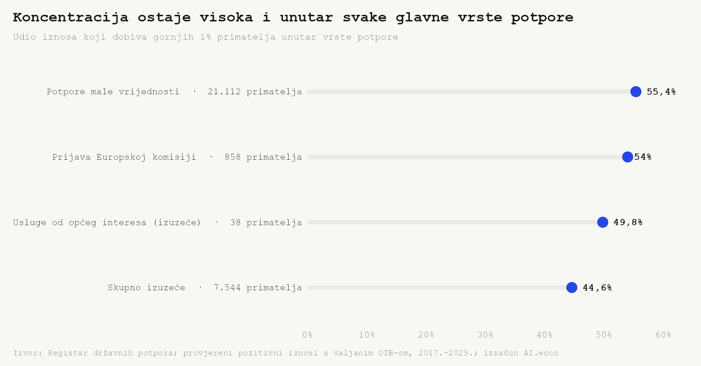
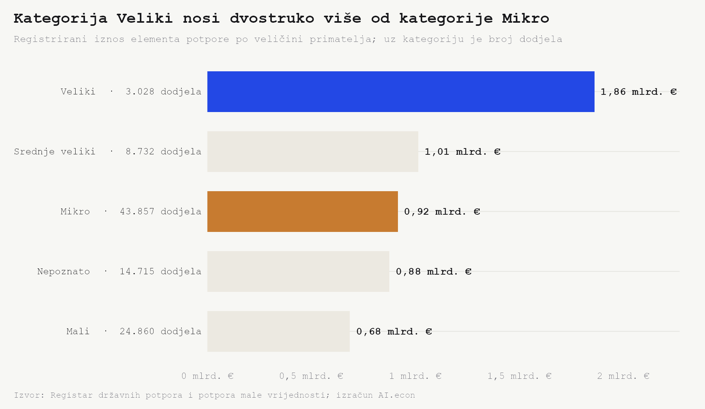
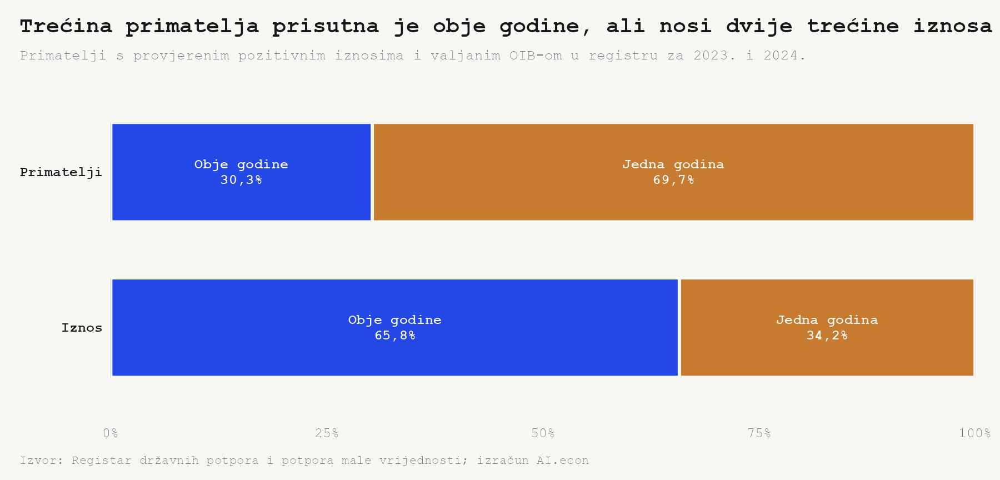

```{python}
#| label: load-state-aid-facts
from pathlib import Path
import json
import pandas as pd


def project_root():
    current = Path.cwd().resolve()
    for candidate in [current, *current.parents]:
        if (candidate / "_quarto.yml").exists() and (candidate / "outputs").exists():
            return candidate
    raise RuntimeError("Ne mogu pronaći korijen projekta.")


def hr_number(value, digits=0):
    raw = f"{float(value):,.{digits}f}"
    return raw.replace(",", "X").replace(".", ",").replace("X", ".")


def hr_pct(value, digits=1):
    return f"{hr_number(value, digits)}%"


def eur_billion(value, digits=2):
    return f"{hr_number(float(value) / 1_000_000_000, digits)} mlrd. eura"


def eur_million(value, digits=2):
    return f"{hr_number(float(value) / 1_000_000, digits)} mil. eura"


root = project_root()
facts = json.loads(
    (root / "outputs" / "facts" / "state_aid_concentration.json").read_text(
        encoding="utf-8"
    )
)
groups = pd.read_csv(root / "outputs" / "tables" / "state_aid_concentration_groups.csv")
aid_types = pd.read_csv(root / "outputs" / "tables" / "state_aid_concentration_by_type.csv")
within_types = pd.read_csv(
    root / "outputs" / "tables" / "state_aid_concentration_within_type.csv"
)
recurrence = pd.read_csv(
    root / "outputs" / "tables" / "state_aid_recipient_recurrence_2023_2024.csv"
)
sizes = pd.read_csv(root / "outputs" / "tables" / "state_aid_concentration_by_size.csv")
aid_types["award_share_pct"] = aid_types["award_count"] / aid_types["award_count"].sum() * 100


def group(name):
    return groups.loc[groups["group"] == name].iloc[0]


def aid_type(starts_with):
    return aid_types.loc[aid_types["aid_type"].str.startswith(starts_with)].iloc[0]


def within_type(starts_with):
    return within_types.loc[within_types["aid_type"].str.startswith(starts_with)].iloc[0]


def recurrence_group(name):
    return recurrence.loc[recurrence["recurrence_group"] == name].iloc[0]


top_one = group("Gornjih 1%")
next_nine = group("Sljedećih 9%")
bottom_ninety = group("Donjih 90%")
de_minimis = aid_type("Program / pojedinačna potpora male vrijednosti")
ec_notification = aid_type(
    "Program / pojedinačna državne potpora za koju postoji obveza prijave"
)
sgei_exempt = aid_type(
    "Program / pojedinačna državne potpora za obavljanje usluga od općeg gospodarskog interesa izuzetog"
)
unknown_size = sizes.loc[sizes["company_size"] == "Nepoznato"].iloc[0]
one_year = recurrence_group("Jedna godina")
both_years = recurrence_group("Obje godine")
major_within_types = within_types.loc[within_types["amount_share_pct"] >= 10]
major_type_amount_share = major_within_types["amount_share_pct"].sum()
```

Koliko su državne potpore u Hrvatskoj doista raspršene među primateljima? Naizgled jednostavno pitanje prvo traži provjeru podataka. [Godišnje izvješće Ministarstva financija za 2023.](https://mfin.gov.hr/UserDocsImages/dokumenti/koncesije-dp/izvjesca/Godi%C5%A1nje%20izvje%C5%A1%C4%87e%20o%20dr%C5%BEavnim%20potporama%202023.pdf) navodi `{python} eur_billion(facts["coverage_2023_official_amount_eur"])` potpora. Današnja snimka javnog registra za istu godinu sadrži `{python} eur_billion(facts["coverage_2023_registry_amount_all_eur"])`, odnosno `{python} hr_pct(facts["coverage_2023_registry_to_official_pct"])` službenog iznosa.

Za raspodjelu po primateljima potreban je valjani OIB. U tom užem analitičkom obuhvatu za 2023. ostaje `{python} eur_billion(facts["coverage_2023_analytical_amount_eur"])`, ili `{python} hr_pct(facts["coverage_2023_analytical_to_official_pct"])` službenog iznosa. Odgovorimo stoga na preciznije pitanje. Kako je raspoređen novac u zapisima koje današnji registar omogućuje pouzdano povezati s primateljima, koliko rezultat ovisi o vrsti potpore i ponavljaju li se isti primatelji?

## Prije raspodjele treba provjeriti obuhvat



Za 2023. javni registar reproducira gotovo cijeli službeni iznos. Za 2022. reproducira `{python} hr_pct(facts["coverage_2022_registry_to_official_pct"])`, a za 2021. samo `{python} hr_pct(facts["coverage_2021_registry_to_official_pct"])`. Razlika nije mala statistička pogreška, nego promjena obuhvata za dva reda veličine.

Iz toga ne slijedi da starije potpore nikada nisu bile unesene. Slijedi samo da ih današnja javna snimka ne sadrži u opsegu na kojem je Ministarstvo temeljilo službeno izvješće. Zbroj zapisa od 2017. do 2025. zato nije hrvatski ukupni račun potpora za devet godina. On je analitički uzorak za proučavanje raspodjele unutar danas vidljivog dijela registra.

## Gornjih 1% primatelja nosi gotovo tri četvrtine iznosa



U promatranom skupu ostaje `{python} hr_number(facts["award_count_oib"])` dodjela, `{python} hr_number(facts["recipient_count"])` primatelja i `{python} eur_billion(facts["amount_eur"])`. Gornjih `{python} hr_number(facts["top_1_recipient_count"])` primatelja zajedno nosi `{python} eur_billion(facts["top_1_amount_eur"])`, odnosno **`{python} hr_pct(facts["top_1_amount_share_pct"])`** iznosa.

Sljedećih 9% primatelja dobiva još **`{python} hr_pct(next_nine["amount_share_pct"])`**. Donjih 90% dijeli preostalih **`{python} hr_pct(bottom_ninety["amount_share_pct"])`**, ili `{python} eur_million(bottom_ninety["amount_eur"])`. Drugim riječima, gornjih 10% prima `{python} hr_pct(facts["top_10pct_share_pct"])` iznosa.

Koncentracija postoji i unutar samog vrha. Deset najvećih primatelja nosi **`{python} hr_pct(facts["top_10_entities_share_pct"])`**, dok medijalni kumulativni iznos po primatelju iznosi `{python} hr_number(facts["median_recipient_amount_eur"])` eura. Ginijev koeficijent raspodjele iznosi `{python} hr_number(facts["gini"], 3)`, vrlo blizu gornjoj granici od 1. Ovdje nije riječ o maloj asimetriji, nego o raspodjeli u kojoj ukupni iznos određuje relativno uzak vrh.

<!-- [KUT] Treba li glavnu interpretaciju usmjeriti prema transparentnosti najvećih shema ili prema razlici između broja korisnika i raspodjele iznosa? -->

## Broj dodjela i iznos mjere različite dijelove sustava



Potpore male vrijednosti čine `{python} hr_pct(de_minimis["award_share_pct"])` svih promatranih dodjela, ali `{python} hr_pct(de_minimis["amount_share_pct"])` iznosa. Nasuprot tome, potpore za koje postoji obveza prijave Europskoj komisiji čine samo `{python} hr_pct(ec_notification["award_share_pct"])` dodjela i čak `{python} hr_pct(ec_notification["amount_share_pct"])` iznosa.

Razlika je još izraženija kod usluga od općeg gospodarskog interesa izuzetih od prijave Komisiji. Njihovih `{python} hr_number(sgei_exempt["award_count"])` dodjela predstavlja `{python} hr_pct(sgei_exempt["award_share_pct"])` broja, ali `{python} hr_pct(sgei_exempt["amount_share_pct"])` iznosa. Sam broj dodjela zato sustav prikazuje kao mnoštvo malih intervencija. Iznos pokazuje da nekoliko regulatornih kategorija nosi najveći dio novca.

## Koncentracija nije samo posljedica miješanja različitih programa



Četiri glavne vrste zajedno nose `{python} hr_pct(major_type_amount_share)` promatranog iznosa. U svakoj od njih gornjih 1% primatelja nosi između **`{python} hr_pct(major_within_types["top_1_amount_share_pct"].min())`** i **`{python} hr_pct(major_within_types["top_1_amount_share_pct"].max())`** iznosa unutar vlastite kategorije. Kod skupnog izuzeća udio iznosi `{python} hr_pct(within_type("Program / pojedinačna državne potpora obuhvaćena skupnim izuzećem")["top_1_amount_share_pct"])`; kod potpora male vrijednosti `{python} hr_pct(within_type("Program / pojedinačna potpora male vrijednosti")["top_1_amount_share_pct"])`.

To je važan test. Ukupna koncentracija nije samo statistička posljedica toga što su u istoj tablici spojene sitne *de minimis* potpore i veliki pojedinačni programi. Visoka koncentracija ostaje vidljiva i kada se primatelji usporede unutar iste vrste potpore. Za kategoriju usluga od općeg gospodarskog interesa pritom postoji samo `{python} hr_number(sgei_exempt["recipient_count"])` primatelja, pa se gornjih 1% nužno zaokružuje na jednog primatelja.

## Veliki primatelji dobivaju više kroz mnogo manje dodjela



Dodjele označene kategorijom *Veliki* nose `{python} eur_billion(facts["large_amount_eur"])`, a dodjele mikroprimateljima `{python} eur_billion(facts["micro_amount_eur"])`. Veliki primatelji taj iznos ostvaruju kroz `{python} hr_number(facts["large_award_count"])` dodjela. Mikroprimatelji ih imaju `{python} hr_number(facts["micro_award_count"])`, odnosno `{python} hr_number(facts["micro_award_count"] / facts["large_award_count"], 1)` na svaku dodjelu velikom primatelju.

Prosječna dodjela u kategoriji *Veliki* iznosi `{python} hr_number(facts["large_average_award_eur"] / 1_000, 0)` tisuća eura. U kategoriji *Mikro* iznosi `{python} hr_number(facts["micro_average_award_eur"] / 1_000, 0)` tisuća. Omjer je **`{python} hr_number(facts["large_to_micro_average_award_ratio"], 1)` puta**. Međutim, kategorija veličine nije poznata za sve dodjele, pa ovaj rez treba čitati zajedno s ograničenjem u *Napomenama*.

## Primatelji koji se ponavljaju nose dvije trećine iznosa



Za provjeru ponavljanja koristimo uži prozor 2023. i 2024. Među primateljima vidljivima u barem jednoj od te dvije godine, njih `{python} hr_number(both_years["recipient_count"])` pojavljuje se u obje. To je `{python} hr_pct(both_years["recipient_share_pct"])` primatelja, ali na njih otpada **`{python} hr_pct(both_years["amount_share_pct"])`** iznosa.

Primatelji prisutni samo u jednoj godini prosječno nose `{python} hr_number(one_year["average_amount_per_recipient_eur"] / 1_000, 0)` tisuća eura. Oni prisutni u obje godine nose `{python} hr_number(both_years["average_amount_per_recipient_eur"] / 1_000, 0)` tisuća, ili `{python} hr_number(both_years["average_amount_per_recipient_eur"] / one_year["average_amount_per_recipient_eur"], 1)` puta više po primatelju. Ponavljanje može nastati zbog višegodišnjih programa, redovitih naknada za javne usluge ili novih dodjela istim poduzećima. Bez povezivanja s konkretnim programom ne može se utvrditi koji mehanizam prevladava.

## Koncentracija potpore nije isto što i učinak potpore

Dobiveni rezultat opisuje raspodjelu javne intervencije. Ne mjeri tržišnu moć primatelja, produktivnost ni opravdanost programa. To su odvojena pitanja. Buts i Jegers na uzorku belgijskih industrija nalaze da su veće subvencije povezane s višom industrijskom koncentracijom, ali njihov [rad](https://researchportal.vub.be/en/publications/a-note-on-state-aid-and-concentration/) koristi tržišni HHI, a ne koncentraciju iznosa potpora među primateljima kao ovdje.

Noviji [rad MMF-a o europskim poduzećima](https://www.imf.org/-/media/files/publications/wp/2024/english/wpiea2024250-print-pdf.pdf) nalazi kratkoročni rast zaposlenosti i prihoda kod primatelja, bez jasnog učinka na ulaganja i produktivnost, uz negativne učinke na konkurente. Rezultat se ne može izravno preslikati na hrvatski registar, ali pokazuje zašto velik registrirani iznos nije dovoljan dokaz uspješnosti. U hrvatskoj literaturi još su Kesner-Škreb, Pleše i Mikić u [analizi za 2001.](https://hrcak.srce.hr/5779) naglašavale razliku između sektorskih i horizontalnih potpora te potrebu za većom transparentnošću.

Ova analiza zato ne završava tvrdnjom da je koncentracija sama po sebi loša. Zaključak je uži i operativniji. Broj korisnika prikriva raspodjelu iznosa, a ista se koncentracija pojavljuje unutar glavnih vrsta potpora i među primateljima koji se ponavljaju. Sljedeći korak treba biti analiza najvećih programa prema cilju, pravnoj osnovi i rezultatu primatelja. Tek tada se može prijeći s pitanja *tko dobiva* na pitanje *što je potpora proizvela*.

<!-- [KUT] Završetak se može dodatno usmjeriti prema evaluaciji učinka ili prema transparentnosti najvećih programa. -->

## Napomene

- Izvor. [Registar državnih potpora i potpora male vrijednosti](https://rdp.gov.hr/javno), snimka dovršena `{python} facts["source_snapshot_completed_at"]`. Službeni godišnji iznosi preuzeti su iz [izvješća Ministarstva financija za 2023.](https://mfin.gov.hr/UserDocsImages/dokumenti/koncesije-dp/izvjesca/Godi%C5%A1nje%20izvje%C5%A1%C4%87e%20o%20dr%C5%BEavnim%20potporama%202023.pdf), str. 14.
- Tablica i stupci. `odvjet12_znalac.state_aid_awards`; `recipient_oib`, `awarded_at`, `gross_amount_eur`, `verification_status`, `company_size` i `aid_type`.
- Obuhvat. Uključene su dodjele od 2017. do 2025. sa statusom `Ispravan` i pozitivnim `gross_amount_eur`. Analize primatelja koriste valjane jedanaesteroznamenkaste OIB-e i obuhvaćaju `{python} hr_number(facts["included_awards_valid_oib"])` od `{python} hr_number(facts["included_awards_all"])` uključenih dodjela. Današnja snimka za 2021. i 2022. ne reproducira službene godišnje iznose, pa agregat 2017.–2025. nije potpuna nacionalna vremenska serija.
- Iznos. `gross_amount_eur` odgovara javnom polju *Iznos elementa potpore – EUR*. Nije nužno jednak proračunskoj isplati niti predstavlja mjeru učinka.
- Provjera. Retci sa statusom `Upozorenje` nisu uključeni. Najveći pozitivan zapis među njima iznosi `{python} eur_billion(facts["excluded_warning_max_eur"])` i njegovo bi uključivanje poništilo smisao usporedbe.
- Koncentracija po vrsti. Gornjih 1% zaokružuje se na najmanje jednog primatelja. Četiri prikazane vrste pojedinačno nose najmanje 10% promatranog iznosa.
- Ponavljanje. Primatelj je *prisutan obje godine* ako ima barem jednu uključenu dodjelu i 2023. i 2024. Rezultat opisuje kontinuitet u današnjoj snimci, ne trajanje pojedinog programa.
- Veličina. `company_size` se odnosi na pojedinu dodjelu i može se mijenjati kroz vrijeme. Za `{python} hr_number(unknown_size["award_count"])` dodjela veličina nije poznata, a njihov iznos doseže `{python} eur_billion(unknown_size["amount_eur"])`.
- Reproducibilnost. Izračuni su u `python/state_aid_concentration_build.py`, grafikoni u `R/state_aid_concentration_charts.R`, a službeni referentni niz u `data/reference/mfin_state_aid_official_totals_2021_2023.csv`. Agregati su spremljeni u `outputs/facts/` i `outputs/tables/`.
