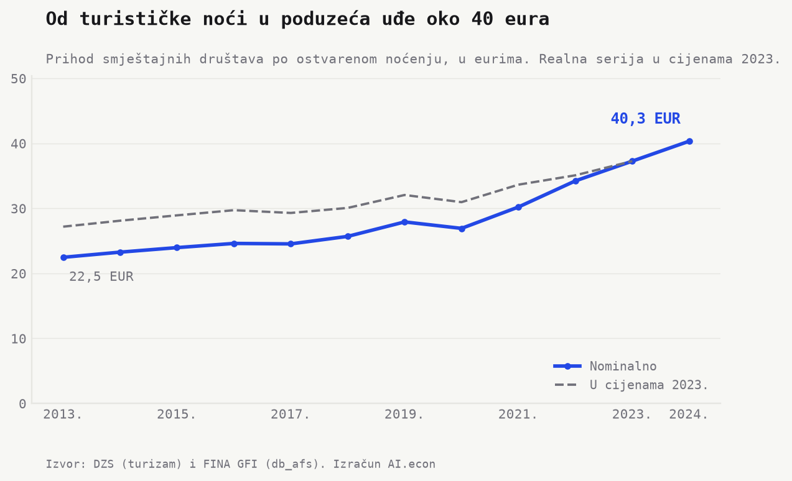
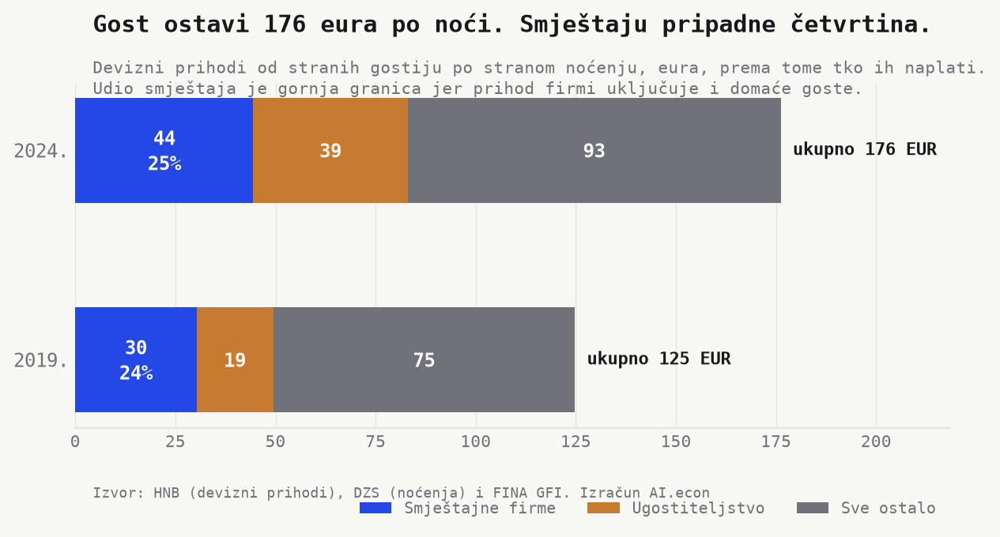
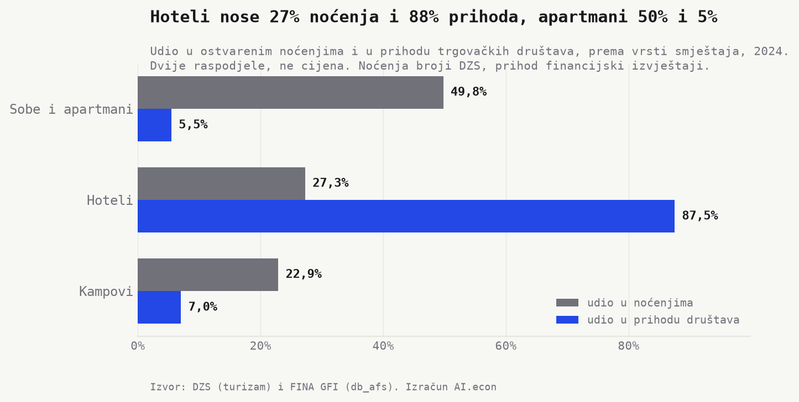
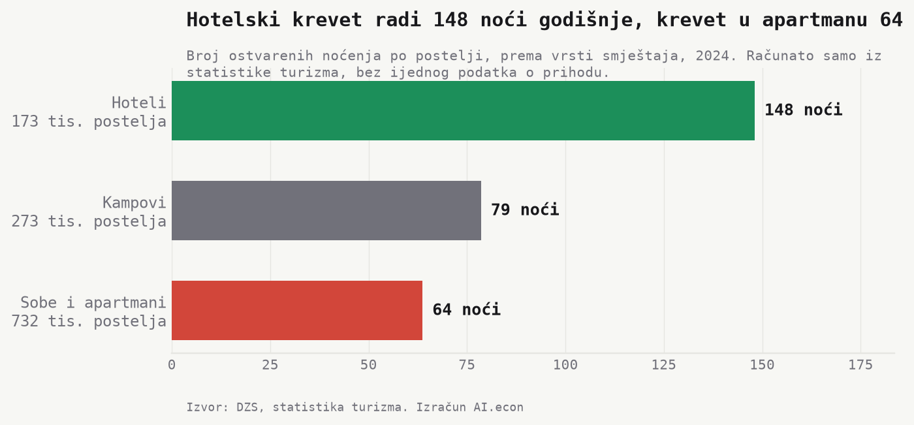
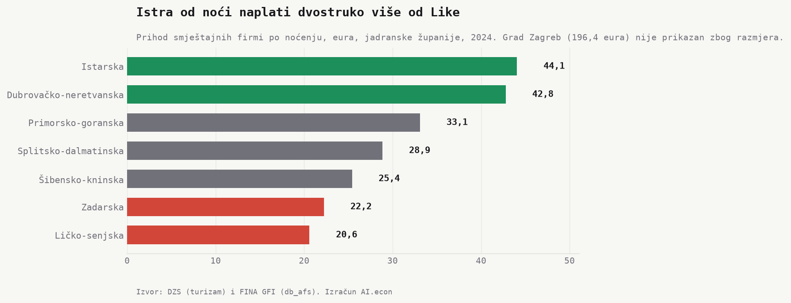
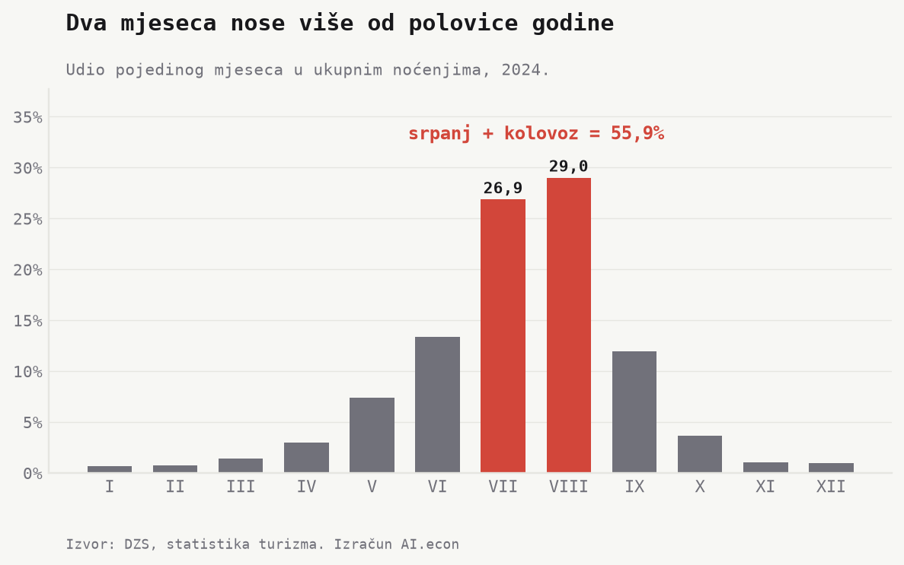
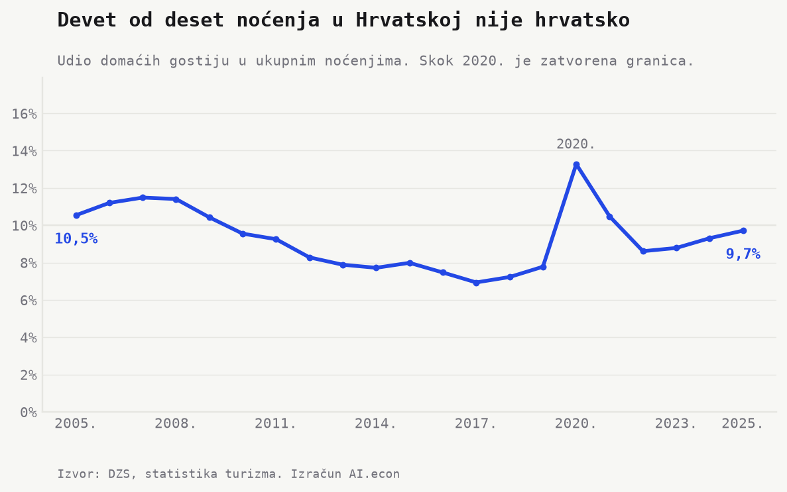
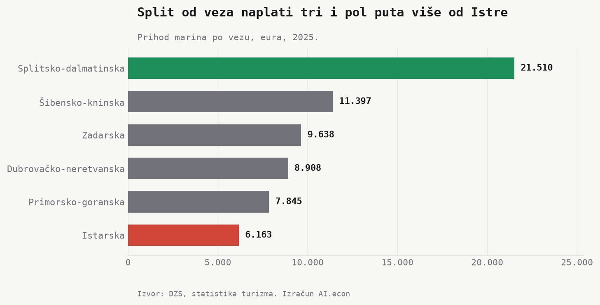

```{python}
#| label: load-tourism-facts
import json
from pathlib import Path

import pandas as pd


def project_root() -> Path:
    path = Path.cwd().resolve()
    for candidate in [path, *path.parents]:
        if (candidate / "_quarto.yml").exists() and (candidate / "outputs").exists():
            return candidate
    raise RuntimeError("Cannot locate project root.")


root = project_root()
facts = json.loads(
    (root / "outputs" / "facts" / "tourism_value.json").read_text(encoding="utf-8")
)
models = pd.read_csv(
    root / "outputs" / "tables" / "tourism_value_by_model.csv", encoding="utf-8-sig"
)


def hr_number(value, digits=0):
    raw = f"{float(value):,.{digits}f}"
    return raw.replace(",", "X").replace(".", ",").replace("X", ".")


def hr_pct(value, digits=1):
    return f"{hr_number(value, digits)}%"


def eur(value, digits=1):
    return f"{hr_number(value, digits)} eura"


def eur_billion(value, digits=2):
    return f"{hr_number(float(value) / 1_000_000_000, digits)} milijarde eura"


def eur_million(value, digits=0):
    return f"{hr_number(float(value) / 1_000_000, digits)} milijuna eura"


def millions(value, digits=1):
    return hr_number(float(value) / 1_000_000, digits)


def year(value):
    """A year takes no thousands separator. hr_number would render 2025 as 2.025."""
    return f"{int(value)}."
```

Hrvatska je 2024. izbrojila `{python} millions(facts["nights_last_year"])` milijuna noćenja. Brojka je točna do zadnje znamenke i objavljena je po mjesecima, po županijama, po općinama, po otocima i po naseljima.

Koliko je jedna od tih noći vrijedila, ne piše nigdje. Vrijednost turizma mjeri se, ali samo u zbroju. HNB objavljuje devizne prihode, DZS satelitski račun i udio u BDP-u. Cijene jedne noći, broja koji stoji uz onaj kojim se zemlja hvali, nema ni u jednoj od `{python} hr_number(facts["dzs_table_count"])` tablica statistike turizma.

Približimo joj se onim što se mjeri. Prihod smještajnih društava podijelimo s brojem ostvarenih noćenja i dobijemo koliko od jedne noći uđe u poduzeće. To nije cijena. U nazivniku su sva noćenja, a gotovo polovica ostvari se u sobama, apartmanima i kućama za odmor, gdje poduzeća gotovo ne postoje. Upravo je ta razlika ono što o hrvatskom turizmu govori više od same brojke.

## Od turističke noći u poduzeća uđe četrdeset eura



Od jednog noćenja u Hrvatskoj u smještajna društva uđe **`{python} eur(facts["eur_per_night_last"])`**. To je sve što firma naplati, soba i ostalo što gost u tom objektu potroši, podijeljeno sa svim noćenjima u zemlji.

Brojka raste. **`{python} eur(facts["eur_per_night_first"])` (2013.) → `{python} eur(facts["eur_per_night_last"])` (2024.)**, dakle plus `{python} hr_pct(facts["eur_per_night_growth_pct"], 0)`. Rast je stvaran, ali manji nego što izgleda. U stalnim cijenama isti niz ide `{python} eur(facts["eur_per_night_real_first"])` (2013.) → `{python} eur(facts["eur_per_night_real_base"])` (`{python} year(facts["eur_per_night_real_base_year"])`), plus `{python} hr_pct(facts["eur_per_night_real_growth_pct"], 0)`. Otprilike polovica nominalnog skoka je, dakle, inflacija.

Dodamo li ugostiteljstvo, restorane i barove, noć naraste na `{python} eur(facts["eur_per_night_with_food_last"])`. Taj broj treba čitati opreznije jer u restoranima jedu i domaći ljudi (više o tome u *Napomenama*).

## Gost ostavi sto sedamdeset šest eura, smještaju pripadne četvrtina



Četrdeset eura zvuči malo dok se ne vidi koliko novca uopće uđe u zemlju. HNB broji svaki euro koji stranac potroši u Hrvatskoj na putovanju. Prošle godine bilo je **`{python} eur_billion(facts["hnb_receipts_last"], 2)`**, na `{python} millions(facts["foreign_nights_last"])` milijuna stranih noćenja.

To je **`{python} eur(facts["eur_per_foreign_night"], 0)`** po jednoj stranoj noći. Smještajna firma od toga proknjiži najviše **`{python} eur(facts["accommodation_per_foreign_night"], 0)`**, dakle `{python} hr_pct(facts["accommodation_share_of_receipts_pct"], 0)`. *Najviše* zato što cijeli prihod smještaja dijelimo samo sa stranim noćenjima, iako u tim objektima spavaju i domaći gosti. Stvarni udio može biti samo manji.

Ostatak ide drugdje. Ugostiteljstvo naplati `{python} eur(facts["food_per_foreign_night"], 0)` po stranoj noći, a preostalih `{python} eur(facts["rest_per_foreign_night"], 0)` razlije se na trgovinu, prijevoz, izlete, marine i na kućanstva koja iznajmljuju sobe.

Taj se omjer ne miče. Godine 2019. gost je ostavljao `{python} eur(facts["eur_per_foreign_night_2019"], 0)` po noći, a smještaj je držao `{python} hr_pct(facts["accommodation_share_of_receipts_2019_pct"], 0)`. Ukupni je iznos u pet godina narastao za `{python} hr_pct(facts["hnb_receipts_growth_pct"], 0)`, ali podjela je ostala ista. Firme koje gosta primaju drže četvrtinu, koliko su držale i prije pandemije.

## Pola noćenja je u smještaju koji firme gotovo ne vode



Vratimo se na onih četrdeset eura. Iza njih stoje tri različita posla. Statistika dijeli noćenja na hotele, na sobe i apartmane, i na kampove, a ista podjela postoji i među firmama. Dva se od tri modela daju izmjeriti u eurima po noćenju. Treći ne, i taj je najveći.

Hotel po noćenju proknjiži **`{python} eur(facts["model_551_eur_per_night"])`**, kamp **`{python} eur(facts["model_553_eur_per_night"])`**. Ta su dva iznosa stvarna naplata, jer u njima prihod i noćenja opisuju iste objekte. Kućanstvo ne vodi hotel ni veliki kamp.

Treća je skupina najveća i za nju te brojke nema. U njoj su sobe, apartmani i kuće za odmor, `{python} millions(facts["subtype_rooms_nights"])` od `{python} millions(facts["model_552_nights"])` milijuna noćenja koliko ih skupina ukupno ima, na `{python} hr_number(facts["subtype_rooms_beds"])` postelja. Društava u istoj djelatnosti ima `{python} hr_number(facts["model_552_n_firms"])`, s ukupno `{python} hr_number(facts["model_552_employees"])` zaposlenih. Koliko od tih noćenja pripada njima, a koliko kućanstvima, ne piše nigdje. Statistika noćenja dijeli po vrsti objekta, ne po tome vodi li objekt firma ili kućanstvo, pa se prihod po noćenju u toj skupini ne može izračunati. Ovaj ga tekst zato i ne navodi.

Ono što se dade izmjeriti, mjeri se čisto. U hotelima i kampovima zajedno ostvari se `{python} millions(facts["matched_segments_nights"])` milijuna noćenja i ondje jedna noć donese **`{python} eur(facts["eur_per_night_matched_segments"], 0)`**, dakle `{python} hr_number(facts["eur_per_night_matched_to_headline_ratio"], 1)` puta više od državnog prosjeka. Onih četrdeset eura nije, dakle, niska cijena. To je mjera koliko turizma uopće prolazi kroz poduzeća.

Dvije se raspodjele ne poklapaju. Na sobe i apartmane otpada **`{python} hr_pct(facts["model_apartment_nights_share"])`** svih noćenja u zemlji, a na društva u toj skupini `{python} hr_pct(facts["model_apartment_revenue_share"])` prihoda djelatnosti. Hoteli su na drugoj strani istog raskoraka, `{python} hr_pct(facts["model_551_nights_share_pct"])` noćenja i `{python} hr_pct(facts["model_551_revenue_share_pct"])` prihoda. Polovica noćenja u zemlji ostvari se, dakle, u smještaju koji poslovne knjige gotovo ne pokrivaju. Koliko je u njemu novca, ne zna se.



Istu se stvar može pokazati i bez ijednog podatka o novcu. Hotelski krevet radi **`{python} hr_number(facts["nights_per_bed_551"])` noći** godišnje, krevet u kampu `{python} hr_number(facts["nights_per_bed_553"])`, a krevet u sobi ili apartmanu **`{python} hr_number(facts["nights_per_bed_552"])`**. Takvih je postelja pritom više nego svih hotelskih i kampskih zajedno, a stoje prazne pet noći od sedam. Ovdje se broje samo noćenja i postelje, oboje iz iste statistike, pa na taj omjer nema prigovora.

Ta je polovica nevidljiva, međutim, samo financijskoj statistici. DZS je eksperimentalno prebrojao noćenja rezervirana preko internetskih platformi. U sobama i apartmanima ih je **`{python} millions(facts["platform_nights_last"])` milijuna**, ili `{python} hr_pct(facts["platform_share_of_apartments_pct"], 0)` svih noćenja u toj kategoriji. Booking i Airbnb taj posao vide do zadnje rezervacije. FINA ga ne vidi jer kućanstvo ne predaje financijski izvještaj.

Ni onaj dio koji jest u firmama nije osobito širok. Hotelskih firmi ima `{python} hr_number(facts["hotels_n_firms_last"])`, ali deset najvećih uzima **`{python} hr_pct(facts["top10_hotels_share_pct"])`** prihoda djelatnosti. U cijelom smještaju deset firmi drži `{python} hr_pct(facts["top10_all_share_pct"])`. Korporativni sloj hrvatskog turizma je malen, a unutar njega je vrh uzak.

[KUT] Je li nevidljiva polovica turizma problem naplate, problem poreza ili problem stanovanja. Ista brojka podupire sva tri čitanja.

## U Istri kroz poduzeća prođe dvostruko više nego u Lici



Ni ovaj se raskorak ne raspoređuje po obali jednako. U Istri po noćenju u firme uđe **`{python} eur(facts["county_top_eur_per_night"])`**, u Ličko-senjskoj **`{python} eur(facts["county_bottom_eur_per_night"])`**. Omjer je **`{python} hr_number(facts["county_coastal_ratio"], 1)` puta**.

Raspored prati vrstu smještaja, ne ljepotu mjesta. Gdje su hoteli i veliki kampovi, novac ide preko poduzeća i vidljiv je. Gdje prevladavaju sobe i apartmani, nije. Ova je karta zato koliko karta naplate, toliko i karta toga koliko je turizam u pojedinoj županiji uopće u poduzećima.

Najveći iznos u zemlji ne stoji uz more nego uz grad. U Zagrebu po noćenju u firme uđe `{python} eur(facts["zagreb_eur_per_night"])`, **`{python} hr_number(facts["zagreb_to_coastal_top_ratio"], 1)` puta** više od najbolje jadranske županije, na znatno manjem broju gostiju. Ondje je brojka i najbliža stvarnoj cijeni, jer je zagrebački smještaj gotovo sav hotelski.

## Gostiju je sve više, a svaki ostaje sve kraće


Ako kroz poduzeća prolazi malo po noćenju, ostaje pitanje raste li barem količina po gostu. Ne raste.

Dolazaka je od 2013. **`{python} millions(facts["arrivals_first_year"])` → `{python} millions(facts["arrivals_last_year"])` milijuna**, plus `{python} hr_pct(facts["arrivals_growth_pct"], 0)`. Noćenja su rasla sporije, `{python} millions(facts["nights_first_year"])` → `{python} millions(facts["nights_last_year"])` milijuna, plus `{python} hr_pct(facts["nights_growth_pct"], 0)`. Razlika između te dvije stope je cijela priča.

Prosječan boravak se krati. **`{python} hr_number(facts["nights_per_arrival_first"], 2)` → `{python} hr_number(facts["nights_per_arrival_last"], 2)` noćenja po dolasku**. Kod stranih gostiju `{python} hr_number(facts["nights_per_arrival_foreign_first"], 2)` → `{python} hr_number(facts["nights_per_arrival_foreign_last"], 2)`. Skok 2020. i 2021. je zatvorena granica, ne promjena navike.

Naslovni broj, dakle, raste zato što dolazi više ljudi, a ne zato što svaki traži više. Po dolasku u firme ipak uđe više nego prije, `{python} eur(facts["eur_per_arrival_first"], 0)` → **`{python} eur(facts["eur_per_arrival_last"], 0)`**, jer je prihod po noćenju rastao brže nego što se boravak kratio. Gost plati više za manje noći.

## Sezona se širi, ali dva mjeseca još nose godinu



Ta skraćena noć nije ravnomjerno razastrta kroz godinu. Srpanj i kolovoz nose **`{python} hr_pct(facts["peak_share_last"])`** svih noćenja, a ostalih deset mjeseci dijeli manje od polovice godine.

Tu ipak ima pomaka. Udio ta dva mjeseca pada. **`{python} hr_pct(facts["peak_share_first"])` (2013.) → `{python} hr_pct(facts["peak_share_last"])` (2024.)**. Sezona se doista produžuje, sporo i bez velikih najava.

Koncentracija je najjača tamo gdje je smještaj najviše privatan. U Šibensko-kninskoj županiji na srpanj i kolovoz otpada `{python} hr_pct(facts["peak_share_max_value"])` godine.

## Devet od deset noćenja u Hrvatskoj nije hrvatsko



Domaći gosti čine **`{python} hr_pct(facts["domestic_share_last"])`** noćenja (`{python} year(facts["domestic_share_last_year"])`). Udio je bio **`{python} hr_pct(facts["domestic_share_2005"])`** još 2005., pa nije riječ o novom istiskivanju. Hrvati na vlastitoj obali nikad i nisu bili velik dio računice.

Ravan udio ipak ne znači da domaći turizam stoji. Noćenja domaćih gostiju porasla su `{python} millions(facts["domestic_nights_first"])` → `{python} millions(facts["domestic_nights_last"])` milijuna, dakle za **`{python} hr_pct(facts["domestic_nights_growth_pct"], 0)`** između 2013. i 2024. Domaći turizam raste otprilike jednako brzo kao i strani, pa udio ostaje isti.

To je važno za cijenu. Tržište koje nosi jednu od deset noći ne može postaviti cijenu ostalih devet. Nju određuje strana potražnja, a njoj je Hrvatska i dalje jeftina.

## Vez je unosniji od prosječnog kreveta



Krevet nije jedina jedinica koja se ovako može izmjeriti. Marine su jedino mjesto gdje statistika objavljuje i količinu i novac, pa se cijena može izračunati bez ikakvog spajanja izvora.

Hrvatska ima `{python} hr_number(facts["marina_national_berths"])` vezova. Jedan vez godišnje donese **`{python} hr_number(facts["marina_national_eur_per_berth"])` eura**. Prosječan krevet u komercijalnom smještaju donese `{python} hr_number(facts["revenue_per_bed_all"])` eura, pa vez vrijedi **`{python} hr_number(facts["berth_to_average_bed_ratio"], 1)` puta** više. Hotelski krevet je ipak unosniji od veza, s `{python} hr_number(facts["model_551_eur_per_bed"])` eura.

Razlike među županijama su velike. Splitsko-dalmatinska naplati **`{python} hr_number(facts["marina_top_eur_per_berth"])` eura** po vezu, Istarska **`{python} hr_number(facts["marina_bottom_eur_per_berth"])`**. Struktura flote to vjerojatno objašnjava bolje od kvalitete posla, više malih plovila i manje tranzita, ali iz ovih se podataka to ne može razlučiti.

## Hoteli se šest godina vraćaju na svoj stari udio


Ostaje pitanje mijenja li se sastav smještaja iz kojeg jeftina noć i dolazi. Udio hotela u noćenjima raste svake godine od 2021., `{python} hr_pct(facts["hotel_share_2021"])` → `{python} hr_pct(facts["hotel_share_now"])`.

Mjereno od druge točke, slika je drukčija. Godine `{python} year(facts["mix_first_year"])`, prije pandemije, hoteli su nosili **`{python} hr_pct(facts["hotel_share_prepandemic"])`** noćenja. Šest godina poslije nose `{python} hr_pct(facts["hotel_share_now"])`, dakle i dalje ispod polazišta.

To nije zaokret nego oporavak. Hoteli su 2020. i 2021. bili zatvoreni, a apartmani nisu, pa je pad bio njihov, a povratak je vraćanje na staro. Udio soba i apartmana danas je `{python} hr_pct(facts["apartment_share_now"])`, gotovo isti kao `{python} hr_pct(facts["apartment_share_prepandemic"])` iz `{python} year(facts["mix_first_year"])` Sastav hrvatskog smještaja u šest godina se nije pomaknuo.

Taj sastav određuje i plaću. U smještaju se prosječno isplati `{python} eur(facts["wage_net_accommodation"], 0)` neto mjesečno, `{python} hr_pct(facts["wage_accommodation_gap_pct"])` ispod prosjeka gospodarstva. U ugostiteljstvu `{python} eur(facts["wage_net_food"], 0)`, ili `{python} hr_pct(facts["wage_food_gap_pct"])` ispod. Noć od četrdeset eura ne plaća više od toga.

[KUT, glavna interpretacija] To da polovica turizma ne prolazi kroz poduzeća nije nesreća nego model. Šest godina bez pomaka u sastavu ide u prilog čitanju da se Hrvatska u taj model uselila jer je bio najlakši, ali ga ne dokazuje. Pravo pitanje je što se događa sada kada smještaj poskupljuje, a sastav stoji.

Jer poskupljuje. Hotelska noć, jedina koja se kroz vrijeme može pošteno usporediti jer se ondje novac i noćenja odnose na iste subjekte, otišla je s **`{python} eur(facts["hotel_eur_per_night_first"], 0)` (`{python} year(facts["hotel_price_first_year"])`) → `{python} eur(facts["hotel_eur_per_night_last"], 0)` (2024.)**, dakle plus `{python} hr_pct(facts["hotel_price_growth_pct"], 0)` u pet godina. Udio hotela u noćenjima u istom je razdoblju ostao gdje je bio. Ekonomski institut upozorava da rast cijena smještaja troši cjenovnu konkurentnost, a porez na nekretnine pritom steže ponudu privatnog smještaja. Model se, dakle, može promijeniti i tako da noć postane skuplja, a da se ono što se prodaje ne promijeni. Od svih ishoda to je najlošiji, jer troši jedinu prednost koju je model imao.

Noćenja su pogrešan rezultat na semaforu. Rastu brže nego što raste ono što zemlja od njih zadrži, a Hrvatska se dvadeset godina hvali brojem koji ne mjeri ono što bi trebao. Jedna noć u poduzeća donese `{python} eur(facts["eur_per_night_last"])`, a za polovicu noćenja ni ne znamo koliko su donijele, jer za njih nitko ne predaje financijski izvještaj. Dok se broji samo koliko ljudi dođe, tako će i ostati.

## Napomene

- Izvor. Državni zavod za statistiku, [statistika turizma](https://podaci.dzs.hr/hr/podaci/turizam/), preuzeto 27. srpnja 2026. Noćenja, kapaciteti i prihodi marina. FINA, Godišnji financijski izvještaji, za prihod firmi, 2013. do 2024. Hrvatska narodna banka za devizne prihode od putovanja, prema [objavi Vlade RH](https://vlada.gov.hr/vijesti/prihodi-od-stranih-turista-u-2024-godini-gotovo-15-milijardi-eura/44175).
- Glavna mjera, i što ona nije. *Prihod po noćenju* je ukupan poslovni prihod trgovačkih društava u djelatnosti smještaja podijeljen sa svim noćenjima ostvarenima u toj godini. **To nije cijena noćenja.** Brojnik obuhvaća samo društva koja predaju financijske izvještaje, a nazivnik sva noćenja, uključujući ona kod kućanstava, koja izvještaj ne predaju. Nazivnik pritom nije razvrstan po tome kome objekt pripada, jer statistika turizma tu podjelu ne objavljuje. Mjera zato pokazuje koliko turizma prolazi kroz poduzeća, a ne koliko noć stoji. Uključuje sve što firma naplati, hranu, piće i usluge u objektu, a isključuje sve što gost potroši izvan njega.
- Gdje je mjera ipak cijena, i gdje se ne računa. U hotelima i kampovima brojnik i nazivnik opisuju iste objekte, jer kućanstvo ne vodi hotel ni veliki kamp, pa je iznos po noćenju ondje stvarna naplata. U skupini soba i apartmana ne opisuju, pa se iznos po noćenju za tu skupinu ovdje ne računa i ne navodi. Podijeliti prihod nekoliko tisuća društava s noćenjima koja uglavnom nisu njihova ne daje ni cijenu ni udio. Vremenski niz hotelske noći iz istog razloga počinje 2019., jer se noćenja po vrsti smještaja tek tada počinju objavljivati. Ranije bi se hotelski prihod morao dijeliti s ukupnim noćenjima, što je upravo greška koju ovaj tekst izbjegava.
- Iskorištenost postelja. Noćenja po postelji računata su isključivo iz statistike turizma, gdje se i noćenja i postelje bilježe na samom objektu, pa taj omjer ne ovisi o tome tko predaje financijski izvještaj.
- Devizni prihodi. HNB mjeri potrošnju stranaca u zemlji, pa je usporediva samo sa stranim noćenjima. Prihod smještajnih firmi dijeli se istim, stranim noćenjima iako uključuje i domaće goste, čime udio smještaja postaje gornja granica. Prijevoz do Hrvatske nije u toj brojci jer se u platnoj bilanci vodi zasebno.
- Vrste smještaja. Podjela na hotele, sobe i apartmane te kampove ista je na obje strane, pa su udjeli u noćenjima i u prihodu usporedivi po modelu. Tri modela pokrivaju 99,9% noćenja, ostatak je *ostali smještaj*. Unutar skupine soba i apartmana statistika objavljuje i podvrste, gdje su sobe, apartmani i kuće za odmor `{python} millions(facts["subtype_rooms_nights"])` od `{python} millions(facts["model_552_nights"])` milijuna noćenja, a ostatak su hosteli, lječilišta, prenoćišta i domovi. Ni ta podjela nije po tome vodi li objekt firma ili kućanstvo. Serija udjela počinje 2019. jer ranije nije objavljena u istom obliku.
- Platforme. Podatak o rezervacijama preko internetskih platformi je eksperimentalna statistika DZS-a i nije službeno usporediv s ostatkom statistike turizma. Ovdje služi kao red veličine, ne kao precizna mjera.
- Zemljopis. Račun je na razini županije. Na razini općine velike grupacije knjiže prihod na svojoj adresi, pa susjedna mjesta u kojima stvarno posluju ispadaju gotovo prazna. Unutar županije se to poništava.
- Ugostiteljstvo. Prihod restorana i barova naveden je kao dopuna, ne kao mjera turističke potrošnje. U njemu je velik udio domaće potrošnje, osobito u Zagrebu.
- Plaće. Prosječne mjesečne neto plaće po zaposlenom u pravnim osobama za 2024., prema DZS-u, preuzeto iz EIZ-ove Sektorske analize turizma (Buturac i Rašić, 2025., tablica 2).
- Zaposlenost i sezona. Financijski izvještaji ne razlikuju ljetnu od zimske zaposlenosti, pa se sezonska radna snaga iz ovih podataka ne može izmjeriti. Sve o sezoni računato je iz mjesečne statistike noćenja.
- Realne cijene. Nominalni niz deflacioniran je deflatorom iz baze, koji za 2024. još ne postoji, pa realna serija završava 2023.
- Povjerljivost. U općinskim tablicama dio vrijednosti je zaštićen kao povjerljiv i tretiran je kao nepoznat, ne kao nula. Zbroj općina zato je za 0,5% manji od državnog ukupno.
- Provjera prema objavljenom. EIZ za 2024. navodi da deset vodećih hotelskih društava ostvaruje 41,2% prihoda te djelatnosti. Neovisan izračun iz financijskih izvještaja daje `{python} hr_pct(facts["top10_hotels_share_pct"])`, uz zbroj prihoda tih deset društava od `{python} eur_billion(facts["top10_hotels_revenue"])`. Ista analiza u tekstu navodi 3,0 milijarde eura kao ukupan prihod djelatnosti, ali njezina vlastita tablica uz udio od 41,2% implicira `{python} eur_billion(facts["eiz_implied_total_revenue"])`. Naš iznos je `{python} eur_billion(facts["hotels_revenue_last"])` poslovnih prihoda, što je s tom tablicom usklađeno.
- Godine. Financijski izvještaji završavaju s 2024., pa je to godina za sve iznose koji spajaju novac i noćenja. Statistika noćenja ide dalje, do 2025., a tamo gdje je korištena ta novija godina, ona je navedena uz broj. Marine i udjeli vrsta smještaja su za 2025., ostalo za 2024.
- Reproducibilnost. Izračun je u `python/tourism_value_build.py`, grafikoni u `python/tourism_value_charts.py`. Agregati su u `outputs/tables/`, a brojke koje tekst navodi u `outputs/facts/tourism_value.json`. Vanjski ulazi, devizni prihodi, plaće i EIZ-ova kontrolna brojka za koncentraciju, drže se u `data/external/tourism_external.csv`, gdje svaki redak nosi svoj izvor. Provjere podudarnosti s objavljenim iznosima DZS-a i EIZ-a su u `outputs/tables/tourism_validation.csv`.
- Literatura. Buturac, G. i Rašić, I. (2025). *Sektorske analize: Turizam*, 14(126). Ekonomski institut, Zagreb. [PDF](https://www.eizg.hr/userdocsimages/publikacije/serijske-publikacije/sektorske-analize/sa_turizam_2025.pdf).
