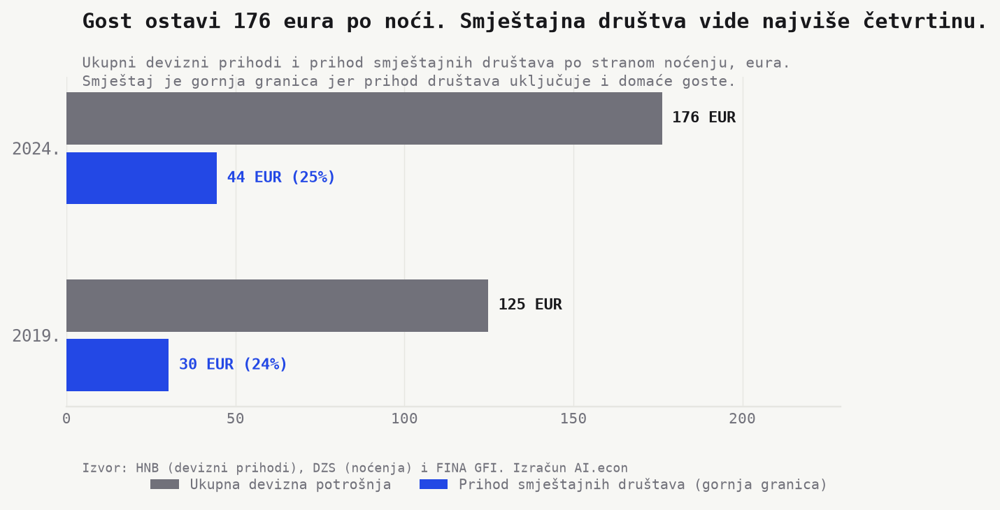
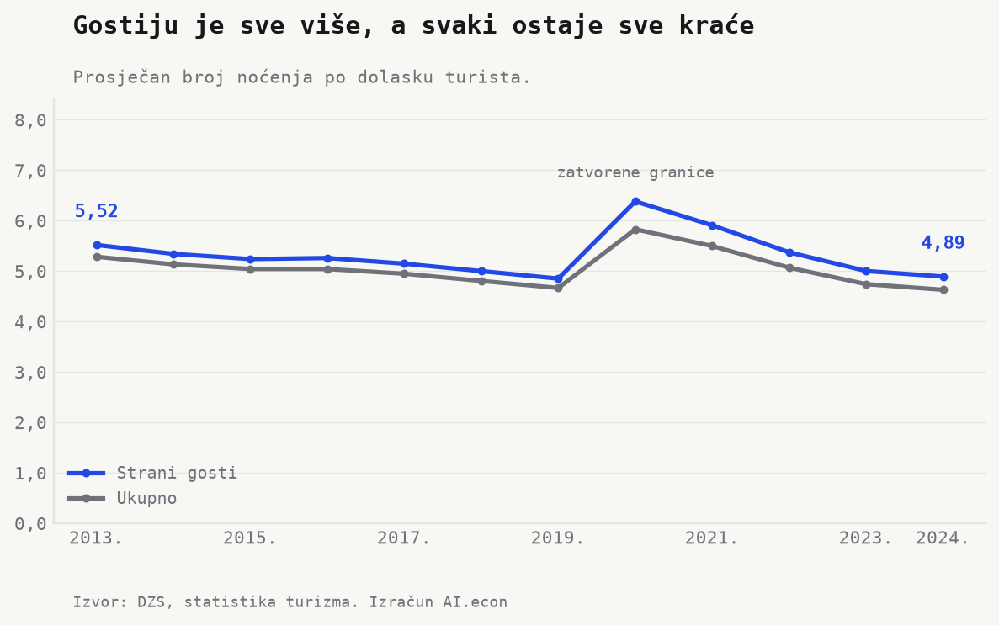
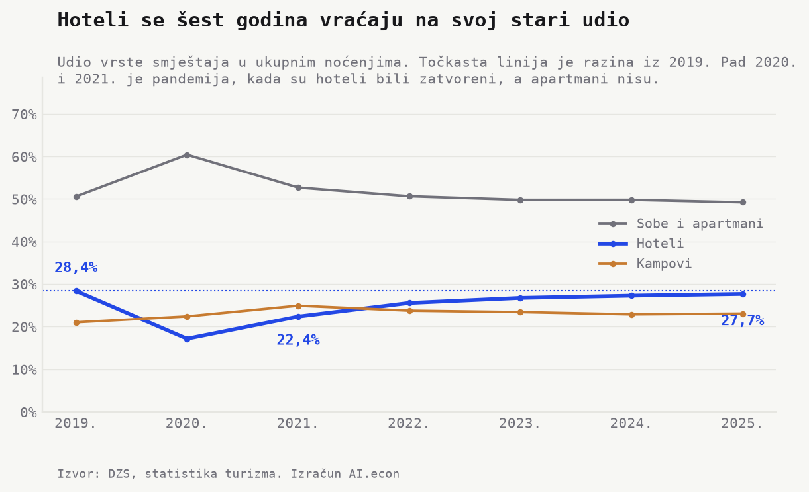

```{python}
#| label: load-tourism-facts
import json
from pathlib import Path

import pandas as pd


def project_root() -> Path:
    path = Path.cwd().resolve()
    for candidate in [path, *path.parents]:
        if (candidate / "_quarto.yml").exists() and (candidate / "outputs").exists():
            return candidate
    raise RuntimeError("Cannot locate project root.")


root = project_root()
facts = json.loads(
    (root / "outputs" / "facts" / "tourism_value.json").read_text(encoding="utf-8")
)
models = pd.read_csv(
    root / "outputs" / "tables" / "tourism_value_by_model.csv", encoding="utf-8-sig"
)


def hr_number(value, digits=0):
    raw = f"{float(value):,.{digits}f}"
    return raw.replace(",", "X").replace(".", ",").replace("X", ".")


def hr_pct(value, digits=1):
    return f"{hr_number(value, digits)}%"


def eur(value, digits=1):
    return f"{hr_number(value, digits)} eura"


def eur_billion(value, digits=2):
    return f"{hr_number(float(value) / 1_000_000_000, digits)} milijarde eura"


def millions(value, digits=1):
    return hr_number(float(value) / 1_000_000, digits)


def year(value):
    """A year takes no thousands separator. hr_number would render 2025 as 2.025."""
    return f"{int(value)}."
```

Hrvatska je **2024.** izbrojila **`{python} millions(facts["nights_last_year"])` milijuna komercijalnih noćenja**. HNB je iste godine zabilježio **`{python} eur_billion(facts["hnb_receipts_last"], 2)` prihoda od stranih turista**.

Dvije rekordne brojke pozivaju na dijeljenje. Taj bi račun bio pogrešan. Prva brojka mjeri spavanje u komercijalnom smještaju, a druga sve što strani gost potroši. Još važnije, noćenja obuhvaćaju poduzeća i kućanstva, dok financijski izvještaji obuhvaćaju poduzeća.

Pod jednim turističkim rezultatom zato stoje dva gospodarstva. **Četiri od deset komercijalnih noćenja** ostvare kućanstva, ali javni podaci njima ne pridružuju prihod usporediv s prihodima poduzeća. Hrvatskom turizmu ne nedostaje još jedan zbroj. Nedostaje mu zajednički nazivnik.

## Četrdeset eura nije cijena turističke noći


Prihod smještajnih društava podijeljen sa svim noćenjima iznosi **`{python} eur(facts["eur_per_night_last"])` po noćenju**. To je sve što firme naplate u smještajnim objektima, raspoređeno na sve noći u zemlji.

Nominalni iznos ide **`{python} eur(facts["eur_per_night_first"])` (2013.) → `{python} eur(facts["eur_per_night_last"])` (2024.), plus `{python} hr_pct(facts["eur_per_night_growth_pct"], 0)`**. U stalnim cijenama ide **`{python} eur(facts["eur_per_night_real_first"])` (2013.) → `{python} eur(facts["eur_per_night_real_base"])` (`{python} year(facts["eur_per_night_real_base_year"])`), plus `{python} hr_pct(facts["eur_per_night_real_growth_pct"], 0)`**. Polovica nominalnog rasta približno otpada na inflaciju.

Dodamo li restorane i barove, iznos raste na **`{python} eur(facts["eur_per_night_with_food_last"])`**. U njemu je i domaća potrošnja, pa nije mjera turista (više u *Napomenama*).

Ovih **`{python} eur(facts["eur_per_night_last"])`** nije cijena. Brojnik obuhvaća samo društva, a nazivnik i društva i kućanstva. Niz prije svega mjeri koliko turizma prolazi kroz poduzeća.

## Četiri od deset noćenja izlaze iz zajedničkog računa


Statistika dijeli noćenja na hotele, sobe i apartmane te kampove. U hotelima i kampovima prihod i noćenja opisuju iste vrste objekata. Hotel po noćenju proknjiži **`{python} eur(facts["model_551_eur_per_night"])`**, a kamp **`{python} eur(facts["model_553_eur_per_night"])`**.

Kod soba i apartmana isti se račun ne može napraviti. Sobe, apartmani i kuće za odmor nose **`{python} millions(facts["subtype_rooms_nights"])` od `{python} millions(facts["model_552_nights"])` milijuna noćenja** u toj skupini i **`{python} hr_number(facts["subtype_rooms_beds"])` postelja**. U istoj djelatnosti posluje **`{python} hr_number(facts["model_552_n_firms"])` društava** s **`{python} hr_number(facts["model_552_employees"])` zaposlenih**. Tablica noćenja objekte dijeli po vrsti, a ne prema tome vodi li ih društvo ili kućanstvo. Prihod društava zato se ne smije podijeliti sa svim tim noćenjima.

Druga podjela pokazuje razmjer neusporedivosti. Objekti u domaćinstvu ostvarili su **`{python} millions(facts["household_nights_htz"])` milijuna noćenja**, odnosno **`{python} hr_pct(facts["household_commercial_share_pct"])` komercijalnih noćenja**. Njihov usporediv prihod po noćenju nije javno objavljen.

Internetske platforme posredovale su u **`{python} millions(facts["platform_nights_last"])` milijuna noćenja**, odnosno **`{python} hr_pct(facts["platform_share_of_apartments_pct"], 0)`** noćenja u skupini soba i apartmana. Rezervaciju možemo smjestiti u kanal. Ne možemo joj iz javnih agregata pridružiti usporediv prihod.

U hotelima i kampovima zajedno ostvari se **`{python} millions(facts["matched_segments_nights"])` milijuna noćenja**. Po jednoj noći kroz društva prođe **`{python} eur(facts["eur_per_night_matched_segments"], 0)`**, odnosno **`{python} hr_number(facts["eur_per_night_matched_to_headline_ratio"], 1)` puta** više od nacionalnog iznosa. Razlika ne dokazuje da su hoteli i kampovi toliko skuplji. Pokazuje što se dogodi kada brojnik i nazivnik obuhvate iste objekte.

Sobe i apartmani nose **`{python} hr_pct(facts["model_apartment_nights_share"])` noćenja**, a društva registrirana u toj djelatnosti **`{python} hr_pct(facts["model_apartment_revenue_share"])` prihoda smještajnih društava**. Hoteli nose **`{python} hr_pct(facts["model_551_nights_share_pct"])` noćenja** i **`{python} hr_pct(facts["model_551_revenue_share_pct"])` prihoda društava**. To nisu udjeli u ukupnom prihodu smještaja. To su dvije odvojene raspodjele koje pokazuju gdje javna usporedba prestaje.

## Dva modela koriste krevet različitim ritmom


Hotelski krevet zabilježi **`{python} hr_number(facts["nights_per_bed_551"])` noći godišnje**. Krevet u kampu zabilježi **`{python} hr_number(facts["nights_per_bed_553"])`**, a krevet u sobi ili apartmanu **`{python} hr_number(facts["nights_per_bed_552"])`**.

Jedna hotelska postelja tako ostvari **`{python} hr_number(facts["hotel_to_apartment_bed_use_ratio"], 1)` puta** više noćenja od postelje u sobi ili apartmanu. Postelja u sobama i apartmanima ima više nego hotelskih i kamp kapaciteta zajedno.

Omjer ne govori je li pojedini apartman profitabilan. Ne zna koliko je dana postelja doista ponuđena ni po kojoj cijeni. Upravo tu prestaje račun. Za oba modela znamo broj postelja i noćenja, ali samo za jedan imamo usporediv javni prihod.

Jesu li **četiri od deset komercijalnih noćenja** u kućanstvima problem naplate, poreza ili stanovanja. Ista brojka podupire sva tri čitanja.

## U Istri kroz firme po noćenju prođe dvostruko više nego u Lici


U Istri po noćenju u društva uđe **`{python} eur(facts["county_top_eur_per_night"])`**. U Ličko-senjskoj uđe **`{python} eur(facts["county_bottom_eur_per_night"])`**. Omjer iznosi **`{python} hr_number(facts["county_coastal_ratio"], 1)` puta**.

Razliku prati struktura smještaja. Gdje prevladavaju hoteli i veliki kampovi, veći dio novca ulazi u financijske izvještaje. Gdje prevladavaju sobe i apartmani, javno vidljiv iznos je manji. Niska vrijednost zato ne znači nužno nisku cijenu. Znači da manje prihoda prolazi kroz društva.

Najveći iznos nije uz more. U Zagrebu po noćenju u društva uđe **`{python} eur(facts["zagreb_eur_per_night"])`**, odnosno **`{python} hr_number(facts["zagreb_to_coastal_top_ratio"], 1)` puta** više nego u vodećoj jadranskoj županiji. Broj je ondje najbliži cijeni jer u smještaju prevladavaju hoteli.

## Od sto sedamdeset šest eura smještajna društva vide najviše četvrtinu



Strani gosti ostvarili su **`{python} millions(facts["foreign_nights_last"])` milijuna noćenja** i potrošili **`{python} eur_billion(facts["hnb_receipts_last"], 2)`**. To je **`{python} eur(facts["eur_per_foreign_night"], 0)` po stranoj noći**.

Smještajna društva od toga proknjiže najviše **`{python} eur(facts["accommodation_per_foreign_night"], 0)`**, odnosno **`{python} hr_pct(facts["accommodation_share_of_receipts_pct"], 0)`**. To je gornja granica jer njihov prihod uključuje i domaće goste. Prihod ugostiteljskih društava iznosi dodatnih **`{python} eur(facts["food_per_foreign_night"], 0)` po stranoj noći**, ali i on uključuje domaću potrošnju.

Računska razlika iznosi **`{python} eur(facts["rest_per_foreign_night"], 0)` po stranoj noći**. To nije sektorska raspodjela. U njoj ostaju trgovina, prijevoz, izleti, marine i kućanstva koja iznajmljuju smještaj, ali javni agregati ne pokazuju koliko pripada svakome.

Ukupan iznos pokazuje koliko strani gost potroši. Ne pokazuje cijenu noćenja ni kome prihod pripadne. Godine **2019.** strani je gost trošio **`{python} eur(facts["eur_per_foreign_night_2019"], 0)` po noći**, a smještajna društva držala su najviše **`{python} hr_pct(facts["accommodation_share_of_receipts_2019_pct"], 0)`**. Do **2024.** ukupna potrošnja po noći raste, ali udio društava ostaje blizu četvrtine.

Rekordni devizni prihod zato odgovara na pitanje koliko je novca ukupno ušlo u zemlju. Ne odgovara na pitanje koliko vrijedi noć u svakom od dva modela smještaja.

## Rekord raste kroz više dolazaka i kraće boravke



Od **2013.** dolasci idu **`{python} millions(facts["arrivals_first_year"])` → `{python} millions(facts["arrivals_last_year"])` milijuna, plus `{python} hr_pct(facts["arrivals_growth_pct"], 0)`**. Noćenja rastu sporije, **`{python} millions(facts["nights_first_year"])` → `{python} millions(facts["nights_last_year"])` milijuna, plus `{python} hr_pct(facts["nights_growth_pct"], 0)`**.

Prosječan boravak zato pada **`{python} hr_number(facts["nights_per_arrival_first"], 2)` → `{python} hr_number(facts["nights_per_arrival_last"], 2)` noći po dolasku**. Kod stranih gostiju pada **`{python} hr_number(facts["nights_per_arrival_foreign_first"], 2)` → `{python} hr_number(facts["nights_per_arrival_foreign_last"], 2)`**. Skokove **2020.** i **2021.** donijele su zatvorene granice.

Po dolasku u smještajna društva ipak uđe više, **`{python} eur(facts["eur_per_arrival_first"], 0)` → `{python} eur(facts["eur_per_arrival_last"], 0)`**. Više dolazaka održava rast noćenja, a veći prihod po noći nadoknađuje kraći boravak. Broj noćenja bilježi promet. Ne mjeri dubinu turističkog modela.

## Dva mjeseca još nose više od pola godine


Srpanj i kolovoz nose **`{python} hr_pct(facts["peak_share_last"])` noćenja**. Ostalih deset mjeseci dijeli manje od polovice godine.

Udio vrhunca pada **`{python} hr_pct(facts["peak_share_first"])` (2013.) → `{python} hr_pct(facts["peak_share_last"])` (2024.)**. Sezona se produžuje, ali sporo. U Šibensko-kninskoj županiji dva ljetna mjeseca još nose **`{python} hr_pct(facts["peak_share_max_value"])` godišnjih noćenja**.

Širenje sezone mijenja raspored prometa. Bez usporedivog prihoda kućanstava ne znamo mijenja li i vrijednost koju pojedina noć stvara.

## Strana potražnja drži devet od deset noćenja


Domaći gosti čine **`{python} hr_pct(facts["domestic_share_last"])` noćenja (`{python} year(facts["domestic_share_last_year"])`)**. Udio je još **2005.** iznosio **`{python} hr_pct(facts["domestic_share_2005"])`**.

Domaća noćenja ipak rastu **`{python} millions(facts["domestic_nights_first"])` → `{python} millions(facts["domestic_nights_last"])` milijuna, plus `{python} hr_pct(facts["domestic_nights_growth_pct"], 0)` od 2013. do 2024.** Unatoč tom rastu, domaći gosti i dalje ostvaruju približno desetinu ukupnih noćenja.

Strana potražnja nosi **devet od deset noći** i zato određuje nacionalni rezultat. Javni podaci ipak ne pokazuju koliko tog prihoda završava u svakom modelu smještaja.

## Marine pokazuju što turizmu nedostaje


Marine su jedino mjesto gdje statistika objavljuje i količinu i novac za isti skup objekata. Prihod po vezu računa se bez spajanja izvora.

Hrvatska ima **`{python} hr_number(facts["marina_national_berths"])` vezova**. Jedan godišnje donese **`{python} hr_number(facts["marina_national_eur_per_berth"])` eura**.

Iznos od **`{python} hr_number(facts["revenue_per_bed_all"])` eura po postelji** dobiva se kada **`{python} eur_billion(facts["revenue_accommodation_last_year"], 2)` prihoda smještajnih društava** podijelimo sa svih **`{python} hr_number(facts["beds_total"])` registriranih postelja**. Brojnik ne obuhvaća prihod kućanstava, a nazivnik obuhvaća njihove postelje. Zato to nije prinos prosječne postelje, nego nacionalna mjera prolaska prihoda kroz društva izražena po postelji.

Uz tu ogradu, vez vrijedi **`{python} hr_number(facts["berth_to_average_bed_ratio"], 1)` puta** više od nacionalnog iznosa po postelji. Usporediv hotelski iznos je veći, **`{python} hr_number(facts["model_551_eur_per_bed"])` eura**, jer prihod i postelje opisuju isti skup hotela.

Splitsko-dalmatinska županija naplati **`{python} hr_number(facts["marina_top_eur_per_berth"])` eura po vezu**, a Istarska **`{python} hr_number(facts["marina_bottom_eur_per_berth"])`**. Razliku vjerojatno više objašnjava struktura flote nego kvaliteta poslovanja, ali ovi podaci to ne razlučuju.

Kad se brojnik i nazivnik poklope, razlike možemo istraživati. Kad se ne poklope, ostaje privid preciznosti.

## Sastav smještaja šest godina stoji



Udio hotela raste od **2021.**, **`{python} hr_pct(facts["hotel_share_2021"])` → `{python} hr_pct(facts["hotel_share_now"])`**. Prije pandemije, **`{python} year(facts["mix_first_year"])`**, iznosio je **`{python} hr_pct(facts["hotel_share_prepandemic"])`**. Današnji je udio još niži.

Udio soba i apartmana danas iznosi **`{python} hr_pct(facts["apartment_share_now"])`**, gotovo jednako kao **`{python} hr_pct(facts["apartment_share_prepandemic"])`** iz **`{python} year(facts["mix_first_year"])`**. Dva gospodarstva pod istim turističkim rezultatom ostaju u gotovo istom odnosu.

To da **četiri od deset komercijalnih noćenja** ostvaruju kućanstva nije nesreća nego model. Šest godina bez pomaka u sastavu podupire čitanje da se Hrvatska u njega uselila jer je bio najlakši, ali ga ne dokazuje. Pitanje je što se događa kada smještaj poskupljuje, a sastav stoji.

Hotelska noć, za koju se prihod i noćenja mogu usporediti kroz vrijeme, ide **`{python} eur(facts["hotel_eur_per_night_first"], 0)` (`{python} year(facts["hotel_price_first_year"])`) → `{python} eur(facts["hotel_eur_per_night_last"], 0)` (2024.), plus `{python} hr_pct(facts["hotel_price_growth_pct"], 0)`**. Udio hotela pritom se nije pomaknuo iznad pretpandemijske razine.

[Ekonomski institut, Zagreb](https://www.eizg.hr/userdocsimages/publikacije/serijske-publikacije/sektorske-analize/sa_turizam_2025.pdf) upozorava da bi rast cijena smještaja, hrane i energije mogao oslabiti cjenovnu konkurentnost hrvatskog turizma. Model može postati skuplji, a ostati isti. To je najlošiji ishod.

Mjereni dio sustava otkriva i koncentraciju. Od **`{python} hr_number(facts["hotels_n_firms_last"])` hotelskih društava**, deset najvećih drži **`{python} hr_pct(facts["top10_hotels_share_pct"])` prihoda**. U cijelom smještaju deset društava drži **`{python} hr_pct(facts["top10_all_share_pct"])`**.

Pokazuje i plaće. Smještajna društva isplaćuju prosječno **`{python} eur(facts["wage_net_accommodation"], 0)` neto mjesečno**, odnosno **`{python} hr_pct(facts["wage_accommodation_gap_pct"])`** ispod prosjeka gospodarstva. U ugostiteljstvu je to **`{python} eur(facts["wage_net_food"], 0)`**, odnosno **`{python} hr_pct(facts["wage_food_gap_pct"])`** manje.

Za kućanstva koja ostvaruju **`{python} millions(facts["household_nights_htz"])` milijuna noćenja** ne možemo javno postaviti ista pitanja. Ne možemo usporediti prihod po noći, prihod po postelji, koncentraciju ni rad koji stoji iza prihoda. Zato rasprava o rekordima, cijenama i porezima stalno preskače temeljnu nepoznanicu.

Turizmu ne fali još jedan rekord, nego zajednička mjera. Objavljeni agregat prihoda kućanstava po noćenju i registriranoj postelji pretvorio bi **četiri od deset komercijalnih noćenja** iz slijepe točke u dio turističkog računa.

## Napomene

- Izvori. [DZS, statistika turizma](https://podaci.dzs.hr/hr/podaci/turizam/), preuzeto **27. srpnja 2026.**, za noćenja, kapacitete i marine. [HTZ, godišnji pregled za 2025.](https://www.htz.hr/sites/default/files/2026-01/informacija_o_statistickim_pokazateljima_prosinac_2025.pdf), za revidirani broj komercijalnih noćenja u objektima u domaćinstvu tijekom **2024.** FINA za prihode društava od **2013. do 2024.** HNB za devizne prihode, prema [objavi Vlade RH](https://vlada.gov.hr/vijesti/prihodi-od-stranih-turista-u-2024-godini-gotovo-15-milijardi-eura/44175).
- Glavna mjera. *Prihod po noćenju* dijeli poslovni prihod smještajnih društava sa svim noćenjima. **To nije cijena.** Brojnik obuhvaća društva koja predaju financijske izvještaje, a nazivnik i noćenja u kućanstvima. Mjera pokazuje koliko turizma prolazi kroz društva. Uključuje sve što firma naplati u objektu, a isključuje potrošnju izvan njega.
- Javna usporedivost. Tvrdnja da nema usporedivog prihoda kućanstava odnosi se na objavljene agregate koji se mogu spojiti s noćenjima. Ne znači da kućanstva ne izdaju račune, ne vode propisane evidencije ili da njihov prihod ne postoji.
- Gdje se prihod po noći može računati. U hotelima i kampovima prihod i noćenja opisuju iste vrste objekata. U skupini soba i apartmana ne opisuju, pa se iznos po noćenju ne računa. DZS-ova tablica dijeli noćenja po vrsti objekta, ne prema operatoru. HTZ objavljuje ukupan promet objekata u domaćinstvu, ali ne presjek potreban da se preostala noćenja u toj DZS-ovoj skupini dodijele društvima. Hotelski niz počinje **2019.**, kada počinje usporediva objava noćenja po vrsti smještaja.
- Iskorištenost postelja. Noćenja i postelje dolaze iz iste statistike i bilježe se na objektu. Omjer je broj noćenja po registriranoj postelji, a ne stopa popunjenosti postelje u danima kada je stvarno bila ponuđena.
- Devizni prihodi. HNB-ova potrošnja stranaca uspoređuje se samo sa stranim noćenjima. Prihod smještajnih društava uključuje i domaće goste, pa je njegov udio u deviznim prihodima gornja granica. Prijevoz do Hrvatske vodi se zasebno.
- Vrste smještaja. Hoteli, sobe i apartmani te kampovi usporedivi su na obje strane. Pokrivaju **99,9% noćenja**. U skupini soba i apartmana sobe, apartmani i kuće za odmor nose **`{python} millions(facts["subtype_rooms_nights"])` od `{python} millions(facts["model_552_nights"])` milijuna noćenja**. Ostatak čine hosteli, lječilišta, prenoćišta i domovi.
- Platforme. Eksperimentalni podatak DZS-a služi kao red veličine i nije službeno usporediv s ostatkom statistike turizma.
- Zemljopis. Račun je na razini županije. Na razini općine velike grupacije prihod knjiže na adresi sjedišta, pa susjedna mjesta u kojima posluju ispadaju prazna. Unutar županije taj se pomak poništava.
- Ugostiteljstvo. Prihod restorana i barova dopuna je, ne mjera turističke potrošnje, jer uključuje velik udio domaće potrošnje.
- Plaće. DZS-ove prosječne neto plaće u pravnim osobama za **2024.** preuzete su iz EIZ-ove *Sektorske analize turizma*.
- Zaposlenost i sezona. Financijski izvještaji ne razlikuju ljetnu i zimsku zaposlenost. Sezona se zato mjeri mjesečnim noćenjima.
- Realne cijene. Deflator za **2024.** ne postoji, pa realna serija završava **2023.**
- Povjerljivost. Zaštićene općinske vrijednosti tretirane su kao nepoznate. Zbroj općina zato je **0,5%** manji od državnog ukupno.
- Vanjska provjera. EIZ za **2024.** navodi da deset vodećih hotelskih društava drži **41,2% prihoda**. Neovisan izračun daje **`{python} hr_pct(facts["top10_hotels_share_pct"])`** i **`{python} eur_billion(facts["top10_hotels_revenue"])` prihoda**. EIZ-ova tablica implicira **`{python} eur_billion(facts["eiz_implied_total_revenue"])` ukupnog prihoda**, a naš iznos je **`{python} eur_billion(facts["hotels_revenue_last"])`**.
- Godine. Novac i noćenja spajaju se za **2024.** Marine i udjeli vrsta smještaja su za **2025.**
- Reproducibilnost. Izračun je u `python/tourism_value_build.py`, a grafikoni u `python/tourism_value_charts.py`. Agregati su u `outputs/tables/`, činjenice u `outputs/facts/tourism_value.json`, vanjski ulazi u `data/external/tourism_external.csv`, a provjere u `outputs/tables/tourism_validation.csv`.
- Literatura. Buturac, G. i Rašić, I. (2025). *Sektorske analize: Turizam*, 14(126). Ekonomski institut, Zagreb. [PDF](https://www.eizg.hr/userdocsimages/publikacije/serijske-publikacije/sektorske-analize/sa_turizam_2025.pdf).
