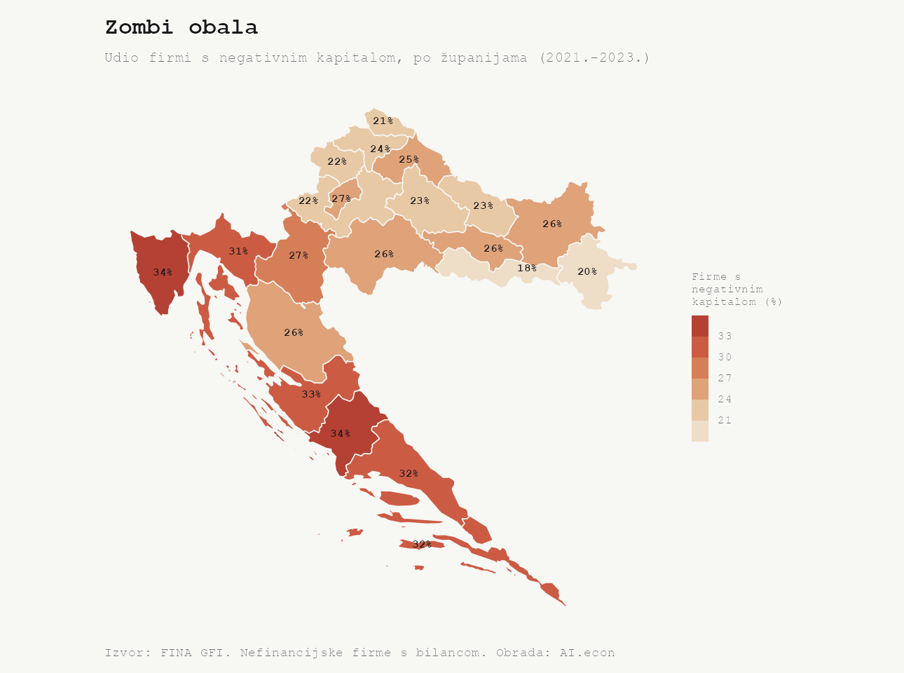
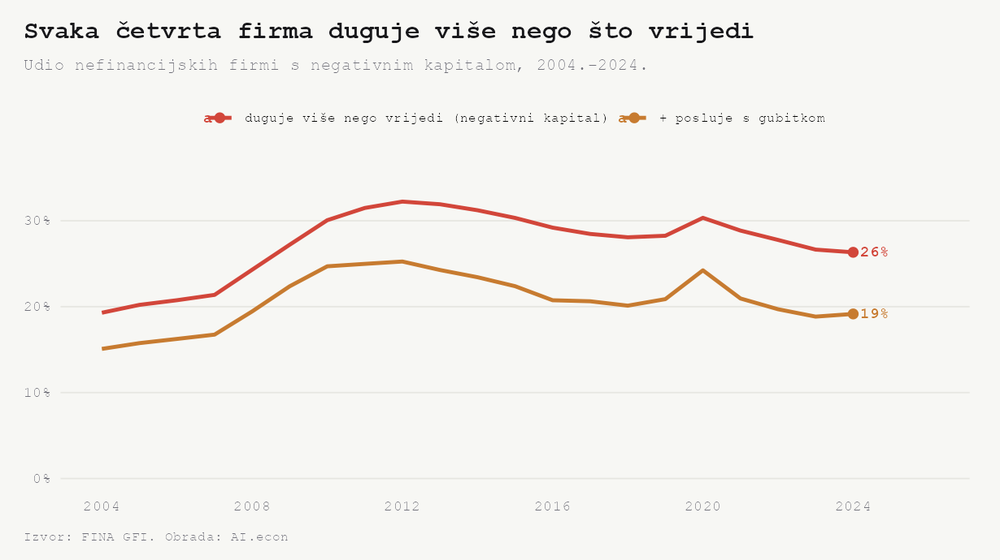
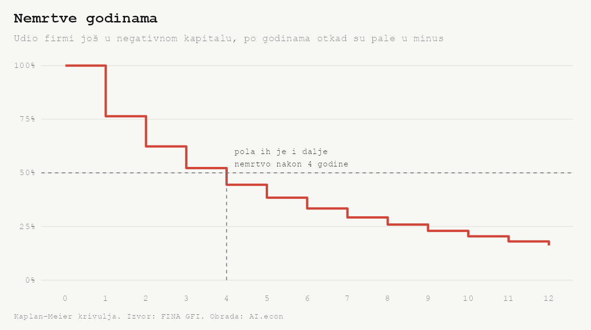
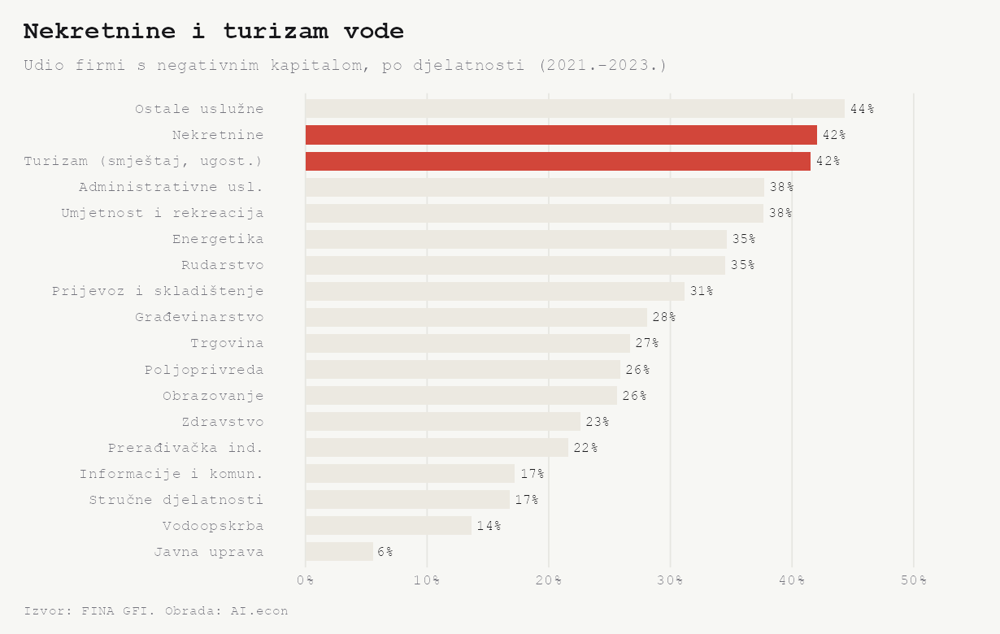
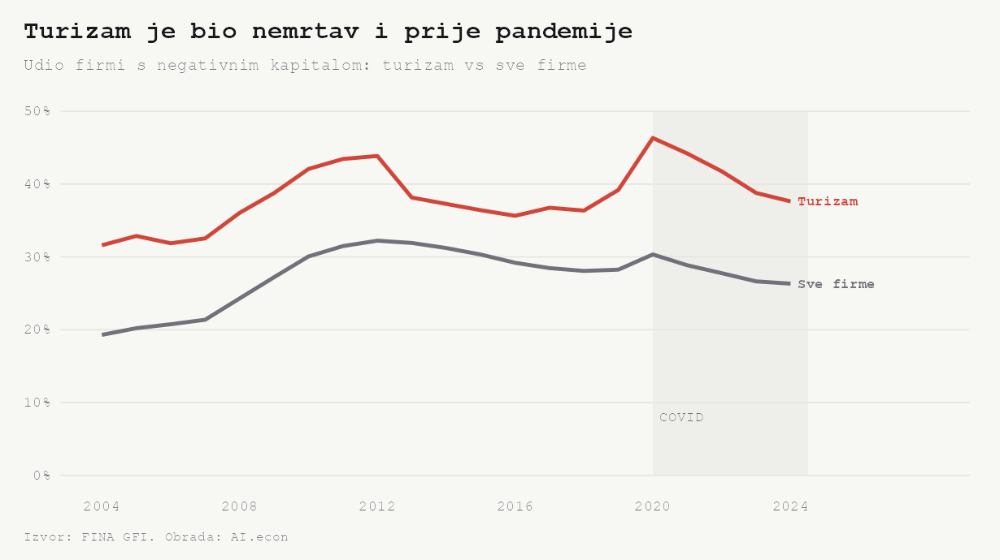

Nacrtajmo jednu kartu. Crvene su županije u kojima najviše firmi duguje više nego što uopće ima imovine. Cijela obala gori.

To je početna zagonetka. Povremeno, ali uvijek iznova, priča se o zombi firmama. Raspravlja se o broju tih firmi. Raspon je od 4% do 22%, ovisno koga se pita. Zapravo ovisno o definiciji što je zombi. Ovdje dodajemo vrijednost u tu raspravu postavljajući novo pitanje. Umjesto *koliko* ih je, postavljamo pitanje *koliko dugo* ostaju nemrtve.

Kako ćemo odgovoriti na to pitanje? Uzimamo naj HC (*hard core*) moguću mjeru: firmu koja duguje više nego što ima, i pratimo je kroz vrijeme.

## Zombači žive na moru

Firma s negativnim kapitalom duguje više nego što vrijedi. Knjigovodstveno je nesolventna. Takvih je najviše na Jadranu. U Istri i Šibensko-kninskoj **34%**, u Zadarskoj **33%**, u Splitsko-dalmatinskoj i Dubrovačko-neretvanskoj **32%**, u Primorsko-goranskoj **31%**. Na obali je nesolventna skoro svaka treća firma.

Unutrašnjost je bljeđa. U Brodsko-posavskoj **18%**, u Vukovarsko-srijemskoj **20%**, u Zagrebačkoj **22%**. Grad Zagreb je u sredini, **27%**. Bogata turistička obala ima najviše firmi u minusu, a ne siromašni istok. To je slika koju treba objasniti.

## Svaka četvrta firma je zombač

Krenimo od razine. Udio firmi s negativnim kapitalom popeo se s **19% (2004.)** na vrh od **32% (2012.)**, pa se spustio na **26% (2024.)**. Znači, u cijeloj državi svaka četvrta firma duguje više nego što vrijedi.

Moglo bi se prigovoriti da negativan kapital nije uvijek zombi. Neke firme financiraju vlasnici zajmovima, pa im je knjigovodstveni kapital u minusu, a posluju dobro. Zato pojačajmo zombi uvjete. Firma koja je u negativnom kapitalu *i* posluje s gubitkom. Takvih je i dalje **19% (2024.)**. Otprilike tri od četiri firme s negativnim kapitalom stvarno gube novac. Nije riječ o bilančnoj fatamorgani.

## Zombač živi godinama

Sad dolazi najzanimljivije. Negativan kapital nije trenutačni šok, nego dugotrajno stanje. Kad firma jednom padne u minus, iduće godine je u minusu s vjerojatnošću **82%**. Zdrava firma ostaje zdrava u **91%** slučajeva.  Nesolventnost je gotovo jednako trajna kao i zdravo poslovanje.

Krivulja pokazuje koliko to traje. **Pola firmi je i nakon četiri godine još u negativnom kapitalu.** Rep je dug, mnogi zombiji žive osam i više godina. Od svih firmi koje uđu u minus, njih **38%** se s vremenom oporavi, **23%** ugasi, a preostalih **39%** je na kraju razdoblja i dalje zombasto. Izlaz iz zombi svijeta je spor u oba smjera.

Sve ovo nije artefakt duljine razdoblja. To potvrđuje jednostavan test. Firme koje su pale u minus između 2005. i 2012. ostaju zombaste jednako uporno kao one iz razdoblja 2013.–2020. (**89%** naspram **88%** godišnje). Trajanje je svojstvo procesa, ne vremena u kojem to promatramo.

## Zašto obala? Nekretnine i turizam

Geo-zombi karta i pregled industrijskih djelatnosti pokazuju istu stvar. Najviše nesolventnih firmi je u nekretninama (**42%**) i turizmu (**42%**). Obje su djelatnosti kapitalno teške i zadužene. Obje su najviše zastupljene upravo na obali. Hoteli, apartmani i projekti nose puno duga i imovine na svaki euro prihoda, pa im kapital lako padne ispod nule. Na drugom kraju su prerađivačka industrija (**22%**) i informacije i komunikacije (**17%**).

## Turizam je bio zombast i prije pandemije

Lako je pomisliti da je turizam pozombirao zbog pandemije. Ipak, podatci to ne podupiru. Udio nesolventnih firmi u turizmu bio je **36% do 44%** svake godine u razdoblju 2008.–2019. Dakle, visok čitavo desetljeće prije COVID-a. Pandemija je 2020. dodala skok na **46%**, ali ona nije stvorila problem.

## U Hrvatskoj se ne bankrotira

Vratimo se na početnu zagonetku. Zašto firme godinama ostaju u minusu? Jer rijetko koja ikad prođe formalni kraj. Kroz stečaj je u cijeloj povijesti registra prošlo tek **2.468** firmi, kroz likvidaciju sličan broj. Firme ne bankrotiraju, nego se tiho odjave ili jednostavno nastave predavati (GFI) izvještaje iz godine u godinu, u minusu.

Podatci ne mogu reći je li sustav osmišljen tako da drži firme nemrtvima. Mogu reći samo da ih drži. Svaka četvrta firma duguje više nego što vrijedi, na obali skoro svaka treća, i takva ostane u prosjeku četiri godine. U Hrvatskoj se ne bankrotira. Polako se zombira.

## Napomene

- Izvor. FINA, Godišnji financijski izvještaji (GFI), 2002. do 2024. Sudski registar za status i datum brisanja firme.
- Glavna mjera. *Negativan kapital* znači da su ukupne obveze veće od imovine, odnosno da je knjigovodstveni kapital i rezerve firme ispod nule. Mjera se računa iz bilance i ne treba podatak o kamatama.
- Uzorak. Nefinancijske firme s predanom bilancom, iz svih djelatnosti osim financijskih. Udjeli se računaju na firme koje u toj godini imaju bilancu.
- Djelatnosti. Graf po djelatnosti prikazuje imenovane djelatnosti. Zbirna kategorija *ostale uslužne djelatnosti* ima tehnički najviši udio (**44%**), no riječ je o rezidualnoj skupini bez jasne priče, pa se tekst drži imenovanih djelatnosti, nekretnina i turizma.
- Trajanje. *Spell* je neprekinuti niz godina u kojima je firma u negativnom kapitalu. Krivulja je Kaplan–Meier procjena, a događaj je izlazak iz minusa (oporavak ili gašenje). Firme koje su na kraju razdoblja još u minusu su cenzurirane.
- Robusnost. Nalaz o trajanju vrijedi i uz strože definicije. Uz *negativan kapital + gubitak* udio je **~19%**, a godišnja upornost **64%**. Uz HNB-ovu definiciju zombija (poslovni rezultat manji od 6% financijskog duga dvije godine zaredom, uz gubitak i dob iznad 3 godine) udio je **~10%**, a upornost **66%**. Razina se mijenja s definicijom, priča o trajanju ostaje.
- Što treba oprezno čitati. Negativan kapital može nastati i zbog zajmova vlasnika, pa ga strože mjere iznad ograđuju. *Oporavak* može biti dokapitalizacija ili revalorizacija, ne nužno stvarni preokret. *Gašenje* je brisanje iz registra unutar oko tri godine od zadnjeg izvještaja. Podatak o blokadi računa na razini firme nije javan.
- Literatura.
    - Adalet McGowan, Andrews i Millot (2017.), [*The Walking Dead? Zombie Firms and Productivity Performance in OECD Countries*](https://doi.org/10.1093/epolic/eiy012), o zombi firmama i produktivnosti.
    - Banerjee i Hofmann (2018.), [*The rise of zombie firms: causes and consequences*](https://www.bis.org/publ/qtrpdf/r_qt1809g.htm), BIS, o rastu i sudbini zombi firmi.
    - HNB (2021.), [*Financijska stabilnost 22, Okvir 4*](https://www.hnb.hr/analize-i-publikacije/redovne-publikacije/financijska-stabilnost), o mjerenju zombi firmi u Hrvatskoj bez pouzdanih kamata.
- Skripte. `scripts/zombie_pull_v2.R`, `scripts/zombie_analysis_v3.R`, `scripts/zombie_analysis_v4.R`, `scripts/zombie_fig_map.R`, `scripts/zombie_figs.R`. Provjereni mapping stupaca u `_workflow/gfi-variable-map.md`.
