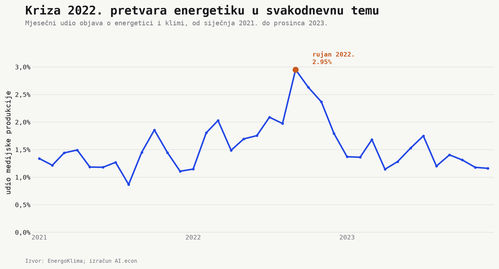
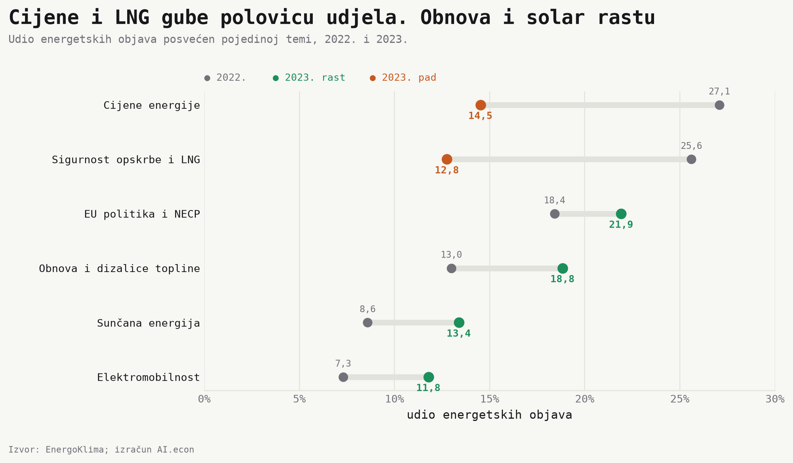
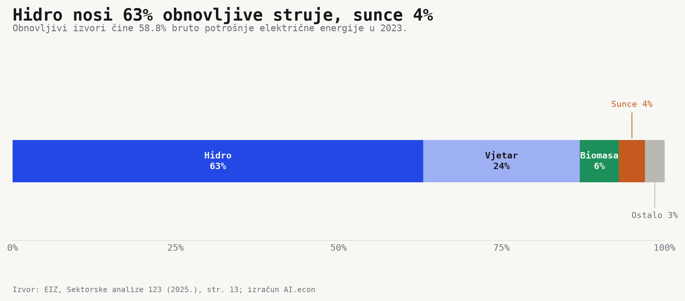
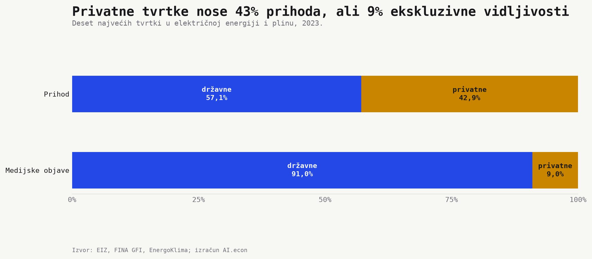

```{python}
#| label: load-energy-facts
from pathlib import Path
import json
import pandas as pd


def project_root():
    current = Path.cwd().resolve()
    for candidate in [current, *current.parents]:
        if (candidate / "_quarto.yml").exists() and (candidate / "outputs").exists():
            return candidate
    raise RuntimeError("Ne mogu pronaći korijen projekta.")


def hr_number(value, digits=0):
    raw = f"{float(value):,.{digits}f}"
    return raw.replace(",", "X").replace(".", ",").replace("X", ".")


def hr_pct(value, digits=1):
    return f"{hr_number(value, digits)}%"


def eur_billion(value, digits=2):
    return f"{hr_number(float(value) / 1_000_000_000, digits)} mlrd. eura"


def eur_million(value, digits=1):
    return f"{hr_number(float(value) / 1_000_000, digits)} mil. eura"


root = project_root()
facts = json.loads(
    (root / "outputs" / "facts" / "energy_attention_balance.json").read_text(
        encoding="utf-8"
    )
)
topics = pd.read_csv(root / "outputs" / "tables" / "energy_media_topic_shift.csv")


def annual(year):
    return next(row for row in facts["media"]["annual"] if row["year"] == str(year))


def topic(label, year):
    return topics.loc[(topics.topic == label) & (topics.year == year)].iloc[0]


p = facts["physical"]
g = facts["gfi_2023"]
```

U rujnu 2022. na kuhinjskom stolu mogla su se naći tri lica hrvatske energetike. Račun za struju, novine otvorene na priči o LNG-u i ponuda za solarne panele. Račun govori o šoku. LNG o sigurnosti opskrbe. Solar o izlazu.

Tri slike, tri brzine. Medijska pažnja mijenja se u tjednima. Elektrane, mreže i grijanje mijenjaju se u godinama. Prihodi i tržišna moć pokazuju tko tu promjenu može financirati.

Odgovorimo na jedno pitanje. Koliko se brzo promjena u javnom razgovoru pretvara u promjenu energetskog sustava? Povezujemo medijsku pažnju s fizičkim pokazateljima iz [Sektorskih analiza Ekonomskog instituta, Zagreb](https://eizg.hr/publikacije-70/novi-broj-sektorskih-analiza-energetika-obnovljivi-izvori-energije-6292/6292) i financijskim rezultatima poduzeća u električnoj energiji i plinu.

## Kriza je energetiku preselila u svakodnevni život



Energetika zauzima `{python} hr_pct(annual(2021)["media_share_pct"], 2)` medijske produkcije 2021. → `{python} hr_pct(annual(2022)["media_share_pct"], 2)` 2022. → `{python} hr_pct(annual(2023)["media_share_pct"], 2)` 2023. Vrh dolazi naglo. U rujnu 2022. energetsko-klimatski sadržaj doseže **`{python} hr_pct(facts["media"]["peak_share_pct"], 2)`** svega objavljenog.

To je medijski potpis šoka. Cijene, ograničenja i sigurnost opskrbe izlaze iz poslovnih rubrika i ulaze u politiku, obiteljski budžet i svakodnevni razgovor. Nakon zime 2022./23. pozornost se spušta prema pretkriznoj razini.

Pažnja se kreće brzinom računa. Sustav ne može. Upravo zato trenutak nakon krize otkriva što ostaje kada hitnost nestane.

## Nakon računa dolaze solar, obnova i dizalice topline



U samo jednoj godini mijenja se rječnik energetike. **Cijene energije.** `{python} hr_pct(topic("Cijene energije", 2022)["corpus_share_pct"])` → `{python} hr_pct(topic("Cijene energije", 2023)["corpus_share_pct"])`. **Sigurnost opskrbe i LNG.** `{python} hr_pct(topic("Sigurnost opskrbe i LNG", 2022)["corpus_share_pct"])` → `{python} hr_pct(topic("Sigurnost opskrbe i LNG", 2023)["corpus_share_pct"])`.

Smjer rasta je drukčiji. **Sunčana energija.** `{python} hr_pct(topic("Sunčana energija", 2022)["corpus_share_pct"])` → `{python} hr_pct(topic("Sunčana energija", 2023)["corpus_share_pct"])`. **Obnova i dizalice topline.** `{python} hr_pct(topic("Obnova i dizalice topline", 2022)["corpus_share_pct"])` → `{python} hr_pct(topic("Obnova i dizalice topline", 2023)["corpus_share_pct"])`.

Javni razgovor prelazi iz obrane u ulaganje. Prvo je pitanje kako ublažiti račun. Zatim kako proizvesti vlastitu energiju i trošiti je učinkovitije.

To je promjena smjera, ne dokaz izvedbe. Urednička agenda može se okrenuti u jednoj sezoni. Za energetsku trebaju projekti, priključci i elektrane.

## Solar pokazuje smjer, hidroelektrane nose sustav



Solarna priča postaje jasnija kada je stavimo uz energetsku bilancu. Obnovljivi izvori čine `{python} hr_pct(p["renewable_electricity_share"], 1)` bruto potrošnje električne energije. Unutar tog obnovljivog dijela hidroenergija nosi `{python} hr_pct(p["renewable_mix_hydro"], 0)`, vjetar `{python} hr_pct(p["renewable_mix_wind"], 0)`, a sunce samo **`{python} hr_pct(p["renewable_mix_solar"], 0)`**.

Sunce pokazuje smjer sljedećeg investicijskog ciklusa. Hidroelektrane isporučuju sadašnji rezultat. Novo je vidljivije. Postojeće je još mnogo veće.

Isti raskorak postoji izvan električne energije. U grijanju i hlađenju obnovljivi izvori dosežu `{python} hr_pct(p["renewable_heat_share"], 1)`, ali `{python} hr_pct(p["heat_biomass_share"], 0)` finalne obnovljive energije za grijanje dolazi iz biomase. Dizalice topline nose `{python} hr_pct(p["heat_pumps_share"], 1)`. U prijevozu je obnovljivi udio oko **`{python} hr_pct(p["renewable_transport_share"], 0)`**, prema cilju od `{python} hr_pct(p["renewable_transport_target_2030"], 1)` za 2030.

Hrvatska zato nema jednu energetsku tranziciju. Električna energija je daleko ispred prometa, a grijanje iza dobrog prosjeka skriva dominantnu biomasu. Ukupni obnovljivi udio od `{python} hr_pct(p["renewable_overall_share"], 1)` nije ciljna crta. To je prosjek nekoliko vrlo različitih putanja.

## Prihod i medijska vidljivost crtaju različite karte moći



U električnoj energiji i plinu posluje `{python} hr_number(g["n_firms"])` poduzeća s `{python} hr_number(g["employees"])` zaposlenih. Zajedno ostvaruju `{python} eur_billion(g["total_revenue_eur"])` prihoda i `{python} eur_million(g["pretax_result_eur"])` dobiti prije oporezivanja.

Broj tvrtki sugerira širok sektor. Prihod pokazuje koncentraciju. Deset najvećih ostvaruje `{python} eur_billion(g["top_ten_revenue_eur"])`, odnosno **`{python} hr_pct(g["top_ten_share_pct"])`** prihoda cijelog sektora.

Privatne tvrtke nose `{python} hr_pct(g["top_ten_private_revenue_share_pct"])` prihoda te desetorke. U medijskoj vidljivosti njihov je udio samo `{python} hr_pct(g["media_private_exclusive_share_pct"])`, dok državne tvrtke uzimaju `{python} hr_pct(g["media_state_exclusive_share_pct"])`.

Razlog nije tajanstven. Državne tvrtke upravljaju infrastrukturom, javnom uslugom i politički osjetljivim cijenama. Zato proizvode više vijesti. No javno lice energetike ostaje znatno državnije od njezine strukture prihoda. Vidljivost tvrtke nije njezina tržišna težina.

## Tranzicija se mjeri pretvaranjem pažnje u infrastrukturu

Najzanimljivija veza nije pojedini medijski vrh, udio tehnologije ili prihod tvrtke. To je brzina pretvaranja jednog u drugo. Koliko brzo javna pažnja postaje instalirana snaga? Koliko široko prihod velikih aktera otvara prostor kućanstvima i manjim proizvođačima?

Mediji se od cjenovnog šoka prema solaru pomiču brže nego solar ulazi u energetsku bilancu. Privatne tvrtke zauzimaju mnogo veći dio prihoda nego medijskog prostora. U oba slučaja ono što je najvidljivije nije isto što i ono što je najteže u sustavu.

Taj raskorak ne umanjuje važnost interesa za solar, obnovu i dizalice topline. Pokazuje gdje je tranzicija još obećanje. Sljedeći test nije broj novih naslova, nego više sunčane energije u proizvodnji, više dizalica topline u grijanju i manji zaostatak prometa.

Rujan 2022. unosi energetiku u dom kao strah od računa. Tranzicija uspijeva kada solar siđe s naslovnice na krov, a s krova na manji račun.

## Napomene

- Mediji. Analiza EnergoKlima. Grafikon pažnje prikazuje 2021. do 2023., a tematska usporedba 2022. i 2023. Teme se mogu preklapati.
- Fizički pokazatelji. [EIZ, *Sektorske analize 123. Energetika i obnovljivi izvori energije*](https://eizg.hr/userdocsimages//publikacije/serijske-publikacije/sektorske-analize/SA-Energetika-22.pdf), lipanj 2025. Pokazatelji se uglavnom odnose na 2023.
- Financijski pokazatelji. FINA GFI za 2023. Obuhvaćaju poduzeća u proizvodnji i opskrbi električnom energijom i plinom. Prihodi deset najvećih i njihovo vlasništvo preuzeti su iz tablice EIZ-a.
- Vidljivost tvrtki. Usporedba koristi istu desetorku i medijske objave iz 2023. u kojima se pojavljuju državne ili privatne tvrtke.
- Reproducibilnost. Izračuni su u `python/energy_attention_balance_build.py`, grafikoni u `python/energy_attention_balance_charts.py`, a objavljeni pokazatelji u `outputs/`.
