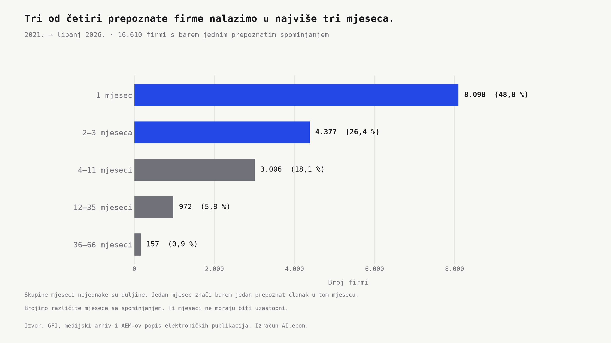
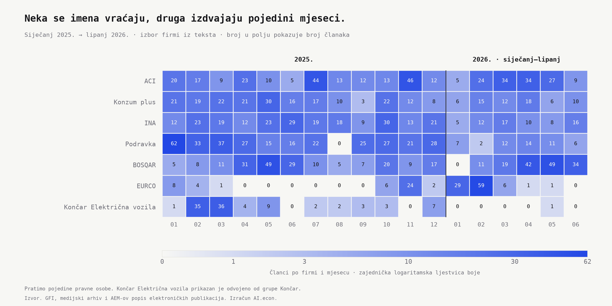

```{python}
#| label: load-firm-media-atlas-post-facts
#| include: false
import json
from pathlib import Path

ROOT = next(p for p in [Path.cwd(), *Path.cwd().parents] if (p / '_quarto.yml').exists())
facts = json.loads((ROOT / 'outputs/facts/gfi_media_atlas_post.json').read_text(encoding='utf-8'))
a = json.loads((ROOT / 'outputs/facts/gfi_media_atlas_public.json').read_text(encoding='utf-8'))
o = facts['overview']
p = facts['persistence']
aci = facts['cases']['aci']
konzum = facts['cases']['konzum']
eurco = facts['cases']['eurco']
koncar = facts['cases']['koncar_ev']
r = facts['rankings']
assert all(facts['checks'].values())
assert 74 < p['le_three_months_pct'] < 76
assert [row['oib'] for row in r['2023_year']['top10'][:3]] == [aci['oib'], konzum['oib'], facts['cases']['ina']['oib']]
for year, key in ((2021, 'ina'), (2022, 'ina'), (2023, 'aci')):
    assert r[f'{year}_year']['top10'][0]['oib'] == facts['cases'][key]['oib']
for year, key in ((2025, 'podravka'), (2026, 'bosqar')):
    assert r[f'{year}_H1']['top10'][0]['oib'] == facts['cases'][key]['oib']

def broj(value):
    return f'{int(value):,}'.replace(',', '.')

def posto(value, digits=1):
    return f'{value:.{digits}f}'.replace('.', ',') + '%'

def polugodiste(case, year):
    return case['h1'][str(year)]['articles']

def godisnje(key, year, field='articles'):
    return r[f'{year}_year']['cases'][key][field]

def mjeseci(case, *months):
    return sum(row['articles'] for row in case['monthly'] if row['month'] in months)
```

Kad otvorimo portal, neka imena prepoznamo bez razmišljanja. INA, Konzum, Podravka. S njima se susrećemo i kad natočimo gorivo ili odemo u trgovinu. Za druge firme prvi put čujemo uz novi tramvaj, gradilište ili posao o kojem se odjednom mnogo piše. Koliko se često ta imena doista pojavljuju u člancima i koliko dugo ostaju u njima?

Pogledajmo **spominjanja hrvatskih firmi na portalima od siječnja 2021. do lipnja 2026.** Povezujemo nazive poduzeća iz FINA-ine GFI baze s člancima iz medijskog arhiva. Za svaku firmu brojimo članke u kojima je prepoznajemo, mjesece u kojima se pojavljuje i portale koji je spominju. Ako se ime u istom članku ponovi više puta, za tu firmu i dalje brojimo jedan članak.

Tako nalazimo **`{python} broj(o['covered_firms'])` firmi**, ali njihova prisutnost izgleda vrlo različito. Nekim se imenima vraćamo godinama. **Tri četvrtine prepoznatih firmi nalazimo u najviše tri mjeseca.** Krenimo od onih koje je lako prepoznati, pa pogledajmo što se krije iza tog velikog broja kratkih pojavljivanja.

## INA vodi dvije godine, zatim prvo mjesto preuzima ACI

U našem poretku INA je prva i 2021. i 2022. Godinu poslije na vrhu je ACI, iza njega Konzum plus, pa INA. Ista poznata imena ostaju visoko, ali redoslijed se mijenja.

| Firma | Članci 2021. | Članci 2022. | Članci 2023. |
|---|---:|---:|---:|
| INA | `{python} broj(godisnje('ina', 2021))` | `{python} broj(godisnje('ina', 2022))` | `{python} broj(godisnje('ina', 2023))` |
| ACI | `{python} broj(godisnje('aci', 2021))` | `{python} broj(godisnje('aci', 2022))` | `{python} broj(godisnje('aci', 2023))` |
| Konzum plus | `{python} broj(godisnje('konzum', 2021))` | `{python} broj(godisnje('konzum', 2022))` | `{python} broj(godisnje('konzum', 2023))` |

*Tri vodeće firme iz 2023. pratimo unatrag kroz iste tri godine. Brojimo članke povezane s pojedinom pravnom osobom.*

ACI se penje na ljestvici. **`{python} broj(godisnje('aci', 2021, 'rank'))`. → `{python} broj(godisnje('aci', 2023, 'rank'))`. mjesto**. U cijelom razdoblju pojavljuje se u `{python} broj(aci['active_months'])` od `{python} broj(o['months'])` mjeseci, a Konzum plus u `{python} broj(konzum['active_months'])`. Njihova mjesta na listi zato lakše razumijemo kad uz godišnji zbroj pogledamo i koliko se redovito vraćaju u tekstove.

Vrh se mijenja i u novijim godinama. U prvom polugodištu 2025. vodi Podravka s `{python} broj(r['2025_H1']['top10'][0]['articles'])` članaka, a u istim mjesecima 2026. BOSQAR s `{python} broj(r['2026_H1']['top10'][0]['articles'])`. Ni dobro poznato ime nema unaprijed rezervirano prvo mjesto.

## Tri četvrtine firmi nalazimo u najviše tri mjeseca

S vrha liste lako bismo stekli dojam da se o firmama piše stalno. Pogled na sve prepoznate firme daje drukčiju sliku. Njih **`{python} broj(p['le_three_months'])`**, odnosno `{python} posto(p['le_three_months_pct'])`, pojavljuje se u jednom, dva ili tri različita mjeseca. Gotovo polovicu nalazimo u samo jednom.

Nasuprot njima, `{python} broj(p['at_least_twelve_months'])` firmi nalazimo u barem dvanaest mjeseci. Ti mjeseci ne moraju biti uzastopni. Zanima nas vraća li se ime kroz vrijeme, pa svaki mjesec sa spominjanjem brojimo jednom.



Tu godišnja lista prestaje biti dovoljna. Pedeset članaka o jednom poslu i pedeset članaka raspoređenih kroz cijelu godinu daju isti zbroj. Ipak, kao čitatelji susrećemo dvije različite priče. Jednu pratimo nekoliko dana, drugoj se povremeno vraćamo mjesecima.

## Novi tramvaj i Vjesnik daju ime mjesečnim vrhuncima

Prisjetimo se novih zagrebačkih tramvaja. U veljači i ožujku 2025. uz Končar Električna vozila povezujemo **`{python} broj(mjeseci(koncar, '2025-02', '2025-03'))` članak**. Među tim tekstovima nalazimo dolazak tramvaja, probne vožnje i početak prijevoza putnika. Grad Zagreb u ožujku potvrđuje [puštanje novog tramvaja u promet](https://www.zagreb.hr/nakon-15-godina-prvi-novi-tramvaj-u-zagrebu-pusten/207347). Ime proizvođača tako možemo povezati s nečim što vidimo na ulici.

Godinu poslije drugi posao izdvaja drugu firmu. EURCO u prvom polugodištu bilježi **`{python} broj(polugodiste(eurco, 2025))` → `{python} broj(polugodiste(eurco, 2026))` članaka**. Od tog kasnijeg zbroja, `{python} broj(mjeseci(eurco, '2026-01', '2026-02'))` dolazi iz siječnja i veljače, kada se među tekstovima ističe uklanjanje Vjesnikova nebodera. Ministarstvo u veljači potvrđuje [potpisivanje ugovora s EURCO-om](https://mpgi.gov.hr/print.aspx?id=19578&page=1&url=print). U zbroju su i druge teme, ali Vjesnik nam pomaže razumjeti zašto se ime pojavljuje baš tada.

Na karti ispod pratimo firme iz teksta tijekom 2025. i prvog polugodišta 2026. Svaki redak pripada istoj firmi, svaki stupac jednom mjesecu. Tamnija polja izdvajaju mjesece s više članaka, a broj u polju omogućuje da ih izravno usporedimo.

{.column-page}

[Otvori veću sliku](images/firm_paths_2025_2026.svg){target="_blank" rel="noopener"}

Promjene nalazimo i među imenima koja se redovito vraćaju. ACI u istim polugodištima ide **`{python} broj(polugodiste(aci, 2025))` → `{python} broj(polugodiste(aci, 2026))` članaka**, a Konzum plus **`{python} broj(polugodiste(konzum, 2025))` → `{python} broj(polugodiste(konzum, 2026))`**. Prisutnost traje, ali broj tekstova varira. Zato uz pitanje *koliko se piše* vrijedi postaviti i *što se upravo događa*.

[Pogledaj mjesečni pregled firmi na pet stranica](atlas/index.html){.btn .btn-primary target="_blank" rel="noopener"}

U širem pregledu prikazujemo **`{python} broj(a['selected_firms'])` najčešće spominjanih firmi**, po `{python} broj(a['firms_per_page'])` na svakoj od pet stranica. Redoslijed određuje ukupan broj povezanih članaka od siječnja 2025. do lipnja 2026. Sve stranice imaju istu ljestvicu boje, pa možemo pratiti kada se pojavljuju veći brojevi članaka i koliko se dugo ime vraća u tekstove.

## Medijska vidljivost ne govori koliko firma znači gospodarstvu

INA i Konzum poznati su nam iz svakodnevice. Končar Električna vozila možemo zapamtiti po novom tramvaju, a EURCO po Vjesniku. Ovi primjeri pokazuju koliko različitih putova vodi do toga da zapamtimo neko poslovno ime. Učestalost, ponavljanje i konkretan događaj svaki daju dio odgovora.

Kad sljedeći put pomislimo da je neka firma *svugdje*, vrijedi zastati nad povodom. Možda pratimo jedan posao koji su prenijeli brojni portali. Možda se firma vraća uz nove teme iz mjeseca u mjesec. **Broj spominjanja sam po sebi ne govori koliko je firma važna za gospodarstvo.** Za taj sud trebaju nam i njezini poslovi, zaposlenost i rezultati. Ova karta pomaže da prepoznatljivo ime bude početak tog pitanja, umjesto gotov odgovor.

## Napomene

Pratimo `{python} broj(o['cohort_firms'])` firmi s barem jednim godišnjim zapisom u FINA-inoj GFI bazi od 2021. do 2024. Spominjanja tražimo u medijskom arhivu, na domenama s preuzetog [AEM-ova popisa elektroničkih publikacija](https://aem.hr/elektronicke-publikacije/). Poredak i trajanje odnose se na prepoznata spominjanja u tom skupu članaka. Grafikon trajanja sažima siječanj 2021. do lipnja 2026., a mjesečna karta prikazuje siječanj 2025. do lipnja 2026.

Povezivanje koristi pravne nazive i identifikatore iz registara. Brojimo pojedine pravne osobe, pa Končar Električna vozila ima vlastiti redak, odvojen od grupe Končar. Članak prenesen na drugom portalu broji se zasebno, a jedan članak može spominjati više firmi. Uključeni tekstovi mogu sadržavati vijesti, oglase, natječaje i usputne reference. Brojevi opisuju učestalost spominjanja, bez ocjene tona, dosega publike ili ugleda firme. Mjesec određuje prvo bilježenje članka u arhivu.

Izračuni su u `python/gfi_media_atlas_post_facts.py`, grafikoni u `python/gfi_media_atlas_post_charts.py`, a pregled na pet stranica u `python/gfi_media_atlas_public.py`. Post čita spremljene rezultate iz `outputs/`.
