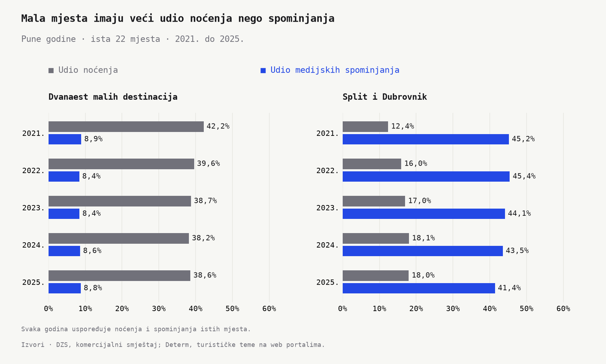
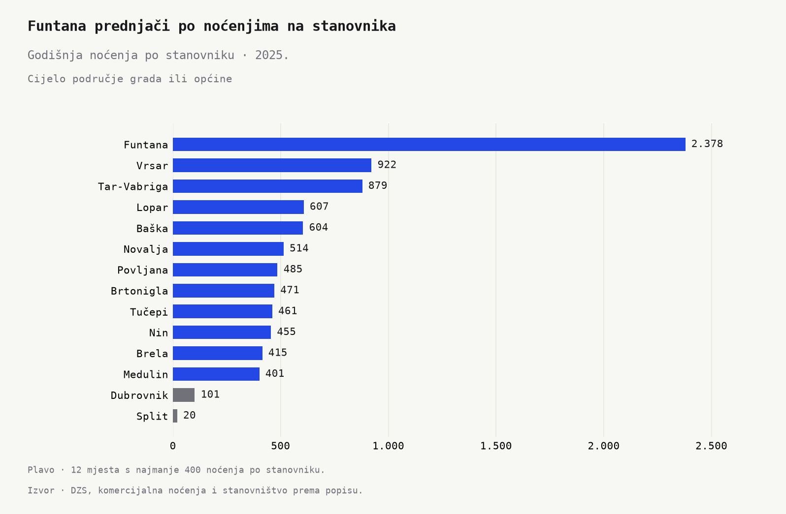
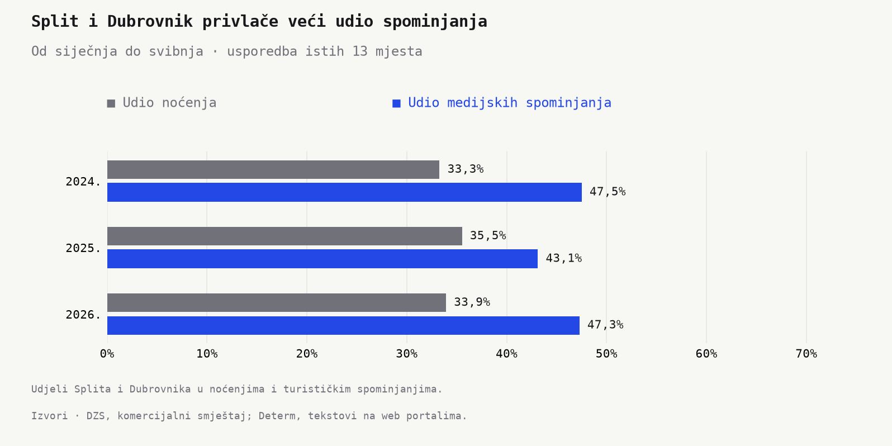

```{python}
#| label: pressure-voice-history-facts
#| include: false
import json
from pathlib import Path

import pandas as pd

root = next(p for p in [Path.cwd(), *Path.cwd().parents] if (p / "_quarto.yml").exists())
facts = json.loads((root / "outputs/facts/pressure_voice_history.json").read_text(encoding="utf-8"))
groups = pd.DataFrame(facts["group_values"]).set_index(["period", "group"])
places = pd.DataFrame(facts["latest_place_values"]).set_index("display_name")
assert facts["aligned_dates_and_geographies"] and facts["annual_tourism_tables_agree"]
assert facts["annual_g2_direction_consistent"] and facts["annual_g1_direction_consistent"]
last_annual = str(facts["end_year"])
last_ytd = str(facts["ytd_year"]) + "_ytd"

def format_hr(value, digits=0):
    if digits < 0:
        return f"{round(value, digits):,.0f}".replace(",", ".")
    return f"{value:,.{digits}f}".replace(",", "X").replace(".", ",").replace("X", ".")

def n(key, digits=0):
    return format_hr(facts[key], digits)

def year(key):
    return str(int(facts[key]))

def g(period, group, key, digits=0):
    return format_hr(groups.loc[(period, group), key], digits)

def p(name, key, digits=0, scale=1):
    return format_hr(places.loc[name, key] / scale, digits)
```

Turistička sezona ima dvije različite karte. Na jednoj su mjesta u kojima gosti noće. Na drugoj su mjesta o kojima čitamo na portalima. Pogledajmo kako se te karte odnose kroz godine.

Uspoređujemo iste `{python} n("annual_frame_n")` obalne destinacije od `{python} year("start_year")`. do `{python} year("end_year")`. Obrazac se ponavlja. Dvanaest malih mjesta s mnogo noćenja po stanovniku **svake godine ima veći udio noćenja nego medijskih spominjanja uz turističke teme**. Za Split i Dubrovnik svake godine vrijedi obrnuto.

U posljednjoj punoj godini, `{python} year("end_year")`., mala mjesta ostvaruju **`{python} g(last_annual, "G2", "nights_share_pct")`% noćenja**, a pripada im **`{python} g(last_annual, "G2", "mention_share_pct")`% spominjanja**. Split i Dubrovnik zajedno imaju `{python} g(last_annual, "G1", "nights_share_pct")`% noćenja i `{python} g(last_annual, "G1", "mention_share_pct")`% spominjanja. Broj gostiju i medijska vidljivost daju različit poredak.

## Raskorak se ponavlja iz godine u godinu

Od `{python} year("start_year")`. do `{python} year("end_year")`. dvanaest malih destinacija ostvaruje između `{python} n("g2_nights_share_min")`% i `{python} n("g2_nights_share_max")`% godišnjih noćenja promatranih mjesta. Njihov udio medijskih spominjanja kreće se između `{python} n("g2_mentions_share_min")`% i `{python} n("g2_mentions_share_max")`%. U svakoj godišnjoj usporedbi razlika ide u istom smjeru.

Medijsku pažnju pratimo kroz spominjanje mjesta uz riječi poput *turisti*, *noćenja*, *hoteli* ili *apartmani*. Jedno mjesto brojimo jednom po članku. Tekst koji spominje i Split i Dubrovnik daje po jedno spominjanje svakome. Tako u usporedbu ulaze vijesti o sezoni, smještaju, ulaganjima i drugim turističkim temama.

{fig-alt="U svakoj prikazanoj godini dvanaest malih destinacija ima veći udio noćenja nego turističkih spominjanja. Split i Dubrovnik svake godine imaju veći udio spominjanja nego noćenja."}

Pogled kroz pune godine daje malim mjestima trajno važno mjesto u turističkom prometu. Na portalima se znatno češće pojavljuju Split i Dubrovnik.

## Funtana je mala po stanovništvu, velika po turizmu

Funtana ima `{python} p("Funtana", "population_2021")` stanovnika. U `{python} year("end_year")`. na svakoga od njih dolazi oko **`{python} p("Funtana", "nights_per_resident", -1)` godišnjih noćenja**. Dubrovnik ima `{python} p("Dubrovnik", "nights_per_resident")` noćenje po stanovniku, a Split `{python} p("Split", "nights_per_resident")`.

Uz Funtanu, u skupini malih destinacija su Vrsar, Tar-Vabriga, Lopar, Baška, Novalja, Povljana, Brtonigla, Tučepi, Nin, Brela i Medulin. Zajedno imaju oko `{python} n("high_intensity_population", -3)` stanovnika. Svako od tih mjesta u posljednjoj punoj godini ostvaruje najmanje `{python} n("annual_group_threshold")` noćenja po stanovniku. Istu skupinu pratimo kroz sve godine.

{fig-alt="Funtana uvjerljivo prednjači po godišnjim noćenjima na stanovnika. Sve destinacije iz skupine malih mjesta nalaze se iznad Dubrovnika i Splita."}

Turizam je u tim sredinama velik u odnosu na zajednicu koja prima goste. Funtana ostvaruje `{python} p("Funtana", "nights", 1, 1000000)` milijuna noćenja, a Split `{python} p("Split", "nights", 1, 1000000)` milijuna. U pretraženim tekstovima o turizmu Funtana bilježi `{python} p("Funtana", "mentions")` spominjanja, dok Split bilježi `{python} p("Split", "mentions")`. Razlika u medijskoj prisutnosti mnogo je veća od razlike u noćenjima.

## Split i Dubrovnik prednjače i na početku godine

Najnoviji zajednički presjek obuhvaća razdoblje od siječnja do svibnja `{python} year("ytd_year")`. Usporedimo tih pet mjeseci s istim mjesecima prethodnih dviju godina, svaki put za istih `{python} n("ytd_frame_n")` destinacija.

U toj skupini Split i Dubrovnik zajedno ostvaruju **`{python} g(last_ytd, "G1", "nights_share_pct")`% noćenja** i **`{python} g(last_ytd, "G1", "mention_share_pct")`% spominjanja** u najnovijem razdoblju. I na početku godine njihov je udio medijske pažnje veći od udjela turističkog prometa.

{fig-alt="Usporedba noćenja i turističkih spominjanja Splita i Dubrovnika u istim mjesecima triju uzastopnih godina."}

Godišnje usporedbe i najnoviji presjek pokazuju koliko izbor mjesta oblikuje priču o turizmu. Split i Dubrovnik zauzimaju velik dio medijskog prostora. Funtana, Vrsar, Lopar i ostale male destinacije primaju velik broj gostiju u odnosu na broj svojih stanovnika, uz mnogo manje spominjanja.

**Gledamo li sezonu samo kroz mjesta o kojima najčešće čitamo, propuštamo velik dio turizma koji se odvija u malim sredinama.** Za malu zajednicu turistička sezona može biti golema, čak i kada o njoj čitamo razmjerno malo.

## Napomene

**Turistički podaci.** DZS, [statistika turizma](https://podaci.dzs.hr/hr/podaci/turizam/). Koristimo godišnja i mjesečna noćenja u komercijalnom smještaju te stanovništvo prema popisu `{python} year("census_year")`., za područja gradova i općina. Uz dvanaest malih destinacija te Split i Dubrovnik, godišnja usporedba uključuje Rovinj, Poreč, Umag, Hvar, Makarsku, Bašku Vodu, Zadar i Pulu. Usporedba od siječnja do svibnja prati Bašku, Bašku Vodu, Dubrovnik, Hvar, Makarsku, Medulin, Nin, Poreč, Pulu, Rovinj, Split, Umag i Zadar.

**Medijski podaci.** Web portali u bazi Determ. Program prepoznaje naziv mjesta uz turističke riječi u susjednim rečenicama. Uklanjamo kopije istog teksta i ponavljajuće odlomke te brojimo svako mjesto jednom po članku. Udjele noćenja i spominjanja računamo za iste destinacije i iste datume unutar svake usporedbe.

**Izračuni i grafikoni.** `python/pressure_voice_history_inventory.py`, `python/pressure_voice_history_extract.py`, `python/pressure_voice_history_build.py` i `python/pressure_voice_history_charts.py`. Tekst i grafikoni učitavaju rezultate iz datoteka u `outputs/`.
